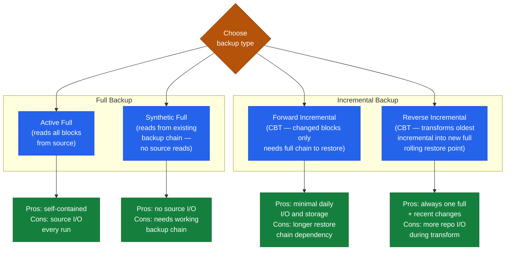

# Veeam — Standards

## Job Naming Convention

| Object | Convention | Example |
|---|---|---|
| Backup job | `<env>-<workload>-<type>` | `prod-vm-daily`, `dr-fileserver-weekly` |
| Backup copy job | `<env>-<workload>-copy-<dest>` | `prod-vm-copy-offsite` |
| Replication job | `<env>-<workload>-repl` | `prod-critical-vm-repl` |
| SOBR | `<site>-sobr-<tier>` | `dc1-sobr-primary` |
| Repository | `<site>-repo-<type>-<seq>` | `dc1-repo-ssd-01`, `dc2-repo-linux-01` |

## Retention Schedule

| Level | Restore Points | Schedule | Repository |
|---|---|---|---|
| Daily | 14 | Incremental (synthetic full weekly) | Performance tier (fast disk) |
| Weekly | 8 | Synthetic full | Performance tier |
| Monthly | 12 | Active full (monthly) | SOBR capacity tier offload |
| Yearly | 7 | Active full (yearly) | Object storage archive |

SOBR capacity tier offload: configure automatic offload after 14 days → moves monthly/yearly points to object storage.

### Backup Job Types Comparison

## Backup Job Configuration Standards

- **Backup window**: 22:00–06:00 (default); set hard stop to prevent daytime impact
- **Source-side deduplication**: Enabled on all jobs (reduces WAN for copy jobs)
- **Compression**: Optimal (default) — do not use Extreme unless backup window permits extra CPU time
- **Application-aware processing**: Enabled for all jobs containing SQL Server, Oracle, Exchange, Active Directory VMs
- **Guest OS quiescence**: VSS quiescence for Windows VMs; file system freeze for Linux VMs

## Encryption Standard

Mandatory encryption for:
- All backup copy jobs targeting off-site repositories
- All cloud repository targets (SOBR capacity tier)
- Any job protecting VMs with classified or regulated data (PII, financial, healthcare)

Algorithm: AES-256.

**Key management**:
- Export encryption keys immediately after creation
- Store in CyberArk → dedicated VBR Encryption Keys safe
- Rotate keys annually — plan for re-encryption of existing backup files

## Proxy Standards

| Setting | Standard |
|---|---|
| Minimum proxies per site | 2 (redundancy + parallel capacity) |
| Transport mode preference | Hot-add (SAN) > Direct NFS > NBD |
| Max concurrent tasks per proxy | vCPU count / 2 (default) |
| Proxy OS | Windows Server 2022 or RHEL 8+ (Linux proxy) |

## Repository Standards

| Repository Type | Use Case | Performance Target |
|---|---|---|
| Linux hardened (immutable) | Primary onsite backup | XFS or ReFS; 10 GbE minimum |
| NFS/SMB share | Secondary onsite storage | Dedicated NAS volume; 10 GbE |
| S3-compatible (SOBR capacity) | Long-term / archival | Glacier-class for yearly; Standard for monthly |

## Sizing Guidelines

| Scale | Backup Server | Proxies per Site |
|---|---|---|
| < 100 VMs | 4 vCPU, 8 GB RAM | 1–2 |
| 100–500 VMs | 8 vCPU, 16 GB RAM | 2–4 |
| 500–2,000 VMs | 16 vCPU, 32 GB RAM (+ full SQL) | 4–8 |

## Instant VM Recovery RTO Targets

| Application Tier | Target RTO |
|---|---|
| Tier 1 (critical DB, ERP) | < 15 minutes via Instant VM Recovery |
| Tier 2 (business apps) | < 1 hour |
| Tier 3 (dev/test) | < 4 hours |

Document agreed RTOs in the DR plan; validate quarterly via Instant VM Recovery test.
