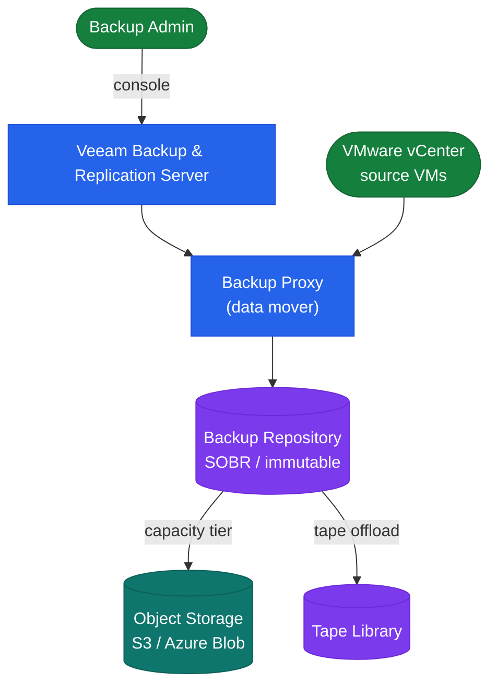
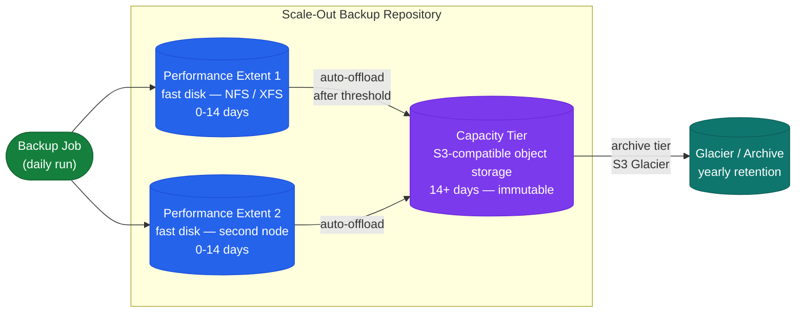

# Veeam — How It Works

## Overview

Veeam Backup & Replication provides backup, replication, recovery, and disaster recovery for virtual, physical, and cloud workloads. The Backup Server manages scheduling and configuration. Backup Proxies perform data movement via VMware VADP or agent-based reads. The Scale-Out Backup Repository (SOBR) provides tiered storage — fast disk for short-term, object storage for long-term.

## Architecture

## Components

| Component | Role | Notes |
|---|---|---|
| Backup Server | Management, scheduler, config DB | Windows Server; SQL Express (≤500 VMs) or full SQL Server |
| Backup Proxy | Data mover (reads VM data via VADP or agent) | One or more per site; scale for throughput |
| Backup Repository | Target storage for backup files (.vbk/.vib) | Linux / Windows / NAS / hardened Linux |
| Scale-Out Backup Repository (SOBR) | Logical pool across multiple repos | Performance tier (fast disk) + capacity tier (object storage) |
| WAN Accelerator | Remote replication deduplication | Source/target pairs — only for VM replication jobs |
| Veeam ONE | Monitoring, alerting, reporting | Separate server; integrates with VBR via DB |

## Backup Proxy Transport Modes (VMware)

- **Hot-add (SAN)**: Proxy VM attached to the production datastore — highest throughput; preferred
- **Direct NFS**: For NFS datastores — bypasses ESXi, directly reads NFS
- **Network (NBD)**: Fallback when SAN/NFS not available — slowest

Deploy minimum 2 proxies per site for redundancy and parallel job capacity.

## Scale-Out Backup Repository (SOBR)

## Supported Platforms

| Platform | Method |
|---|---|
| VMware vSphere | VADP, agentless |
| Microsoft Hyper-V | HV provider, agentless |
| Physical Windows | Veeam Agent for Windows (VAW) |
| Physical Linux | Veeam Agent for Linux (VAL) |
| AWS EC2 | Veeam Backup for AWS (separate appliance) |
| Azure VMs | Veeam Backup for Azure (separate appliance) |

## Retention Schedule

| Level | Restore Points | Schedule | Repository |
|---|---|---|---|
| Daily | 14 | Incremental (synthetic full weekly) | Performance tier (fast disk) |
| Weekly | 8 | Synthetic full | Performance tier |
| Monthly | 12 | Active full (monthly) | SOBR capacity tier offload |
| Yearly | 7 | Active full (yearly) | Object storage archive |

## Sizing Guidelines

| Scale | Backup Server | Proxies per Site |
|---|---|---|
| < 100 VMs | 4 vCPU, 8 GB RAM | 1–2 |
| 100–500 VMs | 8 vCPU, 16 GB RAM | 2–4 |
| 500–2,000 VMs | 16 vCPU, 32 GB RAM (+ full SQL) | 4–8 |

## Instant VM Recovery RTO Targets

| Application Tier | Target RTO |
|---|---|
| Tier 1 (critical DB, ERP) | < 15 minutes via Instant VM Recovery |
| Tier 2 (business apps) | < 1 hour |
| Tier 3 (dev/test) | < 4 hours |
