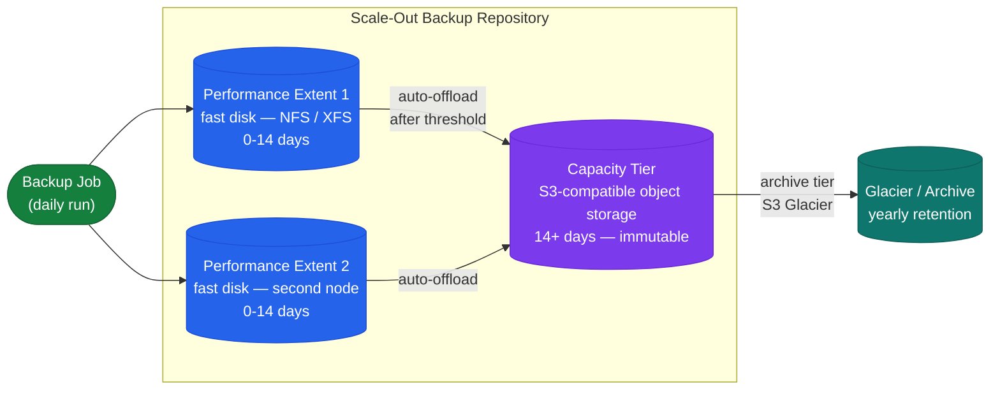

# Veeam — Architecture Overview

Veeam provides backup, replication, recovery, and disaster recovery capabilities for virtual, physical, and cloud workloads.

## Architecture Diagram

## Backup Proxy

The proxy is the workhorse of Veeam — it reads VM data and writes to the repository:

- **Transport modes** (VMware):
  - Hot-add (SAN): proxy VM attached to the production datastore — highest throughput
  - Direct NFS: for NFS datastores — bypasses ESXi, directly reads NFS
  - Network (NBD): fallback when SAN/NFS not available — slowest
- Deploy minimum 2 proxies per site for redundancy and parallel job capacity
- Proxies auto-selected by Veeam based on available throughput — no manual assignment needed for most cases

## Scale-Out Backup Repository (SOBR)

SOBR provides tiered storage without managing individual repository capacity.

Configure SOBR offload: Backup Infrastructure → Scale-Out Repositories → right-click → Properties → Capacity Tier.

## NAS Backup (File Share Backup)

Veeam 12+ supports backup of SMB/NFS shares via dedicated File Share backup jobs:

- Creates a dedicated File Backup Proxy and cache repository
- Processes changed files using VSS or NAS snapshot integration
- Restore granularity: individual files, folder-level, or point-in-time snapshot

---

## In this section

<a class="kb-card" href="components/"><strong>Components</strong>Core components, services, and technical specifications.</a>
<a class="kb-card" href="integrations/"><strong>Integrations</strong>Integration with other platforms and external systems.</a>
<a class="kb-card" href="standards/"><strong>Standards</strong>Sizing guidelines, design standards, and best practices.</a>

