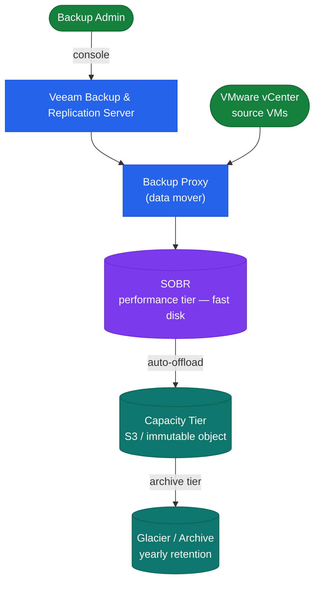

# Veeam — Architecture

Veeam Backup & Replication architecture — Backup Server manages scheduling, Proxies handle data movement via VADP or agent, and SOBR provides tiered storage with immutable object offload.

<a class="kb-card" href="how-it-works/"><strong>How It Works</strong>Proxy transport modes, SOBR tiers, supported platforms, retention schedule, and sizing.</a>
<a class="kb-card" href="integrations/"><strong>Integrations</strong>VMware vSphere, Hyper-V, physical agents, and cloud (AWS/Azure) integrations.</a>
<a class="kb-card" href="design-standards/"><strong>Design Standards</strong>Job naming, retention schedule, SOBR design, proxy placement, and immutability settings.</a>

| Component | Role |
|---|---|
| Backup Server | Management, scheduler, config DB; Windows Server + SQL |
| Backup Proxy | Data mover; reads VM data via VADP (hot-add, Direct NFS, NBD) or agent |
| Backup Repository | Target storage for .vbk/.vib backup files |
| Scale-Out Backup Repository (SOBR) | Tiered pool: performance extent (fast disk) + capacity tier (object storage) |
| Veeam ONE | Monitoring, alerting, and reporting; separate server |

