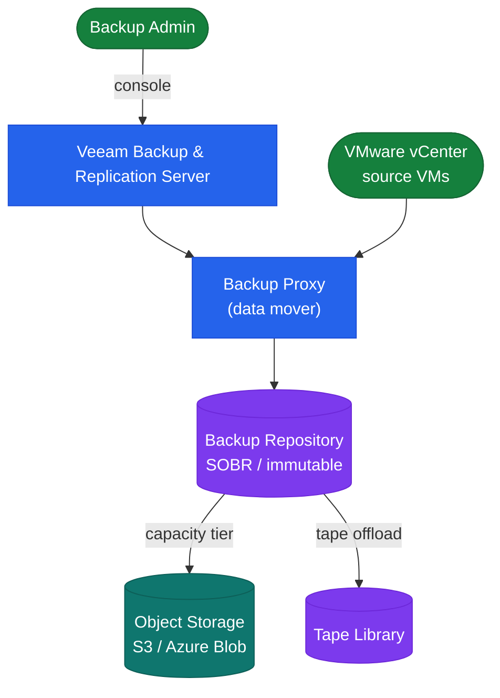

# Veeam Architecture
## Core Components

| Component | Role | Notes |
|---|---|---|
| Backup Server | Management, scheduler, config DB | Windows Server; SQL Express (≤500 VMs) or full SQL Server |
| Backup Proxy | Data mover (reads VM data via VADP or agent) | One or more per site; scale for throughput |
| Backup Repository | Target storage for backup files (.vbk/.vib) | Linux / Windows / NAS / hardened Linux |
| Scale-Out Backup Repository (SOBR) | Logical pool across multiple repos | Performance tier (fast disk) + capacity tier (object storage) |
| WAN Accelerator | Remote replication deduplication | Deployed in source/target pairs — only for VM replication jobs |
| Veeam ONE | Monitoring, alerting, reporting | Separate server; integrates with VBR via DB |

## Architecture Diagram



## Backup Proxy

The proxy is the workhorse of Veeam — it reads VM data and writes to the repository:

- **Transport modes** (VMware):
  - Hot-add (SAN): proxy VM attached to the production datastore — highest throughput
  - Direct NFS: for NFS datastores — bypasses ESXi, directly reads NFS
  - Network (NBD): fallback when SAN/NFS not available — slowest
- Deploy minimum 2 proxies per site for redundancy and parallel job capacity
- Proxies auto-selected by Veeam based on available throughput — no manual assignment needed for most cases

## Scale-Out Backup Repository (SOBR)

SOBR provides tiered storage without managing individual repository capacity:

```
SOBR:
  Performance Extent: fast NFS/CIFS or local disk (hot backups)
    - Stores recent restore points (e.g., last 14 days)
  Capacity Tier: S3-compatible object storage
    - Automatic offload after configured time threshold (e.g., 14 days)
    - Immutable copies via S3 Object Lock
```

Configure SOBR offload: Backup Infrastructure → Scale-Out Repositories → right-click → Properties → Capacity Tier.

## NAS Backup (File Share Backup)

Veeam 12+ supports backup of SMB/NFS shares via dedicated File Share backup jobs:

- Creates a dedicated File Backup Proxy and cache repository
- Processes changed files using VSS or NAS snapshot integration
- Restore granularity: individual files, folder-level, or point-in-time snapshot

## Cloud and Agent Support

| Platform | Method |
|---|---|
| VMware vSphere | VADP, agentless |
| Microsoft Hyper-V | HV provider, agentless |
| Physical Windows | Veeam Agent for Windows (VAW) |
| Physical Linux | Veeam Agent for Linux (VAL) |
| AWS EC2 | Veeam Backup for AWS (separate appliance) |
| Azure VMs | Veeam Backup for Azure (separate appliance) |

## Sizing Guidelines

| Scale | Backup Server | Proxies per Site |
|---|---|---|
| < 100 VMs | 4 vCPU, 8 GB RAM | 1–2 |
| 100–500 VMs | 8 vCPU, 16 GB RAM | 2–4 |
| 500–2,000 VMs | 16 vCPU, 32 GB RAM (+ full SQL) | 4–8 |
