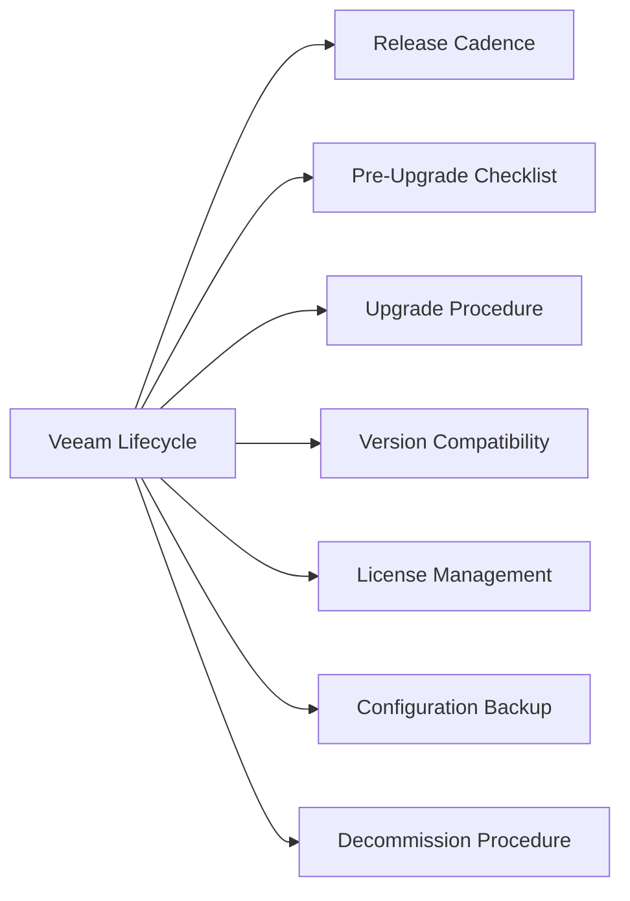

# Veeam Lifecycle



## Release Cadence

Veeam releases major versions (VBR 12, 12.1, 12.2) annually with cumulative patches (P-releases) throughout the year.

| Component | Upgrade Order | Notes |
|---|---|---|
| Veeam Backup Server | 1st | Config DB backed up automatically pre-upgrade |
| Veeam ONE | 2nd | Must match VBR major version — upgrade immediately after VBR |
| Backup Proxies | 3rd | Managed via VBR console; can be pushed remotely |
| Repository Agents | 4th | Veeam Agent for Linux/Windows on managed repos |

Check EOL dates: [veeam.com/product-lifecycle](https://www.veeam.com/product-lifecycle.html)

## Pre-Upgrade Checklist

```powershell
# 1. Export VBR configuration backup before any upgrade
# Main Menu → Configuration Backup → Backup Now
# Verify backup location: C:\VBR\Config\ (default)

# 2. Check no active jobs are running
# Home → Jobs → Active Jobs — must be empty

# 3. Verify SQL Server version compatibility
# VBR 12.x requires SQL Server 2016 or later
```

Additional checks:
- [ ] Veeam ONE version is compatible with target VBR version
- [ ] vCenter version supported by target VBR version
- [ ] Proxy and repository OS versions supported (Windows Server 2016+ or supported Linux)

## Upgrade Procedure

1. **Backup server upgrade**: Run the VBR installer — it performs a pre-upgrade compatibility check, backs up the config DB, and upgrades in-place

2. **Veeam ONE upgrade** (if deployed): Run the Veeam ONE installer on the Veeam ONE server

3. **Push proxy upgrades**: VBR console → Backup Infrastructure → Backup Proxies → right-click each proxy → Upgrade

4. **Update repositories**: VBR console → Backup Infrastructure → Backup Repositories → right-click Linux repos → Upgrade

5. **Post-upgrade validation**: Run a test backup on a non-critical VM

## Version Compatibility

| Scenario | Supported? |
|---|---|
| Proxy N-1 minor behind Backup Server | Supported — upgrade within next cycle |
| Proxy N-2 behind Backup Server | Not supported — upgrade immediately |
| Veeam ONE different major version | Not supported — must match VBR major |

## License Management

| License Model | Tracking |
|---|---|
| Veeam Universal License (VUL) | Per-workload; check consumed vs. licensed monthly |
| Per-socket (legacy) | Per vSphere socket; count sockets in vCenter |
| Rental/subscription | Annual renewal; Veeam licensing portal |

Check licence utilisation: Veeam Backup console → Main Menu → License.

Alert at 90% utilisation — procurement lead time can be 2–4 weeks.

## Configuration Backup

Run a configuration backup before every change and on a scheduled daily basis:

```powershell
# VBR config backup — always run before upgrades
# Main Menu → Configuration Backup → Backup Now

# Verify backup exists
Get-ChildItem "C:\VBR\Config\" | Sort-Object LastWriteTime -Descending | Select-Object -First 5
```

Store the config backup off the Backup Server — it is useless if the server hosting it is lost.

## Decommission Procedure

When retiring a Veeam Backup Server:
1. Export and archive all backup job configuration
2. Migrate retention-period backups to a new repository or archive
3. Un-register all proxies and repositories
4. Deregister vCenter credentials
5. Update CMDB to reflect decommission
