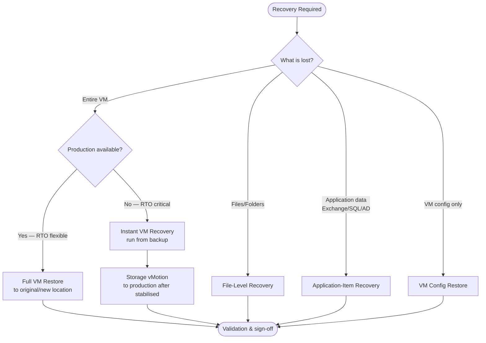

# Veeam — Backup & Restore

Veeam Backup & Replication provides comprehensive recovery options ranging from full VM restore to granular application-item recovery. Choosing the right restore type minimises RTO and avoids unnecessary data movement.

---

## Restore Type Decision Tree



---

## Restore Types Reference

| Restore Type | Use Case | RTO | Data Movement |
|---|---|---|---|
| Instant VM Recovery | Critical VM down, production unavailable | Minutes | None (runs from backup) |
| Full VM Restore | Planned recovery, hardware failure | 30 min – hours | Full VM copied |
| File-Level Recovery | Individual files/folders lost | Minutes | File(s) only |
| Application-Item Recovery | Exchange mailbox, SQL database, AD object | Minutes | Object(s) only |
| Volume-Level Restore | OS volume corrupt, faster than full VM | 15–45 min | Volume only |
| Entire VM Replica Failover | Replication-based DR | Minutes | None |

---

## Instant VM Recovery

Instant VM Recovery mounts the backup directly from the Veeam repository and starts the VM immediately. Use this when RTO is critical.

```
Veeam Console → Home → Restore → VMware vSphere VMs →
  Instant Recovery → select backup → select restore point →
  select target host/datastore → Power on target VM automatically → Finish
```

```powershell
# Via PowerShell (Veeam PowerShell Toolkit)
Add-PSSnapin VeeamPSSnapIn

$vm      = Find-VBRViEntity -Name "PRODVM01"
$backup  = Get-VBRBackup -Name "PRODVM01 - Backup"
$rp      = Get-VBRRestorePoint -Backup $backup | Sort-Object CreationTime -Descending | Select-Object -First 1

Start-VBRInstantVMRecovery -RestorePoint $rp -TargetServer "esx01.corp.example.com" -PowerVM $true
```

**After stabilisation — migrate from backup to production:**

```
Veeam Console → Home → Instant Recovery → select running recovery →
  Migrate to Production → select datastore → Run migration
```

This performs a Storage vMotion in the background. The VM remains live throughout.

---

## Full VM Restore

Full VM Restore copies the backup to a production datastore. Use for planned recoveries or when instant recovery is not required.

```
Veeam Console → Home → Restore → VMware vSphere VMs →
  Entire VM Restore → select backup → select restore point →
  Original location or New location → select ESXi host and datastore →
  Power on VM after restoring → Finish
```

```powershell
$vm     = Find-VBRViEntity -Name "PRODVM01"
$backup = Get-VBRBackup -Name "PRODVM01 - Backup"
$rp     = Get-VBRRestorePoint -Backup $backup | Sort-Object CreationTime | Select-Object -Last 1

$options = New-VBRViRecoveryOptions -PowerVM $true

Start-VBRRestoreVM -RestorePoint $rp -ToOriginalLocation -RecoveryOptions $options
```

---

## File-Level Recovery

Restore individual files from any Windows or Linux guest backup without mounting the full VM.

```
Veeam Console → Home → Restore → Guest Files → Windows / Linux →
  select backup → select restore point → browse guest file system →
  right-click file → Restore to original location / Keep / Overwrite
```

```powershell
# Mount backup for browse/copy
$rp     = Get-VBRRestorePoint -Backup (Get-VBRBackup -Name "FILESERVER01") |
          Sort-Object CreationTime -Descending | Select-Object -First 1

$session = Start-VBRWindowsFileRestore -RestorePoint $rp
# Session opens Windows Explorer-like browser in console
```

---

## Application-Item Recovery

### Exchange Mailbox Recovery

```
Veeam Console → Home → Restore → Microsoft Exchange Items →
  select Exchange server backup → browse mailbox → select items →
  Restore to: Original mailbox / PST export / Another mailbox
```

### SQL Database Recovery

```
Veeam Console → Home → Restore → Microsoft SQL Server Items →
  select SQL server backup → select database → select restore point →
  Restore to original location / Restore to another server
```

```powershell
# SQL restore via PowerShell
$rp = Get-VBRRestorePoint -Backup (Get-VBRBackup -Name "SQLSERVER01") |
      Sort-Object CreationTime -Descending | Select-Object -First 1

Start-VBRSQLDatabaseRestore -RestorePoint $rp `
  -TargetSQLServer "SQLSERVER01" `
  -DatabaseName "ProductionDB" `
  -ToOriginalLocation
```

### Active Directory Object Recovery

```
Veeam Console → Home → Restore → Microsoft Active Directory Items →
  select Domain Controller backup → browse AD → select object →
  Restore to original location (will re-hydrate in AD)
```

---

## Veeam DataLabs — Restore Testing

DataLabs allows testing restores in an isolated sandbox without touching production.

```
Veeam Console → Inventory → Virtual Labs → Run Recovery Verification →
  select backup → select VMs to test → select lab → Run verification
```

**Scheduled SureBackup jobs automate this for all production backups:**

```
Veeam Console → Home → Jobs → SureBackup Job →
  configure virtual lab, application group, and backup job →
  set schedule (weekly recommended)
```

SureBackup boots each VM in the isolated lab and runs application-specific tests (ping, heartbeat, port check, custom script).

---

## Restore Validation Checklist

| # | Check | Method |
|---|---|---|
| 1 | VM powered on and accessible | vCenter console / ping |
| 2 | Guest OS booted successfully | Event log / OS login |
| 3 | Disk count and capacity correct | `lsblk` / Disk Manager |
| 4 | Network connectivity restored | `ping`, `traceroute`, port test |
| 5 | Application services running | Service status / health endpoint |
| 6 | Data integrity verified | Application-level check |
| 7 | DNS and hostname correct | `hostname`, `nslookup` |
| 8 | Backup jobs resumed targeting restored VM | Veeam console → Jobs |
| 9 | Monitoring alerts cleared | Monitoring platform |
| 10 | ITSM incident updated with restore details | Ticket notes + closure |

---

## Common Restore Issues

| Issue | Cause | Fix |
|---|---|---|
| Restore fails: no free space | Target datastore full | Free space or select different datastore |
| Instant recovery VM unresponsive | Network conflict (duplicate IP) | Use isolated network for instant recovery |
| File-level restore: guest OS not detected | VMware Tools missing | Use volume-level or full VM restore |
| SQL restore fails: database in use | Active connections | Disconnect users, set single-user mode |
| Exchange restore: mailbox not found | Old backup predates mailbox creation | Use newer restore point |
| SureBackup: VM fails heartbeat test | Boot time exceeded | Increase boot delay in DataLabs settings |

---

## Related Pages

- [Veeam — Architecture Overview](../../architecture/overview/index.md)
- [Veeam — Health Checks](../health-checks/index.md)
- [Veeam — Troubleshooting](../../troubleshooting/common-issues/index.md)
