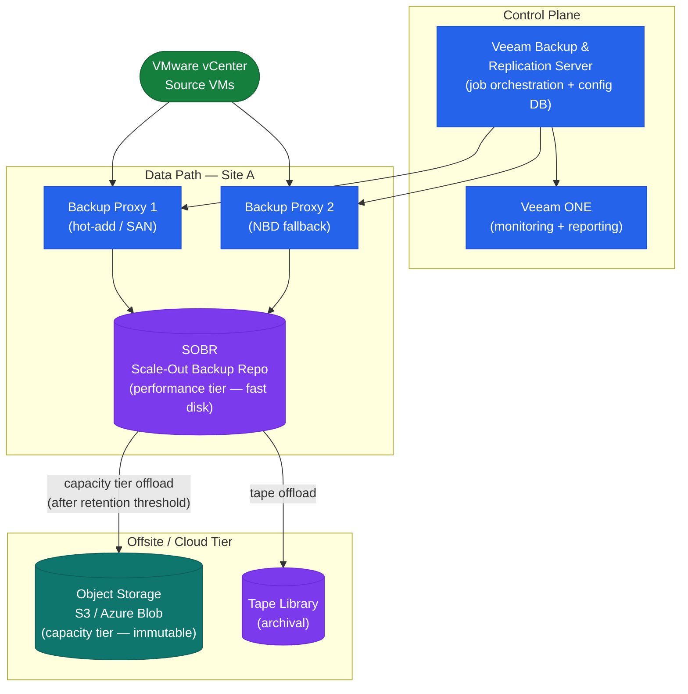

# Veeam — CLI Reference


<div class="kb-summary">
CLI Reference reference covering Backup Infrastructure Topology, Sessions & History, Restore Points, VM Restore, Infrastructure and 1 more sections.
</div>

## Backup Infrastructure Topology

The Veeam component hierarchy governs how jobs are routed, where data lands, and which components need to be healthy for a job to succeed.



```text
┌──────────────────────────────────────── Veeam — CLI Reference ────────────────────────────────────────┐
│                                                                                                       │
│   ┌───────────────────────────────────────────────────────────────────────────────────────────────┐   │
│   │                                   Veeam — Command Reference                                   │   │
│   │           Use these commands for routine operations, scripting, and troubleshooting           │   │
│   │                                    Add-VBRJob / Start-VBRJob                                  │   │
│   │                                       Get-VBRRestorePoint                                     │   │
│   │                                    Start-VBRInstantVMRecovery                                 │   │
│   │                                         Get-VBRJob | fl                                       │   │
│   │                                      Invoke-VBRHealthCheck                                    │   │
│   └───────────────────────────────────────────────────────────────────────────────────────────────┘   │
│                                                                                                       │
│    Ports: 9419 (Veeam REST API) · 6160 (Veeam Agent) · 443 (vCenter)                                  │
│                                                                                                       │
│   ┌───────────────────────────────────────────────────────────────────────────────────────────────┐   │
│   │                                       Command Categories                                      │   │
│   │                  Status / Query  — check current state, list jobs, show config                │   │
│   │                  Operations      — start, stop, failover, restore, sync, expire               │   │
│   │                Configuration   — add/modify policies, schedules, storage targets              │   │
│   │               Diagnostics     — collect logs, run health checks, test connectivity            │   │
│   │                  Scripting       — REST API or CLI for automation and reporting               │   │
│   └───────────────────────────────────────────────────────────────────────────────────────────────┘   │
│                                                                                                       │
│  Physical Infrastructure:                                                                             │
│  Windows Server (Backup Server) · Proxy VMs on ESXi · Backup storage (NAS/SAN) · Management LAN       │
│  Key terms:                                                                                           │
│                                                                                                       │
│  Backup Server = central Veeam component: scheduler, job engine, catalog, REST API                    │
│  Backup Proxy  = data mover between vSphere and repository; runs in virtual-appliance mode or H       │
│  CBT           = Changed Block Tracking; VMware VADP mechanism to track changed disk sectors          │
│  VADP          = VMware vSphere APIs for Data Protection; enables agentless VM backup                 │
│  SOBR          = Scale-Out Backup Repository; tiers extents; moves cold data to object storage        │
│  Instant Recovery= mounts VM disks from backup directly to ESXi; VM live in seconds                   │
│  SureBackup    = automated backup verification; test-restores VM in isolated virtual lab              │
│  Replication   = creates VM replica at DR site; enables failover without full restore time            │
│  GFS Retention = Grandfather-Father-Son retention: daily, weekly, monthly, yearly restore points      │
│  Immutable Repo= object storage (S3 WORM) or Linux XFS (immutable flag) repo; ransomware protec       │
│  Mount Server  = Windows host presenting backup as iSCSI/NFS datastore for instant recovery           │
│  VeeamZIP      = ad-hoc compressed portable backup of a single VM; no job required                    │
│  Health Check  = periodic backup integrity scan; verifies restore points are readable                 │
│  Forward Incremental= default mode; one full + daily incrementals; synthetic full created perio       │
│                                                                                                       │
└───────────────────────────────────────────────────────────────────────────────────────────────────────┘
```

---

## Restore Points

```powershell
# List restore points for a VM
Get-VBRRestorePoint -Name "vm01" | Select Name, CreationTime, IsCorrupted

# Find latest restore point for a VM
Get-VBRRestorePoint -Name "vm01" | Sort-Object CreationTime -Descending | Select -First 1

# Find restore points for all VMs in a job
Get-VBRBackup -Name "prod-vm-daily" | Get-VBRRestorePoint
```

---

## VM Restore

```powershell
# Instant VM recovery to original location
$rp = Get-VBRRestorePoint -Name "vm01" | Sort-Object CreationTime -Descending | Select -First 1
Start-VBRRestoreVM -RestorePoint $rp -Reason "DR test"

# Full VM restore
Start-VBRVMFLRRestore -RestorePoint $rp

# File-level restore (Windows)
Start-VBRWindowsFileRestore -RestorePoint $rp
```

---

## Infrastructure

```powershell
# List repositories with free/total space
Get-VBRRepository | Select Name,
  @{N="FreeTB"; E={[math]::Round($_.FreeSpace/1TB,2)}},
  @{N="TotalTB"; E={[math]::Round($_.TotalSpace/1TB,2)}}

# List proxies
Get-VBRViProxy

# List protected VMs
Get-VBRProtectedVM
```

---

## Configuration Backup

```powershell
# Export configuration backup
Export-VBRConfiguration -Path "C:\vbr-config-backup.xml"

# Check last config backup
Get-VBRConfigurationDatabaseBackup
```
