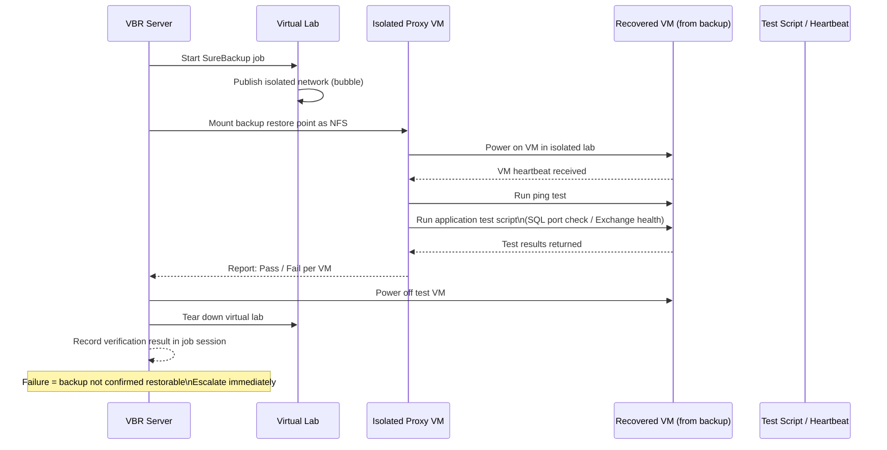

# Veeam — Health Checks

The primary review surface is the **Home** view in the VBR console, which shows job counts grouped by status (Running, Success, Warning, Failed). Work through this list top-to-bottom every morning.

## SureBackup Verification Sequence

SureBackup starts VMs in an isolated virtual lab and runs application-level tests — it is the only way to confirm a backup is truly restorable.



---

## Daily Check Routine

### Job Controller Review

Open **Home > Jobs** and sort by **Last Result**. Failed jobs surface at the top. For each failed or warning job:

1. Right-click the job and select **Statistics**.
2. Expand the failed task — the **Reason** column contains the proximate cause.
3. Note the time of failure and whether it was a retry or first attempt.

```powershell
# Quick PowerShell view of last result per job
Get-VBRJob | Select-Object Name, LastResult, LastRun | Sort-Object LastResult
```

### Failed and Warning Jobs

- **Failed** — investigate before the next scheduled run. Do not allow a job to accumulate two consecutive failures without a documented root cause.
- **Warning** — commonly caused by a VM snapshot commit delay, VSS writer timeout, or guest processing credential issue. Document the cause. Repeated warnings on the same job indicate a structural problem.

```powershell
# List jobs with a non-success last result
Get-VBRJob | Where-Object { $_.LastResult -ne "Success" -and $_.LastResult -ne "None" } |
    Select-Object Name, LastResult, LastRun
```

### SOBR Capacity Check

In **Backup Infrastructure > Scale-Out Repositories**, verify that no extent shows **Sealed** or **Unavailable** status. Check the free space on each performance tier extent.

```powershell
# Repository free space — all repos including SOBR extents
Get-VBRRepository | Select-Object Name, @{N="FreeGB";E={[math]::Round($_.FreeSpace/1GB,1)}}, @{N="TotalGB";E={[math]::Round($_.TotalSpace/1GB,1)}}
```

Flag any extent below 10% free space for immediate action (offload trigger or capacity expansion).

### Tape Check (if applicable)

- Confirm the daily tape job completed and media was ejected on schedule.
- Verify the **Tape** node shows no **Error** state for the library or drives.
- Confirm physical tapes are noted for offsite transport per the media rotation policy.

### Daily Checklist Summary

- [ ] Home view — review Success / Warning / Failed job counts
- [ ] Investigate all Failed jobs — document error and remediation
- [ ] Review all Warning jobs — identify root cause, escalate if recurring
- [ ] SOBR extents — confirm no Sealed or Unavailable extent
- [ ] Repository free space — flag any extent below 10% free
- [ ] Active sessions — confirm no job is running more than 2x its normal duration
- [ ] Tape eject — confirm tapes are offsite (if applicable)

---

## Weekly Checks

### SureBackup Verification Job Review

Run or review the scheduled SureBackup job for critical VM groups. In **Home > Last 24 Hours** (adjust filter to last 7 days), locate SureBackup sessions and check the **Verification** column.

A SureBackup failure means the backup is not confirmed restorable — escalate immediately.

```powershell
# List SureBackup sessions from the last 7 days
Get-VBRBackupSession | Where-Object {
    $_.JobType -eq "SureBackup" -and $_.CreationTime -gt (Get-Date).AddDays(-7)
} | Select-Object JobName, Result, CreationTime, EndTime
```

### Repository Capacity Trend

Pull weekly capacity snapshots and compare against the previous week to identify jobs with abnormal data growth.

```powershell
# Capacity across all repositories
Get-VBRBackupRepository | Select-Object Name,
    @{N="FreeGB";E={[math]::Round($_.FreeSpace/1GB,1)}},
    @{N="TotalGB";E={[math]::Round($_.TotalSpace/1GB,1)}},
    @{N="UsedPct";E={[math]::Round((1 - $_.FreeSpace/$_.TotalSpace)*100,1)}}
```

Flag any repository trending to reach capacity within 30 days at current growth rate.

### Retention Compliance

Verify that restore point counts match the configured retention for each job.

```powershell
# Count restore points per backup job
Get-VBRBackup | ForEach-Object {
    $rp = Get-VBRRestorePoint -Backup $_
    [PSCustomObject]@{
        Job        = $_.JobName
        Points     = $rp.Count
        Oldest     = ($rp | Sort-Object CreationTime | Select-Object -First 1).CreationTime
        Newest     = ($rp | Sort-Object CreationTime -Descending | Select-Object -First 1).CreationTime
    }
}
```
