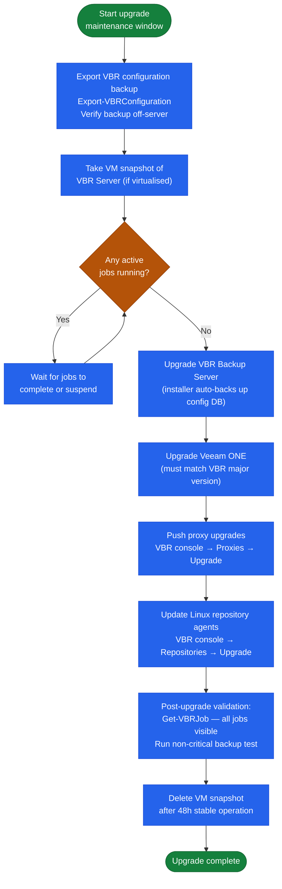

# Veeam — Install & Upgrade

## Release Cadence

Veeam releases major versions (VBR 12, 12.1, 12.2) annually with cumulative patches (P-releases) throughout the year.

### Upgrade Component Order


┌────────────────────────────────────── Veeam — Install & Upgrade ──────────────────────────────────────┐
│                                                                                                       │
│   ┌───────────────────────────────────────────────────────────────────────────────────────────────┐   │
│   │                               Veeam — Installation Prerequisites                              │   │
│   │             OS: supported Linux or Windows Server (see vendor compatibility matrix)           │   │
│   │        Network: 9419 (Veeam REST API) · 6160 (Veeam Agent) — ensure firewall allows these     │   │
│   │  Auth: Windows/AD auth for Veeam console; service account with vSphere admin; repo credentials│   │
│   │  Storage: Windows Server (Backup Server) · Proxy VMs on ESXi · Backup storage (NAS/SAN) · Mana│   │
│   └───────────────────────────────────────────────────────────────────────────────────────────────┘   │
│                                                                                                       │
│                                                   ▼                                                   │
│                                                                                                       │
│   ┌───────────────────────────────────────────────────────────────────────────────────────────────┐   │
│   │                                        Install Sequence                                       │   │
│   │                  1  Deploy control plane component and configure network access               │   │
│   │                          2  Configure storage and network connectivity                        │   │
│   │                        3  Install agent/proxy/splitter on protected hosts                     │   │
│   │                      4  Register sources and configure protection policies                    │   │
│   │                        5  Run first job; verify completion; test restore                      │   │
│   └───────────────────────────────────────────────────────────────────────────────────────────────┘   │
│                                                                                                       │
│   ┌───────────────────────────────────────────────────────────────────────────────────────────────┐   │
│   │                                        Upgrade Sequence                                       │   │
│   │                 1  Review release notes and compatibility matrix before upgrade               │   │
│   │                   2  Snapshot or backup the control plane VM before upgrading                 │   │
│   │                  3  Upgrade control plane first, then proxies/agents/appliances               │   │
│   │                       4  Validate jobs resume automatically after upgrade                     │   │
│   │                        5  Document version change and update CMDB record                      │   │
│   └───────────────────────────────────────────────────────────────────────────────────────────────┘   │
│                                                                                                       │
│  Physical Infrastructure:                                                                             │
│  Windows Server (Backup Server) · Proxy VMs on ESXi · Backup storage (NAS/SAN) · Management LAN       │
│  Key terms:                                                                                           │
│                                                                                                       │
│  Backup Server = central Veeam component: scheduler, job engine, catalog, REST API                    │
│  Backup Proxy  = data mover between vSphere and repository; runs in virtual-appliance mode or H       │
│  CBT           = Changed Block Tracking; VMware VADP mechanism to track changed disk sectors          │
│  VADP          = VMware vSphere APIs for Data Protection; enables agentless VM backup                 │
│  SOBR          = Scale-Out Backup Repository; tiers extents; moves cold data to object storage        │
│  Instant Recovery= mounts VM disks from backup directly to ESXi; VM live in seconds                   │
│  SureBackup    = automated backup verification; test-restores VM in isolated virtual lab              │
│  Replication   = creates VM replica at DR site; enables failover without full restore time            │
│  GFS Retention = Grandfather-Father-Son retention: daily, weekly, monthly, yearly restore points      │
│  Immutable Repo= object storage (S3 WORM) or Linux XFS (immutable flag) repo; ransomware protec       │
│  Mount Server  = Windows host presenting backup as iSCSI/NFS datastore for instant recovery           │
│  VeeamZIP      = ad-hoc compressed portable backup of a single VM; no job required                    │
│  Health Check  = periodic backup integrity scan; verifies restore points are readable                 │
│  Forward Incremental= default mode; one full + daily incrementals; synthetic full created perio       │
│                                                                                                       │
└───────────────────────────────────────────────────────────────────────────────────────────────────────┘
```

Additional checks:
- [ ] Veeam ONE version is compatible with target VBR version
- [ ] vCenter version supported by target VBR version
- [ ] Proxy and repository OS versions supported (Windows Server 2016+ or supported Linux)

## Upgrade Procedure

1. **Backup server upgrade**: Run the VBR installer — it performs a pre-upgrade compatibility check, backs up the config DB, and upgrades in-place

2. **Veeam ONE upgrade** (if deployed): Run the Veeam ONE installer on the Veeam ONE server

3. **Push proxy upgrades**: VBR console → Backup Infrastructure → Backup Proxies → right-click each proxy → Upgrade

4. **Update repositories**: VBR console → Backup Infrastructure → Backup Repositories → right-click Linux repos → Upgrade

5. **Post-upgrade validation**: Run a test backup on a non-critical VM

## Pre-Upgrade Checklist (VBR Version Upgrades)

### Before the Upgrade Window

- [ ] Read the Veeam release notes — check for breaking changes, deprecated features, and required component upgrades.
- [ ] Verify OS and SQL Server compatibility for the new version.
- [ ] Export the current VBR configuration backup:
  ```powershell
  Export-VBRConfiguration -Path "C:\vbr-config-backup-$(Get-Date -Format yyyyMMdd).xml"
  ```
- [ ] Take a snapshot of the Veeam Backup Server VM (if virtualised) immediately before the upgrade.
- [ ] Confirm all running jobs are complete and no jobs are scheduled to start during the upgrade window.
- [ ] Notify stakeholders of the maintenance window and expected impact.
- [ ] Download the ISO or installer from Veeam's site and verify the checksum.

### After the Upgrade

- [ ] Confirm the VBR service starts and the console connects.
- [ ] Run `Get-VBRJob` to confirm all jobs are visible and their schedules are intact.
- [ ] Manually start a non-critical backup job to confirm end-to-end function.
- [ ] Upgrade the Veeam ONE server and agent if in use (must match VBR version).
- [ ] Delete the pre-upgrade VM snapshot after 48 hours of stable operation.
- [ ] Update this runbook with the new version number and upgrade date.

## Version Compatibility

| Scenario | Supported? |
|---|---|
| Proxy N-1 minor behind Backup Server | Supported — upgrade within next cycle |
| Proxy N-2 behind Backup Server | Not supported — upgrade immediately |
| Veeam ONE different major version | Not supported — must match VBR major |

## License Management

| License Model | Tracking |
|---|---|
| Veeam Universal License (VUL) | Per-workload; check consumed vs. licensed monthly |
| Per-socket (legacy) | Per vSphere socket; count sockets in vCenter |
| Rental/subscription | Annual renewal; Veeam licensing portal |

Check licence utilisation: Veeam Backup console → Main Menu → License.

Alert at 90% utilisation — procurement lead time can be 2–4 weeks.

## Configuration Backup

Run a configuration backup before every change and on a scheduled daily basis:

```powershell
# VBR config backup — always run before upgrades
# Main Menu → Configuration Backup → Backup Now

# Verify backup exists
Get-ChildItem "C:\VBR\Config\" | Sort-Object LastWriteTime -Descending | Select-Object -First 5
```

Store the config backup off the Backup Server — it is useless if the server hosting it is lost.

## Decommission Procedure

When retiring a Veeam Backup Server:
1. Export and archive all backup job configuration
2. Migrate retention-period backups to a new repository or archive
3. Un-register all proxies and repositories
4. Deregister vCenter credentials
5. Update CMDB to reflect decommission
