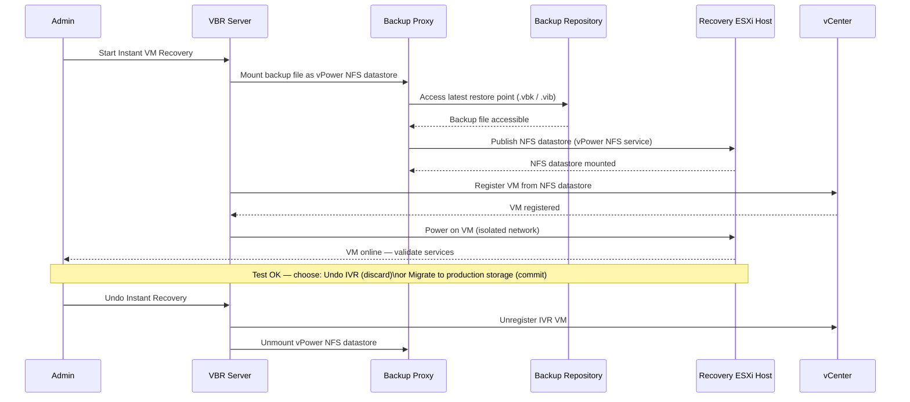

# Veeam — Procedures


<div class="kb-summary">
Operational procedures covering backup job creation, copy job setup, SOBR management, and restore testing.
</div>

## Instant VM Recovery Flow

The Instant VM Recovery (IVR) sequence mounts the backup file directly as an NFS datastore — the VM starts from the backup without waiting for a full restore.


┌───────────────────────────────────────── Veeam — Procedures ──────────────────────────────────────────┐
│                                                                                                       │
│   ┌──────────────────────────────────────────────┐  ┌─────────────────────────────────────────────┐   │
│   │              Routine Procedures              │  │                DR Procedures                │   │
│   │          Add new protection source           │  │              Initiate failover              │   │
│   │           Modify retention policy            │  │               Validate replica              │   │
│   │          Expire old recover points           │  │              Redirect host I/O              │   │
│   │             Add storage capacity             │  │         Test failover (non-disrupt)         │   │
│   │           Service account rotation           │  │            Failback to production           │   │
│   └──────────────────────────────────────────────┘  └─────────────────────────────────────────────┘   │
│                                                                                                       │
│   ┌───────────────────────────────────────────────────────────────────────────────────────────────┐   │
│   │                             Change Control Requirements for Veeam                             │   │
│   │           All changes to protection policies require change ticket with rollback plan         │   │
│   │                      Failover tests must be scheduled in maintenance window                   │   │
│   │              Firmware/software upgrades need 48 h pre-approval and backup snapshot            │   │
│   │                  Post-change: verify jobs run successfully for 2 backup cycles                │   │
│   └───────────────────────────────────────────────────────────────────────────────────────────────┘   │
│                                                                                                       │
│  Physical Infrastructure:                                                                             │
│  Windows Server (Backup Server) · Proxy VMs on ESXi · Backup storage (NAS/SAN) · Management LAN       │
│  Key terms:                                                                                           │
│                                                                                                       │
│  Backup Server = central Veeam component: scheduler, job engine, catalog, REST API                    │
│  Backup Proxy  = data mover between vSphere and repository; runs in virtual-appliance mode or H       │
│  CBT           = Changed Block Tracking; VMware VADP mechanism to track changed disk sectors          │
│  VADP          = VMware vSphere APIs for Data Protection; enables agentless VM backup                 │
│  SOBR          = Scale-Out Backup Repository; tiers extents; moves cold data to object storage        │
│  Instant Recovery= mounts VM disks from backup directly to ESXi; VM live in seconds                   │
│  SureBackup    = automated backup verification; test-restores VM in isolated virtual lab              │
│  Replication   = creates VM replica at DR site; enables failover without full restore time            │
│  GFS Retention = Grandfather-Father-Son retention: daily, weekly, monthly, yearly restore points      │
│  Immutable Repo= object storage (S3 WORM) or Linux XFS (immutable flag) repo; ransomware protec       │
│  Mount Server  = Windows host presenting backup as iSCSI/NFS datastore for instant recovery           │
│  VeeamZIP      = ad-hoc compressed portable backup of a single VM; no job required                    │
│  Health Check  = periodic backup integrity scan; verifies restore points are readable                 │
│  Forward Incremental= default mode; one full + daily incrementals; synthetic full created perio       │
│                                                                                                       │
└───────────────────────────────────────────────────────────────────────────────────────────────────────┘
```powershell

---

## SOBR Capacity Management

### Offload Policy

In **Backup Infrastructure > Scale-Out Repositories**, select the SOBR and open **Properties > Capacity Tier**. Configure:

- **Move backups older than N days** — set based on how long backups should remain on fast storage before offloading to object storage.
- **Copy backups to object storage as soon as they are created** — use this for a continuous offload model (no delay).
- **Encrypt data uploaded to object storage** — always enable for cloud targets.

```powershell
# Trigger SOBR offload (capacity tier upload)
$sobr = Get-VBRScaleOutBackupRepository -Name "SOBR-Primary"
Invoke-VBRScaleOutBackupRepositoryOffload -ScaleOutBackupRepository $sobr
```

### Sealing Extents

When an extent needs to be decommissioned:

1. Right-click the extent and select **Set to Seal** — Veeam will evacuate data to other extents during the next job run.
2. Monitor evacuation progress in **Backup Infrastructure** until the extent shows 0 restore points.
3. Remove the extent only after it is fully evacuated.
