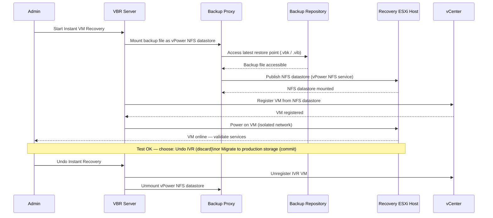

# Veeam — Procedures

Operational procedures covering backup job creation, copy job setup, SOBR management, and restore testing.

## Instant VM Recovery Flow

The Instant VM Recovery (IVR) sequence mounts the backup file directly as an NFS datastore — the VM starts from the backup without waiting for a full restore.



### File-Level Restore Test

For Windows VMs, mount the backup and browse files to confirm data integrity:

1. In the console, right-click the backup job and select **Restore guest files > Microsoft Windows**.
2. Choose the restore point.
3. Browse to a known file (e.g., a log file with a recent timestamp) and confirm it is accessible.
4. Optionally restore one file to an alternate location to confirm write path.

---

## Backup Job Creation Checklist

Before creating a new backup job, confirm the following are defined:

| Parameter | Decision Required |
|---|---|
| VM scope | Individual VMs, container (folder/tag/cluster), or policy-based |
| Proxy assignment | Automatic or specific proxy (network vs. hot-add vs. direct SAN) |
| Repository | Target SOBR or standalone repo — confirm sufficient capacity |
| Retention | Restore points count or GFS (daily/weekly/monthly/yearly) |
| Schedule | Daily window; allow offset if proxy is shared across jobs |
| Application-aware | Enable for VMs with SQL, Exchange, Oracle — requires guest credentials |
| Guest OS credentials | Pre-add credentials to the Veeam Credentials Manager |
| Exclusions | Exclude swap/temp disks, ISO mount points, VMs in dev/test if appropriate |
| Notifications | Enable email or Veeam ONE alert for job failures |

```powershell
# Create a simple VM backup job via PowerShell
$vm     = Find-VBRViEntity -Name "vm01"
$repo   = Get-VBRBackupRepository -Name "SOBR-Primary"
$cred   = Get-VBRCredentials -Name "svc-veeam-guest"

Add-VBRViBackupJob `
    -Name "vm01-daily" `
    -Entity $vm `
    -BackupRepository $repo `
    -GuestCredentials $cred `
    -ApplicationAwareProcessing $true
```

After creation:
- [ ] Run the job once manually and verify success before relying on the schedule.
- [ ] Confirm the restore point appears under **Home > Backups**.
- [ ] Document the job name, scope, repository, and retention in the CMDB or runbook.

---

## Backup Copy Job Setup (Offsite / Cloud Target)

Backup copy jobs pull from a source backup job and write a secondary chain to an offsite or cloud repository. This is the primary mechanism for the 3-2-1 rule.

### Steps

1. Go to **Home > Backup Copy > VMware vSphere Backup...** (or Hyper-V equivalent).
2. Select the **source** — a specific backup job or all backups from a repository.
3. Select the **target repository** — object storage (S3-compatible, Azure Blob, Wasabi, etc.) or a remote Linux/Windows repo.
4. Set the **copy interval** (e.g., every 1 day) and configure GFS retention independently of the source job.
5. Enable **encryption** on the target if the repository is offsite or cloud.

```powershell
# List existing backup copy jobs
Get-VBRJob -Type BackupSync | Select-Object Name, LastResult, LastRun

# Check copy job sessions
Get-VBRBackupSession | Where-Object { $_.JobType -eq "BackupSync" } |
    Sort-Object CreationTime -Descending | Select-Object -First 10 |
    Select-Object JobName, Result, CreationTime, EndTime
```

---

## SOBR Capacity Management

### Offload Policy

In **Backup Infrastructure > Scale-Out Repositories**, select the SOBR and open **Properties > Capacity Tier**. Configure:

- **Move backups older than N days** — set based on how long backups should remain on fast storage before offloading to object storage.
- **Copy backups to object storage as soon as they are created** — use this for a continuous offload model (no delay).
- **Encrypt data uploaded to object storage** — always enable for cloud targets.

```powershell
# Trigger SOBR offload (capacity tier upload)
$sobr = Get-VBRScaleOutBackupRepository -Name "SOBR-Primary"
Invoke-VBRScaleOutBackupRepositoryOffload -ScaleOutBackupRepository $sobr
```

### Sealing Extents

When an extent needs to be decommissioned:

1. Right-click the extent and select **Set to Seal** — Veeam will evacuate data to other extents during the next job run.
2. Monitor evacuation progress in **Backup Infrastructure** until the extent shows 0 restore points.
3. Remove the extent only after it is fully evacuated.
