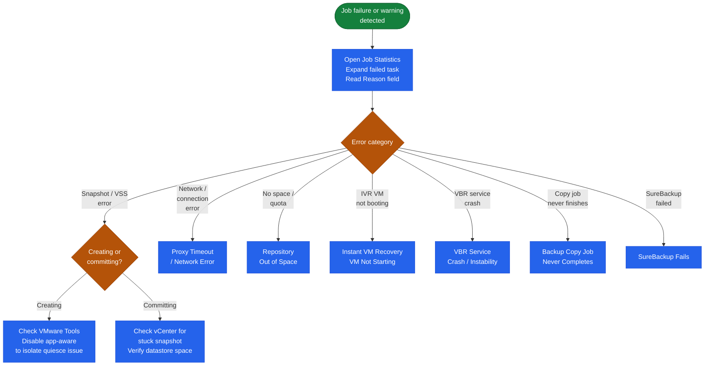

# Veeam — Common Issues


<div class="kb-summary">
Most Veeam job failures fall into a small set of categories: VMware snapshot issues, repository space problems, proxy connectivity timeouts, and Veeam service instability.
</div>

 The first step for any failure is to open the job statistics view in the console — the task-level error message and reason field usually point to the root cause without needing to open log files.

## Triage Decision Tree


┌──────────────────────────────────────── Veeam — Common Issues ────────────────────────────────────────┐
│                                                                                                       │
│   │     Symptom      │   Likely Cause   │    First Check    │       Fix        │      Verify      │   │
│   │Snapshot not relea│proxy error mid-j │  check proxy logs │run snapshot clea │    Get-VBRJob    │   │
│   │    CBT reset     │VMware tools upda │  rescan VM disks  │force full backup │  Reset-VBRVMCBT  │   │
│   │    Repo full     │retention not del │  check GFS config │expire old points │  Remove-VBRBack  │   │
│   │Instant recovery s│NFS mount latency │ check mount serve │migrate to datast │    veeam log     │   │
│   └───────────────────────────────────────────────────────────────────────────────────────────────┘   │
│                                                                                                       │
│   ┌───────────────────────────────────────────────────────────────────────────────────────────────┐   │
│   │                                     General Triage Pattern                                    │   │
│   │          Is the issue new or recurring? New = recent change; Recurring = config problem       │   │
│   │             Is it isolated to one source or all? Isolated = agent; All = server/repo          │   │
│   │                           Check logs first: Start-VBRInstantVMRecovery                        │   │
│   │                    If unresolved in 2h: open vendor case with full log bundle                 │   │
│   └───────────────────────────────────────────────────────────────────────────────────────────────┘   │
│                                                                                                       │
│  Physical Infrastructure:                                                                             │
│  Windows Server (Backup Server) · Proxy VMs on ESXi · Backup storage (NAS/SAN) · Management LAN       │
│  Key terms:                                                                                           │
│                                                                                                       │
│  Backup Server = central Veeam component: scheduler, job engine, catalog, REST API                    │
│  Backup Proxy  = data mover between vSphere and repository; runs in virtual-appliance mode or H       │
│  CBT           = Changed Block Tracking; VMware VADP mechanism to track changed disk sectors          │
│  VADP          = VMware vSphere APIs for Data Protection; enables agentless VM backup                 │
│  SOBR          = Scale-Out Backup Repository; tiers extents; moves cold data to object storage        │
│  Instant Recovery= mounts VM disks from backup directly to ESXi; VM live in seconds                   │
│  SureBackup    = automated backup verification; test-restores VM in isolated virtual lab              │
│  Replication   = creates VM replica at DR site; enables failover without full restore time            │
│  GFS Retention = Grandfather-Father-Son retention: daily, weekly, monthly, yearly restore points      │
│  Immutable Repo= object storage (S3 WORM) or Linux XFS (immutable flag) repo; ransomware protec       │
│  Mount Server  = Windows host presenting backup as iSCSI/NFS datastore for instant recovery           │
│  VeeamZIP      = ad-hoc compressed portable backup of a single VM; no job required                    │
│  Health Check  = periodic backup integrity scan; verifies restore points are readable                 │
│  Forward Incremental= default mode; one full + daily incrementals; synthetic full created perio       │
│                                                                                                       │
└───────────────────────────────────────────────────────────────────────────────────────────────────────┘
```
```powershell

Veeam uses ports 2500–3300 (TCP) for data channel communication between VBR, proxies, and repositories.

**Check proxy resource exhaustion:** if the proxy CPU or RAM is at capacity, tasks queue and eventually time out. Increase max concurrent tasks or add a proxy.

---

## Repository Out of Space

**Symptom:** Job fails with "not enough free disk space on the repository" or "Veeam backup files have been detected outside of the quota."

```powershell
# Check repository free space
Get-VBRBackupRepository | Select Name, FriendlyPath, Path,
  @{N="FreeMB";E={[math]::Round($_.GetContainer().CachedFreeSpace / 1MB)}}
```

**Immediate remediation:**

1. Check if SOBR capacity tier offload is configured and working — manually trigger offload if needed.
2. Identify large backup chains that can be reduced:

```powershell
# Find largest backup chains
Get-VBRBackup | Select JobName, @{N="SizeGB";E={[math]::Round(($_.GetStorageFiles() | Measure-Object -Property Stats -Sum).Sum.DataSize / 1GB, 1)}} | Sort-Object SizeGB -Descending
```

3. Reduce retention policy on some jobs to free space sooner.
4. Delete orphaned backup files (Backups → Orphaned → Remove from disk).

---

## Instant VM Recovery — VM Not Starting

**Symptom:** Instant recovery completes but the recovered VM does not boot, cannot be accessed over the network, or vNIC is not working.

**Check in order:**

1. **Datastore access from recovery proxy** — the proxy needs direct access to the backup repository to mount the NFS datastore used for instant recovery.
2. **Network configuration of the recovered VM** — Instant Recovery places the VM in a publish network by default. Verify it is connected to the correct port group.
3. **Veeam vPower NFS service** — if the NFS service is not running on the proxy, the virtual disk cannot be mounted:

```cmd
# On the Veeam proxy — check the vPower NFS service
Get-Service -Name VeeamVssProvider
Get-Service -Name VeeamNFSSvc
```

---

## VBR Service Crash / Instability

**Symptom:** Jobs fail to start, Veeam console cannot connect, or the VBR service restarts repeatedly.

```cmd
# Check Windows Event Log on the VBR server
Get-EventLog -LogName Application -Source "Veeam*" -Newest 50 | Select TimeGenerated, Message | Format-List

# Check Veeam service log
Get-Content "C:\ProgramData\Veeam\Backup\Svc.VeeamBackup.log" -Tail 100
```

**Restart the VBR service:**

```cmd
# Restart the Veeam Backup Service (all running jobs will be interrupted and resume from checkpoint)
net stop "Veeam Backup Service"
net start "Veeam Backup Service"
```

---

## Backup Copy Job Never Completes

**Symptom:** The backup copy job runs continuously, never reaching a "Success" state, or transfers a tiny amount of data each cycle.

**Check:**

1. **WAN Accelerator stats** — if using WAN Acceleration, check if the cache is populated and the source/target accelerators are connected.
2. **Target repository reachability** — test port 2500–3300 from the source repository server to the target.
3. **Retention difference** — the copy job may be waiting for a full restore point that matches the target retention window.
4. **Seeding** — for a new backup copy job over a slow WAN, seed the initial full backup locally and ship it to the remote site (Veeam seeding procedure).

---

## SureBackup Fails

**Symptom:** SureBackup verification job reports "VM failed to start" or "application test script failed."

```powershell
# Check virtual lab network mapping
Get-VBRVirtualLab | Select Name, Platform, Description
```

1. Verify the **virtual lab network mapping** — the VLan used inside the isolated lab must be mapped to a real port group.
2. Check **test credentials** — SureBackup uses guest credentials to run verification scripts; confirm they are correct and the account is not locked.
3. For application-aware tests (SQL, Exchange), confirm the VM's application services started within the timeout window (default 2 minutes; increase if needed for slow VMs).
4. Check the SureBackup session log for the specific task that failed — it lists which VM and which test step failed.
