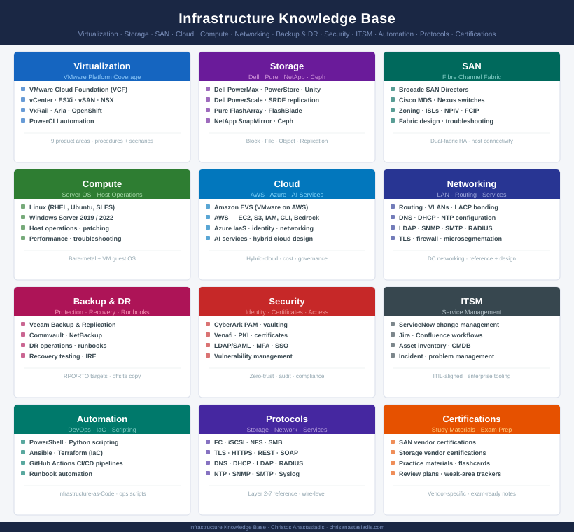

  

    
Infrastructure Engineering · Technical Reference

    <h1>Knowledge Base</h1>
    
Technical reference for enterprise infrastructure — virtualization, storage, SAN, cloud, compute, backup, disaster recovery, security, ITSM, protocols, and automation.

  

  

    <strong>Christos Anastasiadis</strong>
    Infrastructure Engineer
    <a href="/about.html" style="color:rgba(255,255,255,0.7);text-decoration:none;">About</a> &nbsp;·&nbsp; <a href="https://www.linkedin.com/in/canast/" style="color:rgba(255,255,255,0.7);text-decoration:none;">LinkedIn</a> &nbsp;·&nbsp; <a href="mailto:canast01@gmail.com" style="color:rgba(255,255,255,0.7);text-decoration:none;">Email</a>
  

## Platforms

<a class="kb-card" href="virtualization/">
  <strong>Virtualization</strong>
  VMware VCF, vCenter, ESXi, vSAN, NSX, VxRail, and Aria.
</a>

<a class="kb-card" href="storage/">
  <strong>Storage</strong>
  Dell, Pure, NetApp — block, file, object, and replication.
</a>

<a class="kb-card" href="san/">
  <strong>SAN</strong>
  Cisco, Brocade, zoning, fabrics, ISLs, ports, and host paths.
</a>

<a class="kb-card" href="compute/">
  <strong>Compute</strong>
  Windows Server, Linux, host operations, and server support.
</a>

<a class="kb-card" href="cloud/">
  <strong>Cloud</strong>
  AWS and Azure — identity, compute, networking, storage, cost, and AI services.
</a>

<a class="kb-card" href="networking/">
  <strong>Networking</strong>
  Routing, DNS, DHCP, VLANs, and connectivity references.
</a>

<a class="kb-card" href="backup/">
  <strong>Backup & DR</strong>
  Veeam, Commvault, NetBackup — backup products, DR design, runbooks, recovery testing, and IRE.
</a>

<a class="kb-card" href="security/">
  <strong>Security</strong>
  CyberArk, Venafi, PKI, LDAP/SAML, MFA, access review, and vulnerability management.
</a>

<a class="kb-card" href="itsm/">
  <strong>ITSM</strong>
  ServiceNow, Jira, and Confluence — change management, asset inventory, and lifecycle.
</a>

<a class="kb-card" href="automation/">
  <strong>Automation</strong>
  PowerShell, Python, Ansible, Terraform, and GitHub Actions.
</a>

<a class="kb-card" href="networking/protocols/">
  <strong>Protocols</strong>
  Fibre Channel, iSCSI, NFS, SMB, TLS, DNS, DHCP, LDAP, NTP, SNMP, and SMTP.
</a>

<a class="kb-card" href="certifications/">
  <strong>Certifications</strong>
  Study notes, practice exam materials, review plans, and weak-area trackers for SAN and storage vendor certifications.
</a>

<a class="kb-card" href="reference/">
  <strong>Quick Reference</strong>
  Cheat sheets, interaction maps, decision trees, glossary, and version matrices.
</a>

<a class="kb-card" href="labs/">
  <strong>Lab Guides</strong>
  Nested ESXi homelab, vSAN 2-node, NSX-T, and VCF step-by-step walkthroughs.
</a>

