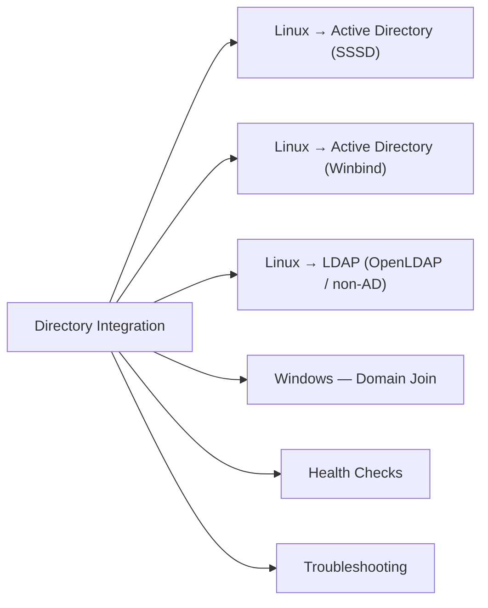

# Directory Integration

Connect Linux and Windows systems to Active Directory or LDAP for centralised authentication, group-based access control, and identity management.



## Linux → Active Directory (SSSD)

### Join Domain

```bash
# Install required packages (RHEL/Rocky)
dnf install -y realmd sssd adcli samba-common-tools krb5-workstation

# Install (Debian/Ubuntu)
apt-get install -y realmd sssd sssd-tools adcli samba-common-bin krb5-user

# Discover domain
realm discover corp.example.com

# Join domain (requires domain admin credentials)
realm join -U administrator corp.example.com

# Verify join
realm list
id administrator@corp.example.com
```

### SSSD Configuration

```ini
# /etc/sssd/sssd.conf
[sssd]
domains = corp.example.com
config_file_version = 2
services = nss, pam

[domain/corp.example.com]
ad_domain = corp.example.com
krb5_realm = CORP.EXAMPLE.COM
realmd_tags = manages-system joined-with-adcli
cache_credentials = True
id_provider = ad
auth_provider = ad
access_provider = ad
krb5_store_password_if_offline = True
default_shell = /bin/bash
fallback_homedir = /home/%u@%d
use_fully_qualified_names = False   # omit @domain suffix for local users
ldap_id_mapping = True
```

```bash
systemctl enable --now sssd
# Test
id <ad-username>
getent passwd <ad-username>
getent group "Domain Admins"
```

### Restrict Login to AD Groups

```bash
# Allow only members of 'linux-admins' AD group to log in
realm permit -g linux-admins@corp.example.com
# Or edit /etc/sssd/sssd.conf:
# access_provider = simple
# simple_allow_groups = linux-admins@corp.example.com
```

## Linux → Active Directory (Winbind)

```bash
# smb.conf excerpt for AD membership
[global]
   workgroup = CORP
   realm = CORP.EXAMPLE.COM
   security = ADS
   idmap config * : range = 10000-19999
   idmap config CORP : backend = rid
   idmap config CORP : range = 1000000-1999999
   winbind use default domain = yes
   winbind enum users = no
   winbind enum groups = no

# Join
net ads join -U administrator
systemctl enable --now winbind

# Test
wbinfo -t        # check trust
wbinfo -u        # list domain users
wbinfo -g        # list domain groups
wbinfo -i <user> # get user info
```

## Linux → LDAP (OpenLDAP / non-AD)

```bash
# SSSD with LDAP provider
# /etc/sssd/sssd.conf
[domain/ldap.example.com]
id_provider = ldap
auth_provider = ldap
ldap_uri = ldaps://ldap.example.com:636
ldap_search_base = dc=example,dc=com
ldap_default_bind_dn = cn=readonly,dc=example,dc=com
ldap_default_authtok = <bind-password>
ldap_tls_reqcert = demand
ldap_tls_cacert = /etc/ssl/certs/internal-ca.crt
```

```bash
# Test LDAP query
ldapsearch -x -H ldaps://ldap.example.com \
  -D "cn=readonly,dc=example,dc=com" -w <password> \
  -b "dc=example,dc=com" "(uid=testuser)" cn mail
```

## Windows — Domain Join

```powershell
# Join to domain
Add-Computer -DomainName "corp.example.com" -Credential (Get-Credential) -Restart

# Verify domain membership
(Get-WmiObject Win32_ComputerSystem).Domain
nltest /dsgetdc:corp.example.com
```

## Health Checks

```bash
# SSSD health
systemctl status sssd
sssctl domain-status corp.example.com    # shows DC used and last successful auth
sssctl cache-expire -u <username>        # force cache refresh for one user

# Kerberos ticket
klist -c                                 # show current tickets
kinit <user>@CORP.EXAMPLE.COM            # obtain ticket manually

# Clear SSSD cache (force re-fetch from DC)
sssctl cache-remove -y && systemctl restart sssd

# Winbind
wbinfo --ping-dc                         # check DC reachable
net ads testjoin                         # verify machine account still valid
```

## Troubleshooting

| Symptom | Check | Action |
|---|---|---|
| `id user` returns nothing | SSSD running? DC reachable? | `systemctl status sssd`; `sssctl domain-status` |
| Authentication failing | Kerberos time drift? | Check `timedatectl`; ensure < 5min skew from DC |
| Group membership stale | Cache not refreshed | `sssctl cache-expire -u <user>`; or `sssctl cache-remove -y` |
| `realm join` fails | Firewall blocking Kerberos (88/tcp,udp)? | Open port 88, 389, 636 to DC |
| Machine account expired | `net ads testjoin` fails | Rejoin: `realm leave` then `realm join` |
| sudoers / PAM not applying AD groups | SSSD `access_provider` misconfigured | Verify `simple_allow_groups` or `ad_access_filter` |
