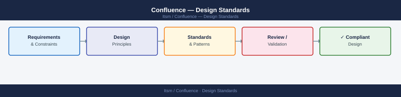

---
tags:
  - architecture
  - confluence
---
# Confluence — Design Standards



```bash
# List global templates
curl -u user:token \
  "https://your-instance.atlassian.net/wiki/rest/api/template?type=global"

# List space-level templates
curl -u user:token \
  "https://your-instance.atlassian.net/wiki/rest/api/template?type=space&spaceKey=ENG"

# Get a specific template by ID
curl -u user:token \
  "https://your-instance.atlassian.net/wiki/rest/api/template/TEMPLATE_ID"
```

```json
// atlassian-connect.json blueprint module entry
{
  "blueprints": [{
    "key": "incident-blueprint",
    "name": "Incident Report",
    "createResult": "edit",
    "template": {"url": "/templates/incident.xml"},
    "wizard": {
      "steps": [{
        "title": "Incident Details",
        "instructions": "Fill in the key incident fields below"
      }]
    }
  }]
}
```

---

```d2
direction: down

network_controls: "Network Controls" {shape: rectangle}
os_hardening: "OS Hardening" {shape: rectangle}
application_security: "Application Security" {shape: rectangle}
audit_monitoring: "Audit & Monitoring" {shape: rectangle}

network_controls -> os_hardening: hardens
os_hardening -> application_security: hardens
application_security -> audit_monitoring: hardens
```

## See also

- [Confluence — Deploy](../../deploy/)
