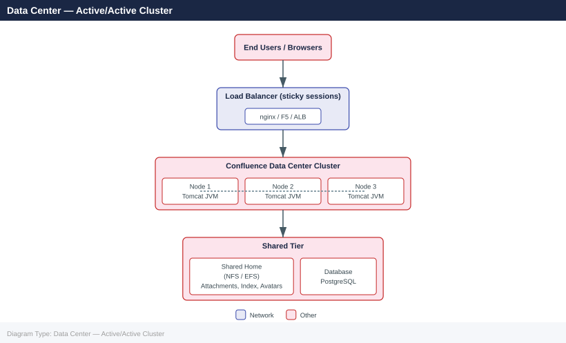

---
tags:
  - architecture
  - confluence
---
# Confluence — How It Works

Confluence is Atlassian's enterprise wiki and collaboration platform, available in three deployment models: **Server** (EOL), **Data Center** (self-managed, HA-capable), and **Cloud** (SaaS).

*Applies to: Confluence Cloud / Data Center*

 This page covers the internal component architecture and deployment topology for on-premises Data Center deployments.

---

## Deployment Models

| Model | Hosting | HA | Clustering | Atlassian Managed |
|---|---|---|---|---|
| Server | Self-hosted | No | No | No |
| Data Center | Self-hosted | Yes | Yes (active/active) | No |
| Cloud | Atlassian infrastructure | Yes | Managed | Yes |

> Confluence Server reached End of Life on **February 15, 2024**. All self-managed deployments should be on Data Center.

---

## Core Components

### Application Server

Confluence runs as a Java web application inside an embedded **Apache Tomcat** servlet container.

| File | Purpose |
|---|---|
| `<CONFLUENCE_HOME>/confluence.cfg.xml` | Database connection, home directory, cluster settings |
| `<CONFLUENCE_INSTALL>/conf/server.xml` | Tomcat connector ports, TLS offload, AJP |
| `<CONFLUENCE_INSTALL>/bin/setenv.sh` | JVM heap, GC flags, system properties |
| `<CONFLUENCE_HOME>/confluence-init.properties` | Override home directory path |

### Database

| Database | Minimum Version | Notes |
|---|---|---|
| PostgreSQL | 14 | Recommended; best tested |
| Microsoft SQL Server | 2017 | Requires JDBC driver drop-in |
| MySQL | 8.0 | Requires explicit collation config |
| Oracle | 19c | Supported; least common |

### Search (Lucene)

Confluence uses an embedded **Apache Lucene** index for full-text search. In Data Center mode, the index lives in the **shared home** directory so all nodes share a single index.

- Index location: `<SHARED_HOME>/index/`
- Rebuilding: **Admin > General Configuration > Content Indexing**

### File / Attachment Storage

| Mode | Location |
|---|---|
| Single node (Server) | `<LOCAL_HOME>/attachments/` |
| Data Center | `<SHARED_HOME>/attachments/` (must be accessible by all nodes) |

### Shared Home vs Local Home (Data Center)

| Directory | Scope | Contents |
|---|---|---|
| Local home (`confluence.home`) | Per node | Temp files, caches, local logs |
| Shared home (`confluence.shared-home`) | Cluster-wide | Attachments, index, avatars, backups, plugins |

---

## Deployment Topology

### Data Center — Active/Active Cluster

---

## Network Port Reference

| Port | Protocol | Component | Notes |
|---|---|---|---|
| 8090 | TCP | Confluence HTTP | Default; front with nginx/443 |
| 5801 | TCP | Hazelcast | Inter-node cluster comms |
| 5432 | TCP | PostgreSQL | From app nodes to DB |
| 25 / 587 | TCP | SMTP | Outbound email |
| 636 / 389 | TCP | LDAP/AD | User directory sync |

---

## Plugin Architecture

Confluence plugins use the **Atlassian Plugin Framework (APF2)**. Plugin states and compatibility flags are stored in the database table `PLUGINVERSION`.

- `<SHARED_HOME>/plugins-osgi-cache/` — compiled plugin artifacts
- `<SHARED_HOME>/bundled-plugins/` — plugins shipped with Confluence

---

## Key Admin URLs

| URL | Purpose |
|---|---|
| `/admin/systeminfo.action` | JVM info, memory, uptime |
| `/admin/clustering.action` | Cluster node status |
| `/admin/indexqueue.action` | Search index queue |
| `/admin/scheduledjobs.action` | Scheduled task status |
| `/admin/logging.action` | Log level control |

---

## See also

- [Confluence — Design Standards](../design-standards/)
- [Confluence — Integrations](../integrations/)
- [Confluence — Deploy](../../deploy/)
