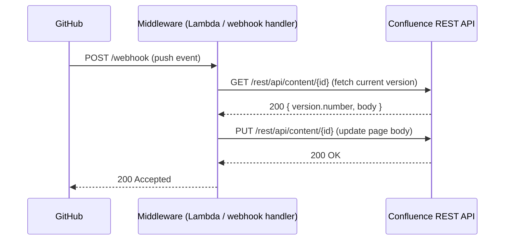

---
tags:
  - architecture
  - confluence
---
# Confluence — Integrations

<div class="kb-summary">
Confluence integrates with a wide range of external systems. This page covers the most common enterprise integrations: Jira, SCM platforms, LDAP/Active Directory, SMTP, webhooks, and the REST API.

*Applies to: Confluence Cloud / Data Center*
</div>

---

## Jira Integration

The Confluence–Jira integration is Atlassian's flagship integration and runs bidirectionally over the **Confluence–Jira Application Links** framework.

### Application Link Setup

1. Go to **Admin > Application Links**
2. Enter the Jira base URL and click **Create new link**
3. On the Jira side, accept the incoming link and grant **Trusted Application** or **OAuth** authentication
4. Choose **2-legged OAuth (2LO)** for service-account-style access without per-user consent

For live repository content, install the **Bitbucket for Confluence** app (Marketplace) which renders repository files inline with diffs and blame views.

### Webhook from GitHub to Confluence (Custom Integration)

If using the REST API to auto-update pages on push:



---

## LDAP / Active Directory Authentication

Confluence supports external user directories via **LDAP** or **Microsoft Active Directory**. Configuration is per-directory and supports multiple directories with priority ordering.

### Adding a Directory

**Admin > User management > User Directories > Add Directory > Microsoft Active Directory** (or Generic LDAP)

Key settings:

| Setting | Example Value | Notes |
|---|---|---|
| URL | `ldaps://dc01.example.com:636` | Use `ldaps://` for TLS |
| Base DN | `DC=example,DC=com` | Root search context |
| User DN | `CN=svc-confluence,OU=Services,DC=example,DC=com` | Bind account |
| User Object Filter | `(&(objectClass=user)(!(userAccountControl:1.2.840.113556.1.4.803:=2)))` | Exclude disabled accounts |
| User Name Attr | `sAMAccountName` | AD; use `uid` for OpenLDAP |
| Group Object Filter | `(objectClass=group)` | |
| Group Member Attr | `member` | AD; use `memberUid` for POSIX |
| Sync Interval (min) | `60` | Background sync frequency |

### Sync Control

```bash
# Trigger an immediate sync via the admin UI:
# Admin > User management > User Directories > [Directory] > Synchronise

# Or via REST (requires admin credentials):
curl -u admin:password \
  -X POST \
  "https://confluence.example.com/rest/api/user-directory/{directoryId}/sync"
```


```text title="Expected output"
{"status":"SYNC_IN_PROGRESS","directoryId":"12345","syncStartTime":"2024-01-15T14:32:18.742Z","estimatedDuration":"45 seconds"}
```

!!! warning "Common errors"
    **`curl: (7) Failed to connect to confluence.example.com port 443: Connection refused`** — Verify the Confluence server is running and accessible; check the hostname and port in your URL.
    **`{"errorMessages":["You do not have permission to perform this operation"],"statusCode":403}`** — Ensure the credentials provided have admin privileges; verify the user account hasn't been restricted or disabled.
    **`curl: (60) SSL certificate problem: self signed certificate`** — Add the `-k` flag to bypass SSL verification for self-signed certificates, or import the certificate into your CA bundle.
### Nested Groups

Enable **Nested Groups** if AD groups contain other groups as members. This has a performance cost on large directories — set a sync interval accordingly and consider flattening the group tree where possible.

---

## SMTP Email Configuration

Confluence sends notifications, password resets, and alerts via SMTP.

**Admin > General Configuration > Mail Servers > Add SMTP Mail Server**

| Field | Example |
|---|---|
| From Address | `confluence@example.com` |
| SMTP Host | `smtp.example.com` |
| SMTP Port | `587` |
| TLS | Enabled (STARTTLS) |
| Username | `svc-confluence-mail@example.com` |
| Password | (service account password / app password) |

### Test SMTP from CLI

```bash
# Quick connectivity test
telnet smtp.example.com 587

# Send a test email via Python (run on the Confluence server)
python3 -c "
import smtplib
from email.message import EmailMessage

msg = EmailMessage()
msg['Subject'] = 'Confluence SMTP Test'
msg['From'] = 'confluence@example.com'
msg['To'] = 'admin@example.com'
msg.set_content('SMTP test from Confluence server.')

with smtplib.SMTP('smtp.example.com', 587) as s:
    s.starttls()
    s.login('svc-confluence-mail@example.com', 'PASSWORD')
    s.send_message(msg)
    print('Sent OK')
"
```


```text title="Expected output"
Trying 203.0.113.42...
Connected to smtp.example.com.
Escape character is '^]'.
220 mail.example.com ESMTP Postfix
^]
telnet> quit
Connection closed.
Sent OK
```

!!! warning "Common errors"
    **`telnet: Unable to connect to remote host: Connection refused`** — Verify the SMTP server is running and listening on port 587, or check firewall rules blocking outbound connections from the Confluence server.
    **`smtplib.SMTPAuthenticationError: (535, b'5.7.8 Error: authentication failed')`** — Confirm the service account credentials (svc-confluence-mail@example.com) are correct and the account is not locked or expired in your mail system.
    **`smtplib.SMTPException: SMTP AUTH extension not supported by server`** — Ensure the SMTP server supports STARTTLS on port 587; verify you're not connecting to a submission port that requires different authentication or TLS negotiation.
### Notification Troubleshooting

- Check **Admin > Mail > Mail Queue** for stuck messages
- Check **Admin > Mail > Mail Error Queue** for failed deliveries
- Enable debug logging: `com.atlassian.confluence.mail` → DEBUG

---

## Webhooks

Confluence Data Center supports outbound webhooks for real-time event notification to external systems.

**Admin > General Configuration > Webhooks > Create Webhook**

### Supported Events

| Event Category | Example Events |
|---|---|
| Page | page_created, page_updated, page_removed, page_restored |
| Blog | blog_created, blog_updated, blog_removed |
| Space | space_created, space_updated, space_removed |
| Comment | comment_created, comment_updated, comment_removed |
| Attachment | attachment_created, attachment_updated |
| User | user_created, user_deactivated |

### Webhook Payload Structure

```json
{
  "timestamp": 1715170800000,
  "event": "page_updated",
  "userKey": "user:abc123",
  "page": {
    "id": "98304",
    "title": "Deployment Runbook",
    "spaceKey": "OPS",
    "url": "https://confluence.example.com/display/OPS/Deployment+Runbook",
    "version": {
      "number": 5,
      "by": "chris.a",
      "when": "2026-05-08T09:00:00.000Z"
    }
  }
}
```

### Webhook Secret Verification (HMAC)

```python
import hashlib, hmac

def verify_confluence_webhook(secret: str, payload: bytes, signature_header: str) -> bool:
    expected = hmac.new(
        secret.encode(), payload, hashlib.sha256
    ).hexdigest()
    return hmac.compare_digest(expected, signature_header)
```

---

## REST API Overview

Confluence exposes two REST API generations.

| API Version | Base Path | Authentication | Notes |
|---|---|---|---|
| REST API v1 | `/rest/api/` | Basic auth, PAT, OAuth 1.0a | Full feature coverage for DC |
| REST API v2 | `/api/v2/` | PAT, OAuth 2.0 | Available DC 8.x+; cleaner design |

### Common Endpoints

| Method | Endpoint | Description |
|---|---|---|
| GET | `/rest/api/space` | List all spaces |
| GET | `/rest/api/space/{spaceKey}` | Get space details |
| GET | `/rest/api/content?spaceKey=OPS&type=page` | List pages in a space |
| GET | `/rest/api/content/{id}?expand=body.storage,version` | Get page with body |
| POST | `/rest/api/content` | Create a new page |
| PUT | `/rest/api/content/{id}` | Update page (must increment `version.number`) |
| DELETE | `/rest/api/content/{id}` | Trash a page |
| GET | `/rest/api/user/current` | Authenticated user info |
| GET | `/rest/api/search?cql=space=OPS` | CQL search |

### Authentication — Personal Access Tokens (PAT)

```bash
# Generate a PAT: Profile > Settings > Personal Access Tokens

# Use in API calls
curl -H "Authorization: Bearer <PAT>" \
  "https://confluence.example.com/rest/api/space"
```


```text title="Expected output"
{
  "results": [
    {
      "id": "0",
      "key": "INFRA",
      "name": "Infrastructure",
      "type": "global",
      "status": "current"
    },
    {
      "id": "1",
      "key": "SEC",
      "name": "Security",
      "type": "global",
      "status": "current"
    },
    {
      "id": "2",
      "key": "NET",
      "name": "Networking",
      "type": "global",
      "status": "current"
    }
  ],
  "start": 0,
  "limit": 25,
  "size": 3,
  "_links": {
    "self": "https://confluence.example.com/rest/api/space"
  }
}
```

!!! warning "Common errors"
    **`curl: (7) Failed to connect to confluence.example.com port 443: Connection refused`** — Verify the Confluence instance hostname and that it is accessible from your network.
    **`{"statusCode":401,"data":{"authorized":false},"message":"Unauthorized"}`** — Ensure the PAT token is valid, not expired, and correctly formatted in the Authorization header without extra whitespace.
    **`curl: (60) SSL certificate problem: self signed certificate`** — Add `-k` flag to skip SSL verification for self-signed certificates, or install the proper CA certificate bundle.
### CQL (Confluence Query Language)

CQL is analogous to Jira's JQL for searching content:

```bash
# Pages modified in the last 7 days in the OPS space
space = "OPS" AND type = page AND lastModified >= "-7d"

# Pages containing specific text created by a user
text ~ "runbook" AND creator = "chris.a" AND type = page

# All blog posts in any space
type = blogpost ORDER BY created DESC
```


```text title="Expected output"
(no output — these are CQL query examples for documentation reference, not executable bash commands)
```
---

## See also

- [Confluence — Design Standards](../design-standards/)
