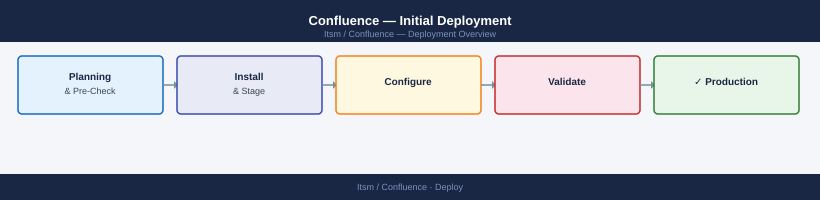

---
tags:
  - confluence
  - deployment
search:
  boost: 1.5
---
# Confluence — Initial Deployment

<div class="kb-summary">
Step-by-step guide to installing Confluence Data Center, configuring the database, setting up LDAP authentication, and validating the deployment.

*Applies to: Confluence Cloud / Data Center*
</div>



## Before you begin

- **Access:** admin credentials for the target system and any upstream dependencies (DNS, NTP, vCenter, directory services)
- **Timing:** safe to run during a scheduled maintenance window; allow 1-2 hours for initial deployment
- **Dependencies:** network connectivity verified; DNS resolvable; NTP configured; any licence keys available
- **Logging:** record every IP address, hostname, and credential set assigned during this deployment

---


## Prerequisites

Before installing Confluence, confirm the following.

**JDK:**

- Eclipse Temurin (AdoptOpenJDK) 11 or 17 — install separately from the system JDK
- Verify with `java -version` after installation
- Set `JAVA_HOME` in the environment before running the installer

**Database:**

- PostgreSQL 14.x or 15.x (recommended) or MySQL 8.0.x
- Create a dedicated database and user before running the setup wizard
- Encoding: UTF-8; PostgreSQL collation: C

**System resources:**

| Parameter | Minimum | Recommended |
|---|---|---|
| RAM | 8 GB | 16 GB |
| vCPU | 4 | 8 |
| App disk | 50 GB | 100 GB |
| Home/attachments disk | 500 GB | 1 TB |

- RHEL 8/9 or Ubuntu 22.04 LTS
- Static IP, DNS forward and reverse records, NTP synchronised
- `ulimit -n` ≥ 65536 — set in `/etc/security/limits.conf`

**Ports:**

- 8090/TCP — Confluence HTTP
- 8091/TCP — Confluence synchrony (collaborative editing)
- 25/TCP or 587/TCP outbound — SMTP for email notifications

---

## Install Confluence

1. Download the Confluence Data Center Linux installer from `https://www.atlassian.com/software/confluence/download`.
2. Make the installer executable and run it:
   ```bash
   chmod +x atlassian-confluence-X.Y.Z-x64.bin
   sudo ./atlassian-confluence-X.Y.Z-x64.bin
   ```
3. Follow the installer prompts:
   - **Installation type:** Custom
   - **Install directory:** `/opt/atlassian/confluence`
   - **Home directory:** `/var/atlassian/application-data/confluence`
   - **TCP ports:** accept defaults (8090, 8091) unless conflicts exist
   - **Start Confluence automatically:** yes
4. The installer creates the `confluence` system user and starts the service.
5. Confirm Confluence is running:
   ```bash
   sudo systemctl status confluence
   ```
6. Watch the startup log:
   ```bash
   tail -f /opt/atlassian/confluence/logs/catalina.out
   ```

---

## Configure Database

**Create the database and user (run as postgres):**

```bash
sudo -u postgres psql
CREATE USER confluence WITH PASSWORD 'secure-password-here';
CREATE DATABASE confluence OWNER confluence ENCODING 'UTF8' LC_COLLATE 'C' LC_CTYPE 'C' TEMPLATE template0;
GRANT ALL PRIVILEGES ON DATABASE confluence TO confluence;
\q
```

**Run the Confluence setup wizard:**

1. Open a browser to `http://<confluence-server>:8090`.
2. On the **Get apps** screen, click **Skip** (apps can be added later).
3. On the **Licence** screen, enter the Confluence Data Center licence key from `my.atlassian.com`.
4. On the **Choose setup** screen, select **Production installation**.
5. On the **Database configuration** screen:
   - Database type: **PostgreSQL**
   - Setup type: **Simple**
   - Hostname: `localhost` (or DB server IP)
   - Port: `5432`
   - Database name: `confluence`
   - Username: `confluence`
   - Password: the password set above
6. Click **Next** — Confluence creates the schema (5–15 minutes).

**Set JVM heap:**

Edit `/opt/atlassian/confluence/bin/setenv.sh`:

```bash
CATALINA_OPTS="-Xms2g -Xmx8g ${CATALINA_OPTS}"
```

Restart: `sudo systemctl restart confluence`

---

## Create First Space

1. After completing the setup wizard, log in as the admin account.
2. Click **Spaces → Create space**.
3. Select **Team Space** for a general-purpose shared knowledge space.
4. Enter:
   - **Space name:** e.g. `IT Operations`
   - **Space key:** e.g. `ITOPS` (short identifier, used in page URLs)
5. Click **Create**.
6. The space home page opens — click **Create** to add the first page and confirm editing works.

**Recommended spaces to create at launch:**

| Space name | Key | Purpose |
|---|---|---|
| IT Operations | ITOPS | Runbooks, procedures, on-call |
| Engineering | ENG | Design docs, ADRs, RFCs |
| HR & Company | HR | Policies, org charts, onboarding |
| Projects | PROJ | Project documentation |

---

## Configure LDAP Authentication

1. Navigate to **Administration (cog icon) → User management → User directories**.
2. Click **Add directory** and select **Microsoft Active Directory** or **OpenLDAP**.
3. Configure the LDAP connection:
   - **Server:** LDAP server FQDN (e.g. `dc01.company.local`)
   - **Port:** 636 (LDAPS recommended) or 389 (LDAP)
   - **Use SSL:** yes (if using port 636)
   - **Bind DN:** service account DN (e.g. `CN=svc-confluence,OU=ServiceAccounts,DC=company,DC=local`)
   - **Bind password:** service account password
   - **Base DN:** user search base (e.g. `OU=Users,DC=company,DC=local`)
4. Under **Schema settings**, confirm:
   - User object class: `person` (AD) or `inetOrgPerson` (OpenLDAP)
   - Username attribute: `sAMAccountName` (AD) or `uid` (OpenLDAP)
   - Email attribute: `mail`
5. Click **Test Settings** — the test must return a successful bind and user count.
6. Click **Save and Test**.
7. Set the directory order so LDAP is above the internal directory.

**Group synchronisation:**

1. In the same LDAP directory settings, expand **Group settings**.
2. Set the group object class and membership attribute.
3. Map LDAP groups to Confluence groups for space and global permissions.

---

## Install Recommended Add-ons

1. Navigate to **Administration → Manage apps → Find new apps**.
2. Search for and install the following:

| App | Purpose |
|---|---|
| **Draw.io (Confluence)** | Embedded diagram creation and editing |
| **Table Filter and Charts for Confluence** | Advanced table filtering and inline charts |
| **Refined for Confluence** | Improved navigation and intranet features |
| **Gliffy Diagrams** | Alternative diagramming if draw.io is not preferred |

3. After installing each app, click **Enable** and confirm the status shows **Enabled**.
4. Apply app licences from `my.atlassian.com` where required.

---

## Configure Backup Schedule

Confluence includes a built-in XML backup and can integrate with filesystem-level backups.

**Built-in scheduled backup:**

1. Navigate to **Administration → Configuration → Backup administration**.
2. Enable **Scheduled backups**.
3. Set the backup schedule (recommended: daily at 02:00).
4. Set the **Backup path** to a directory on a separate volume (not the Confluence home disk).
5. Set **Backup retention** to 7 days.
6. Click **Save**.

**Important:** The built-in XML backup is not suitable for large instances (>1 GB home directory). For large instances, use filesystem snapshots or a dedicated backup tool.

**Recommended backup approach for production:**

```bash
# Stop Confluence (or take a consistent snapshot while running with flush)
sudo systemctl stop confluence

# Back up the home directory
rsync -av /var/atlassian/application-data/confluence/ /backup/confluence/$(date +%F)/

# Back up the database
pg_dump -U confluence confluence > /backup/confluence-db-$(date +%F).sql

# Start Confluence
sudo systemctl start confluence
```

---

## Validate Deployment

**Application health:**

```bash
# Check Confluence process
sudo systemctl status confluence

# Confirm Confluence responds
curl -I http://localhost:8090
# Expected: HTTP 200

# Check for OOM errors
grep -i "out of memory" /opt/atlassian/confluence/logs/catalina.out
```

**Web UI:**

- Log in as admin — dashboard loads with the first space visible
- Log in as an LDAP user — login succeeds and the user's display name shows correctly
- Create a page in the first space — page saves and the URL uses the correct base URL

**Collaborative editing (Synchrony):**

- Open a page in edit mode and confirm the real-time editing toolbar appears
- If Synchrony fails to connect, check: `sudo systemctl status confluence` and review `synchrony.log` in the Confluence home directory

**Backup:**

- Navigate to **Administration → Backup administration** and click **Back up now**
- Confirm the backup file appears in the configured backup path

**LDAP:**

- Navigate to **Administration → User management** and search for an AD user — the user must appear in the results
- Confirm the user can log in and is assigned to the correct Confluence groups

---

## Verify

- Confirm the service or component is running and reachable
- Check management UI for any errors or warnings
- Run a basic functional test (login, read, write) to confirm end-to-end operation

---

## See also

- [Confluence — Procedures](../operations/procedures/)
- [Confluence — Common Issues](../troubleshooting/common-issues/)
- [Confluence — How It Works](../architecture/how-it-works/)
