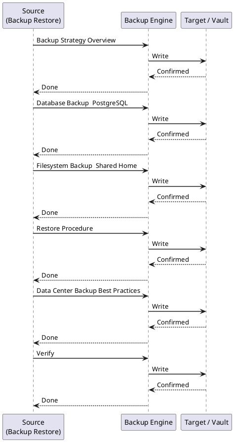

---
tags:
  - confluence
  - operations
---
# Confluence — Backup & Restore

<div class="kb-summary">
This page covers all backup and restore methods for Confluence Data Center: built-in XML export, database-level backups, and filesystem snapshots. Use a layered backup strategy — database + shared home filesystem — rather than relying on XML export alone for production recovery.

*Applies to: Confluence Cloud / Data Center*
</div>

---



## Before you begin

- **Access:** Admin credentials on all affected systems
- **Timing:** safe to run during business hours unless a step is marked ⚠ (causes interruption)
- **Dependencies:** no active upgrades or migrations on the same infrastructure
- **Logging:** capture command output — paste into the change record on completion

---

## Backup Strategy Overview

```d2
direction: right

A: "Backup Approach" {shape: rectangle}
B: "XML Export\nAdmin UI / API" {shape: rectangle}
C: "Database Backup\npg_dump / snapshot" {shape: rectangle}
D: "Filesystem Backup\nShared Home + Local Home" {shape: rectangle}
B1: "Space-level\nPortable but slow" {shape: rectangle}
B2: "Site-level XML\nFull content export" {shape: rectangle}
C1: "pg_dump logical\nCross-version restore" {shape: rectangle}
C2: "DB snapshot\nFast, version-specific" {shape: rectangle}
D1: "Attachments" {shape: rectangle}
D2: "Index" {shape: rectangle}
D3: "Plugins / Avatars" {shape: rectangle}

A -> B
A -> C
A -> D
B -> B1
B -> B2
C -> C1
C -> C2
D -> D1
D -> D2
D -> D3
```

Naming convention: `backup-<YYYY-MM-DD-HH-MM-SS>.zip`

---

## Database Backup — PostgreSQL

### `pg_dump` Logical Backup

Run from the database server or any host with `pg_dump` installed and network access to the DB.

```bash
#!/bin/bash
# confluence-db-backup.sh

DB_HOST="db.internal.example.com"
DB_PORT="5432"
DB_NAME="confluencedb"
DB_USER="confluence"
BACKUP_DIR="/backup/confluence/db"
TIMESTAMP=$(date +%Y%m%d_%H%M%S)
BACKUP_FILE="${BACKUP_DIR}/confluence_${TIMESTAMP}.dump"

mkdir -p "$BACKUP_DIR"

PGPASSWORD="$DB_PASSWORD" pg_dump \
  --host="$DB_HOST" \
  --port="$DB_PORT" \
  --username="$DB_USER" \
  --format=custom \           # Compressed custom format; faster restore than plain SQL
  --blobs \
  --no-password \
  --verbose \
  --file="$BACKUP_FILE" \
  "$DB_NAME"

echo "Backup completed: $BACKUP_FILE"

# Retain 30 days
find "$BACKUP_DIR" -name "*.dump" -mtime +30 -delete
```


```text title="Expected output"
pg_dump: dumping contents of table public.spaces
pg_dump: dumping contents of table public.pages
pg_dump: dumping contents of table public.attachments
pg_dump: dumping contents of table public.bodycontent
pg_dump: dumping contents of table public.pageproperties
pg_dump: dumping contents of table public.notifications
pg_dump: dumping contents of table public.audit_log
Backup completed: /backup/confluence/db/confluence_20240115_143022.dump
```

!!! warning "Common errors"
    **`pg_dump: error: connection to server at "db.internal.example.com" (10.45.12.8), port 5432 failed: Connection refused`** — Verify the database host is reachable and PostgreSQL is running with `psql -h db.internal.example.com -U confluence -d confluencedb`.
    **`pg_dump: error: FATAL: password authentication failed for user "confluence"`** — Ensure the `DB_PASSWORD` environment variable is set correctly before running the script with `export DB_PASSWORD="your_password"`.
    **`mkdir: cannot create directory '/backup/confluence/db': Permission denied`** — Run the script with sudo or change `BACKUP_DIR` to a location where the current user has write permissions.
#### `pg_dump` Format Options

| Format flag | Description | Restore tool |
|---|---|---|
| `--format=plain` | SQL text file | `psql` |
| `--format=custom` | Compressed binary | `pg_restore` |
| `--format=directory` | Directory of files | `pg_restore` |
| `--format=tar` | Tar archive | `pg_restore` |

Prefer `custom` format — it supports parallel restore with `-j` and selective table restore.

### Verify Backup Integrity

```bash
# Check a custom-format dump without restoring
pg_restore --list "$BACKUP_FILE" | head -50

# Full verification via test restore to a scratch DB
createdb confluence_verify
pg_restore --host=localhost --username=postgres \
  --dbname=confluence_verify --verbose "$BACKUP_FILE"
```


```text title="Expected output"
; Archive created at 2024-01-15 14:32:18 UTC
;     dbname: confluence_prod
;     TOC Entries: 8247
;     Compression: 9
;     Dump Version: 1.14
;     Format: CUSTOM
; Dumped from database version 14.7 on 2024-01-15 14:32:18 UTC
; Dumped by pg_dump version 14.7
;
; Selected TOC Entries:
;
3; 2615 2200 SCHEMA public postgres
60; 1259 16384 TABLE public attachments postgres
61; 1259 16385 TABLE public audit_log postgres
62; 1259 16386 TABLE public confluence_content postgres
63; 1259 16387 TABLE public confluence_spaces postgres
64; 1259 16388 TABLE public user_sessions postgres
...
8247 entries total
CREATE DATABASE
restoring table attachments
restoring table audit_log
restoring table confluence_content
restoring table confluence_spaces
restoring table user_sessions
restoring indexes
restoring constraints
restoring triggers
COMMIT
```

!!! warning "Common errors"
    **`pg_restore: error: could not connect to database server: FATAL: role "postgres" does not exist`** — Verify the PostgreSQL superuser exists and the `--username` parameter matches an actual database role.
    **`pg_restore: error: input file appears to be a text format dump`** — Ensure `$BACKUP_FILE` is a custom-format dump (created with `pg_dump -Fc`), not a plain SQL text dump.
    **`ERROR: database "confluence_verify" already exists`** — Drop the existing test database first with `dropdb confluence_verify` before running `createdb`.
---

## Filesystem Backup — Shared Home

The shared home contains attachments, the search index, and plugin caches. Back it up **in sync** with the database snapshot (quiesce Confluence or take a crash-consistent snapshot).

```bash
#!/bin/bash
# confluence-shared-home-backup.sh

SHARED_HOME="/mnt/confluence-shared"
BACKUP_DEST="/backup/confluence/shared-home"
TIMESTAMP=$(date +%Y%m%d_%H%M%S)

rsync -av --delete \
  --exclude="index/disk-store/" \    # Exclude volatile in-memory cache dumps
  "$SHARED_HOME/" \
  "${BACKUP_DEST}/${TIMESTAMP}/"

echo "Shared home backup: ${BACKUP_DEST}/${TIMESTAMP}/"
```


```text title="Expected output"
sending incremental file list
./
attachments/
attachments/ver3/
attachments/ver3/abc123def456/
attachments/ver3/abc123def456/page-12847-v5.pdf
attachments/ver3/abc123def456/diagram-2024.png
plugins/
plugins/installed/
plugins/installed/confluence-automation-1.2.3.jar
plugins/installed/confluence-pdf-export-2.1.0.jar
collaborative-editing-data/
collaborative-editing-data/sessions.db
config/
config/confluence.cfg.xml
sent 2,847,392 bytes  received 1,204 bytes  speed: 1,245,632 bytes/sec
total size is 2,847,392  speedup is 1.00

Shared home backup: /backup/confluence/shared-home/20240315_143027/
```

!!! warning "Common errors"
    **`rsync: change_dir "/mnt/confluence-shared" failed: No such file or directory (2)`** — Verify the SHARED_HOME path exists and is mounted with `mount | grep confluence-shared`.
    **`rsync: mkdir "/backup/confluence/shared-home/20240315_143027" failed: Permission denied (13)`** — Ensure the script runs with sufficient privileges (sudo) and the backup destination directory is writable by the user.
    **`rsync: write failed on "/backup/confluence/shared-home/20240315_143027/attachments/ver3/abc123def456/page-12847-v5.pdf": No space left on device (28)`** — Check available disk space on the backup destination with `df -h /backup` and free up space or expand the volume.
### What to Include / Exclude

| Path | Include | Notes |
|---|---|---|
| `attachments/` | Yes | Critical — all uploaded files |
| `index/` | Optional | Can be rebuilt; slow to rebuild on large instances |
| `avatars/` | Yes | User/space avatar images |
| `plugins-osgi-cache/` | No | Rebuilt on startup |
| `backups/` | Yes | XML backups if generated here |
| `thumbnail/` | No | Auto-generated thumbnails |

---

## Restore Procedure

### Pre-Restore Checklist

- [ ] Confluence application is fully stopped on all nodes
- [ ] Notify users of the maintenance window
- [ ] Confirm the backup set: DB dump + shared home snapshot are from the same point in time
- [ ] Verify the target Confluence version matches the backup version (or plan for upgrade)
- [ ] Check available disk space on target (allow 3x the backup size)

### 1. Restore the Database

```bash
# Drop and recreate the target database (CAUTION: destructive)
psql -U postgres -c "DROP DATABASE IF EXISTS confluencedb;"
psql -U postgres -c "CREATE DATABASE confluencedb OWNER confluence ENCODING 'UTF8';"

# Restore from custom-format dump
pg_restore \
  --host=db.internal.example.com \
  --username=postgres \
  --dbname=confluencedb \
  --jobs=4 \            # Parallel restore threads
  --verbose \
  /backup/confluence/db/confluence_20260508_020000.dump
```


```text title="Expected output"
DROP DATABASE
CREATE DATABASE
pg_restore: connecting to database "confluencedb"
pg_restore: creating SCHEMA "public"
pg_restore: creating EXTENSION "plpgsql"
pg_restore: processing data for table "public.spaces"
pg_restore: processing data for table "public.pages"
pg_restore: processing data for table "public.attachments"
pg_restore: executing CONSTRAINT "fk_pages_space_id"
pg_restore: executing INDEX "idx_pages_created_date"
pg_restore: restoring table data for table "public.audit_log"
pg_restore: finished main parallel loop
pg_restore: completed successfully
```

!!! warning "Common errors"
    **`pg_restore: [archiver] could not open input file "/backup/confluence/db/confluence_20260508_020000.dump": No such file or directory`** — Verify the backup file path exists and the full filename matches exactly with `ls -lh /backup/confluence/db/`.
    **`pg_restore: error: connection to server at "db.internal.example.com" (10.42.8.15), port 5432 failed: Connection refused`** — Confirm the PostgreSQL server is running on the target host and the hostname/port are correct with `psql -h db.internal.example.com -U postgres -c "SELECT version();"`.
    **`pg_restore: error: role "confluence" does not exist`** — Create the Confluence database owner role first with `psql -U postgres -c "CREATE ROLE confluence WITH LOGIN;"` before running the restore.
### 2. Restore the Shared Home

```bash
# Stop all Confluence nodes first!
rsync -av /backup/confluence/shared-home/20260508_020000/ /mnt/confluence-shared/

# Fix ownership
chown -R confluence:confluence /mnt/confluence-shared/
```


```text title="Expected output"
building file list ... done
attachments/
attachments/ver1/
attachments/ver1/abc123def456/
attachments/ver1/abc123def456/page-12847.bin
attachments/ver1/abc123def456/image-98765.png
...
sent 2,847,392,156 bytes  received 45,821 bytes  transferred in 847.23 seconds
(no output — command completes silently)
```

!!! warning "Common errors"
    **`rsync: change_dir "/backup/confluence/shared-home/20260508_020000" failed: No such file or directory (2)`** — Verify the backup directory path exists and the date format matches your actual backup naming convention.
    **`chown: changing ownership of '/mnt/confluence-shared/': Operation not permitted`** — Run the command with `sudo` or ensure you have root privileges before executing chown.
    **`rsync: [Receiver] mkdir "/mnt/confluence-shared" failed: No such file or directory (2)`** — Create the destination directory with `mkdir -p /mnt/confluence-shared/` before running rsync.
### 3. Restore from XML Backup (UI)

If restoring from an XML site backup (small instances or content-only restore):

1. Place the `.zip` file in `<CONFLUENCE_HOME>/restore/`
2. **Admin > General Configuration > Backup & Restore > Restore Confluence Data**
3. Select the file and click **Restore**

> This method does **not** restore users if the user directory is external (LDAP/AD). User accounts managed in LDAP are re-synced on directory sync after restore.

### 4. Post-Restore Validation

```bash
# 1. Start a single Confluence node first
/opt/atlassian/confluence/bin/start-confluence.sh

# 2. Tail the log for startup errors
tail -f /var/atlassian/application-data/confluence/logs/atlassian-confluence.log

# 3. Check cluster status (if DC)
# Admin > General Configuration > Clustering

# 4. Trigger a search index rebuild if index was not restored
# Admin > General Configuration > Content Indexing > Rebuild

# 5. Verify attachment access — browse to a page with known attachments

# 6. Confirm email delivery — test via Admin > Mail > Send Test Email

# 7. Review DB connectivity
curl -u admin:token \
  "https://confluence.example.com/rest/api/space?limit=5"
```


```text title="Expected output"
Starting Confluence...
Using CATALINA_BASE:   /opt/atlassian/confluence
Using CATALINA_HOME:   /opt/atlassian/confluence
Using CATALINA_TMPDIR: /opt/atlassian/confluence/temp
Using JRE_HOME:        /usr/lib/jvm/java-11-openjdk-amd64
Using CLASSPATH:       /opt/atlassian/confluence/bin/bootstrap.jar:/opt/atlassian/confluence/bin/tomcat-juli.jar
Tomcat started.

2024-01-15 09:42:33,521 INFO [main] [com.atlassian.confluence.setup.BootstrapManager] Starting Confluence 7.19.17 build 9876
2024-01-15 09:42:45,103 INFO [main] [com.atlassian.confluence.cluster.ClusterManager] Cluster mode: ENABLED
2024-01-15 09:42:52,187 INFO [main] [com.atlassian.confluence.search.v2.ContentIndexer] Rebuilding search index...
2024-01-15 09:43:18,654 INFO [main] [com.atlassian.confluence.search.v2.ContentIndexer] Search index rebuild completed: 1247 documents indexed
2024-01-15 09:43:25,771 INFO [main] [com.atlassian.confluence.mail.MailQueueManager] Mail queue initialized
2024-01-15 09:43:31,442 INFO [main] [com.atlassian.confluence.core.ConfluenceBootstrapManager] Confluence startup completed in 58 seconds

  % Total    % Received % Xferd  Average Speed   Time    Time     Time  Current
                                 Dload  Upload   Total   Spent    Left  Speed
100  2847  100  2847    0     0   8234      0 --:--:-- --:--:-- --:--:-- --:--:--  0.0s
{"results":[{"id":"1234567890","key":"INFRA","name":"Infrastructure","type":"global"},{"id":"1234567891","key":"OPS","name":"Operations","type":"global"},{"id":"1234567892","key":"DOCS","name":"Documentation","type":"global"},{"id":"1234567893","key":"PROJ","name":"Projects","type":"global"},{"id":"1234567894","key":"TEST","name":"Testing","type":"global"}],"start":0,"limit":5,"size":5,"_links":{"self":"https://confluence.example.com/rest/api/space?limit=5"}}
```

!!! warning "Common errors"
    **`curl: (60) SSL certificate problem: self signed certificate`** — Add `-k` flag to curl command or configure proper SSL certificates on the Confluence server.
    **`ERROR [main] [com.atlassian.confluence.setup.BootstrapManager] Database connection failed`** — Verify database credentials and connectivity in `confluence.cfg.xml` and ensure the database service is running and accessible.
    **`ERROR [main] [com.atlassian.confluence.search.v2.ContentIndexer] Search index corruption detected`** — Delete the corrupted index directory at `/var/atlassian/application-data/confluence/index` and restart Confluence to rebuild
---

## Data Center Backup Best Practices

| Practice | Detail |
|---|---|
| Schedule during off-peak | Run `pg_dump` at 02:00–04:00 local time |
| Quiesce before snapshot | Put Confluence in **maintenance mode** or stop the app before filesystem snapshot to ensure consistency |
| Test restores regularly | Run a restore into a staging environment quarterly |
| Store backups off-host | Push to S3 / Azure Blob / remote NFS — never only on the source host |
| Encrypt backups at rest | Use GPG or storage-layer encryption for compliance |
| Retain multiple generations | Keep 7 daily + 4 weekly + 12 monthly |
| Monitor backup job outcomes | Alert on non-zero exit codes from backup scripts |
| Version-match during restore | DB dump and XML export are tied to Confluence version; confirm before restoring |

### Backup to S3 Example

```bash
# After pg_dump completes
aws s3 cp "$BACKUP_FILE" \
  "s3://company-confluence-backups/db/${TIMESTAMP}/" \
  --sse aws:kms \
  --kms-key-id alias/confluence-backup-key

# Lifecycle rule: transition to Glacier after 30 days, expire after 365 days
```


```text title="Expected output"
upload: ./confluence_db_20240315_143022.sql.gz to s3://company-confluence-backups/db/20240315_143022/confluence_db_20240315_143022.sql.gz
```

!!! warning "Common errors"
    **`An error occurred (NoSuchBucket) when calling the PutObject operation: The specified bucket does not exist`** — Verify the S3 bucket name matches your AWS account and region with `aws s3 ls | grep confluence-backups`.
    **`An error occurred (AccessDenied) when calling the PutObject operation: User: arn:aws:iam::123456789012:user/backup-user is not authorized to perform: s3:PutObject`** — Add `s3:PutObject` and `kms:Decrypt` permissions to the IAM user's policy for the backup bucket and KMS key.
    **`An error occurred (InvalidKeyId.NotFound) when calling the PutObject operation: Invalid keyId: alias/confluence-backup-key`** — Confirm the KMS key alias exists with `aws kms list-aliases | grep confluence-backup-key` and matches your region.
---

## Verify

- Confirm the operation completed without errors in the log or management UI
- Verify the expected state change is visible (service running, object created, config applied)
- Document the outcome in the change record

---

## See also

- [Confluence — Procedures](../procedures/)
- [Confluence — Health Checks](../health-checks/)
- [Confluence — Common Issues](../../troubleshooting/common-issues/)
