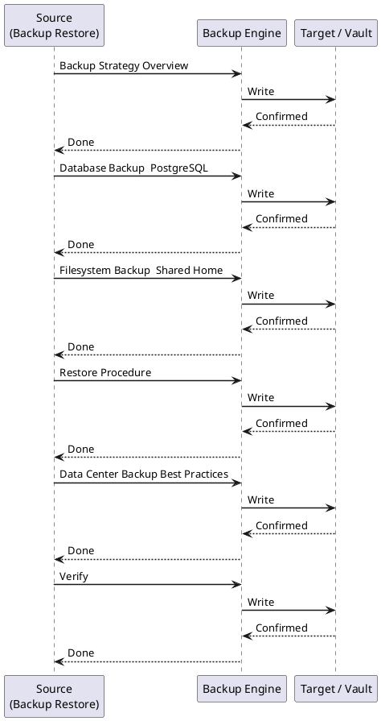

---
tags:
  - confluence
  - operations
---
# Confluence — Backup & Restore

<div class="kb-summary">
This page covers all backup and restore methods for Confluence Data Center: built-in XML export, database-level backups, and filesystem snapshots. Use a layered backup strategy — database + shared home filesystem — rather than relying on XML export alone for production recovery.

*Applies to: Confluence Cloud / Data Center*
</div>

---



## Before you begin

- **Access:** Admin credentials on all affected systems
- **Timing:** safe to run during business hours unless a step is marked ⚠ (causes interruption)
- **Dependencies:** no active upgrades or migrations on the same infrastructure
- **Logging:** capture command output — paste into the change record on completion

---

## Backup Strategy Overview

```d2
direction: right

A: "Backup Approach" {shape: rectangle}
B: "XML Export\nAdmin UI / API" {shape: rectangle}
C: "Database Backup\npg_dump / snapshot" {shape: rectangle}
D: "Filesystem Backup\nShared Home + Local Home" {shape: rectangle}
B1: "Space-level\nPortable but slow" {shape: rectangle}
B2: "Site-level XML\nFull content export" {shape: rectangle}
C1: "pg_dump logical\nCross-version restore" {shape: rectangle}
C2: "DB snapshot\nFast, version-specific" {shape: rectangle}
D1: "Attachments" {shape: rectangle}
D2: "Index" {shape: rectangle}
D3: "Plugins / Avatars" {shape: rectangle}

A -> B
A -> C
A -> D
B -> B1
B -> B2
C -> C1
C -> C2
D -> D1
D -> D2
D -> D3
```

Naming convention: `backup-<YYYY-MM-DD-HH-MM-SS>.zip`

---

## Database Backup — PostgreSQL

### `pg_dump` Logical Backup

Run from the database server or any host with `pg_dump` installed and network access to the DB.

```bash
#!/bin/bash
# confluence-db-backup.sh

DB_HOST="db.internal.example.com"
DB_PORT="5432"
DB_NAME="confluencedb"
DB_USER="confluence"
BACKUP_DIR="/backup/confluence/db"
TIMESTAMP=$(date +%Y%m%d_%H%M%S)
BACKUP_FILE="${BACKUP_DIR}/confluence_${TIMESTAMP}.dump"

mkdir -p "$BACKUP_DIR"

PGPASSWORD="$DB_PASSWORD" pg_dump \
  --host="$DB_HOST" \
  --port="$DB_PORT" \
  --username="$DB_USER" \
  --format=custom \           # Compressed custom format; faster restore than plain SQL
  --blobs \
  --no-password \
  --verbose \
  --file="$BACKUP_FILE" \
  "$DB_NAME"

echo "Backup completed: $BACKUP_FILE"

# Retain 30 days
find "$BACKUP_DIR" -name "*.dump" -mtime +30 -delete
```

#### `pg_dump` Format Options

| Format flag | Description | Restore tool |
|---|---|---|
| `--format=plain` | SQL text file | `psql` |
| `--format=custom` | Compressed binary | `pg_restore` |
| `--format=directory` | Directory of files | `pg_restore` |
| `--format=tar` | Tar archive | `pg_restore` |

Prefer `custom` format — it supports parallel restore with `-j` and selective table restore.

### Verify Backup Integrity

```bash
# Check a custom-format dump without restoring
pg_restore --list "$BACKUP_FILE" | head -50

# Full verification via test restore to a scratch DB
createdb confluence_verify
pg_restore --host=localhost --username=postgres \
  --dbname=confluence_verify --verbose "$BACKUP_FILE"
```

---

## Filesystem Backup — Shared Home

The shared home contains attachments, the search index, and plugin caches. Back it up **in sync** with the database snapshot (quiesce Confluence or take a crash-consistent snapshot).

```bash
#!/bin/bash
# confluence-shared-home-backup.sh

SHARED_HOME="/mnt/confluence-shared"
BACKUP_DEST="/backup/confluence/shared-home"
TIMESTAMP=$(date +%Y%m%d_%H%M%S)

rsync -av --delete \
  --exclude="index/disk-store/" \    # Exclude volatile in-memory cache dumps
  "$SHARED_HOME/" \
  "${BACKUP_DEST}/${TIMESTAMP}/"

echo "Shared home backup: ${BACKUP_DEST}/${TIMESTAMP}/"
```

### What to Include / Exclude

| Path | Include | Notes |
|---|---|---|
| `attachments/` | Yes | Critical — all uploaded files |
| `index/` | Optional | Can be rebuilt; slow to rebuild on large instances |
| `avatars/` | Yes | User/space avatar images |
| `plugins-osgi-cache/` | No | Rebuilt on startup |
| `backups/` | Yes | XML backups if generated here |
| `thumbnail/` | No | Auto-generated thumbnails |

---

## Restore Procedure

### Pre-Restore Checklist

- [ ] Confluence application is fully stopped on all nodes
- [ ] Notify users of the maintenance window
- [ ] Confirm the backup set: DB dump + shared home snapshot are from the same point in time
- [ ] Verify the target Confluence version matches the backup version (or plan for upgrade)
- [ ] Check available disk space on target (allow 3x the backup size)

### 1. Restore the Database

```bash
# Drop and recreate the target database (CAUTION: destructive)
psql -U postgres -c "DROP DATABASE IF EXISTS confluencedb;"
psql -U postgres -c "CREATE DATABASE confluencedb OWNER confluence ENCODING 'UTF8';"

# Restore from custom-format dump
pg_restore \
  --host=db.internal.example.com \
  --username=postgres \
  --dbname=confluencedb \
  --jobs=4 \            # Parallel restore threads
  --verbose \
  /backup/confluence/db/confluence_20260508_020000.dump
```

### 2. Restore the Shared Home

```bash
# Stop all Confluence nodes first!
rsync -av /backup/confluence/shared-home/20260508_020000/ /mnt/confluence-shared/

# Fix ownership
chown -R confluence:confluence /mnt/confluence-shared/
```

### 3. Restore from XML Backup (UI)

If restoring from an XML site backup (small instances or content-only restore):

1. Place the `.zip` file in `<CONFLUENCE_HOME>/restore/`
2. **Admin > General Configuration > Backup & Restore > Restore Confluence Data**
3. Select the file and click **Restore**

> This method does **not** restore users if the user directory is external (LDAP/AD). User accounts managed in LDAP are re-synced on directory sync after restore.

### 4. Post-Restore Validation

```bash
# 1. Start a single Confluence node first
/opt/atlassian/confluence/bin/start-confluence.sh

# 2. Tail the log for startup errors
tail -f /var/atlassian/application-data/confluence/logs/atlassian-confluence.log

# 3. Check cluster status (if DC)
# Admin > General Configuration > Clustering

# 4. Trigger a search index rebuild if index was not restored
# Admin > General Configuration > Content Indexing > Rebuild

# 5. Verify attachment access — browse to a page with known attachments

# 6. Confirm email delivery — test via Admin > Mail > Send Test Email

# 7. Review DB connectivity
curl -u admin:token \
  "https://confluence.example.com/rest/api/space?limit=5"
```

---

## Data Center Backup Best Practices

| Practice | Detail |
|---|---|
| Schedule during off-peak | Run `pg_dump` at 02:00–04:00 local time |
| Quiesce before snapshot | Put Confluence in **maintenance mode** or stop the app before filesystem snapshot to ensure consistency |
| Test restores regularly | Run a restore into a staging environment quarterly |
| Store backups off-host | Push to S3 / Azure Blob / remote NFS — never only on the source host |
| Encrypt backups at rest | Use GPG or storage-layer encryption for compliance |
| Retain multiple generations | Keep 7 daily + 4 weekly + 12 monthly |
| Monitor backup job outcomes | Alert on non-zero exit codes from backup scripts |
| Version-match during restore | DB dump and XML export are tied to Confluence version; confirm before restoring |

### Backup to S3 Example

```bash
# After pg_dump completes
aws s3 cp "$BACKUP_FILE" \
  "s3://company-confluence-backups/db/${TIMESTAMP}/" \
  --sse aws:kms \
  --kms-key-id alias/confluence-backup-key

# Lifecycle rule: transition to Glacier after 30 days, expire after 365 days
```

---

## Verify

- Confirm the operation completed without errors in the log or management UI
- Verify the expected state change is visible (service running, object created, config applied)
- Document the outcome in the change record

---

## See also

- [Confluence — Procedures](../procedures/)
- [Confluence — Health Checks](../health-checks/)
- [Confluence — Common Issues](../../troubleshooting/common-issues/)
