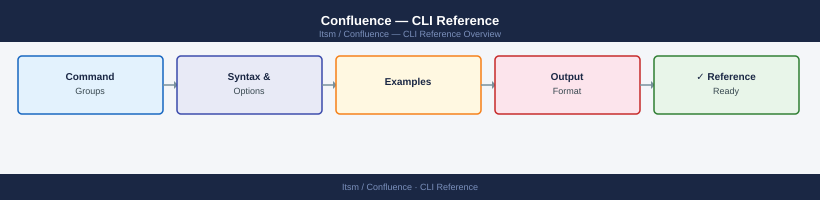

---
tags:
  - confluence
  - operations
---
# Confluence — CLI Reference



```bash
# Set common variables to avoid repetition
export CF_URL="https://confluence.example.com"
export CF_TOKEN="<your-PAT-here>"
export CF_AUTH="Authorization: Bearer ${CF_TOKEN}"
```

```bash
# Get current authenticated user
curl -s -H "$CF_AUTH" \
  "${CF_URL}/rest/api/user/current" | jq '{username, displayName, email}'

# Get a user by username
curl -s -H "$CF_AUTH" \
  "${CF_URL}/rest/api/user?username=chris.a" | jq '.'

# List members of a group
curl -s -H "$CF_AUTH" \
  "${CF_URL}/rest/api/group/confluence-administrators/member" \
  | jq '.results[].username'

# Add user to a group
curl -s -X POST -H "$CF_AUTH" -H "Content-Type: application/json" \
  "${CF_URL}/rest/api/group/confluence-users/user?accountId=<accountId>" 

# Get all groups
curl -s -H "$CF_AUTH" \
  "${CF_URL}/rest/api/group?limit=50" | jq '.results[].name'
```
```bash
# Get labels on a page
curl -s -H "$CF_AUTH" \
  "${CF_URL}/rest/api/content/12345/label" | jq '.results[].name'

# Add a label to a page
curl -s -X POST -H "$CF_AUTH" -H "Content-Type: application/json" \
  "${CF_URL}/rest/api/content/12345/label" \
  -d '[{"prefix": "global", "name": "runbook"}]'

# List watchers of a page
curl -s -H "$CF_AUTH" \
  "${CF_URL}/rest/api/content/12345/notification/child-created" | jq '.'
```
```bash
#!/bin/bash
# export-all-pages.sh — outputs CSV: space_key,page_id,page_title

CF_URL="https://confluence.example.com"
CF_TOKEN="<PAT>"
OUTPUT="all_pages_$(date +%Y%m%d).csv"

echo "space_key,page_id,page_title" > "$OUTPUT"

# Get all space keys
spaces=$(curl -s -H "Authorization: Bearer $CF_TOKEN" \
  "${CF_URL}/rest/api/space?limit=500" | jq -r '.results[].key')

for space in $spaces; do
  start=0
  limit=50
  while true; do
    resp=$(curl -s -H "Authorization: Bearer $CF_TOKEN" \
      "${CF_URL}/rest/api/content?spaceKey=${space}&type=page&limit=${limit}&start=${start}")
    count=$(echo "$resp" | jq '.results | length')
    [ "$count" -eq 0 ] && break
    echo "$resp" | jq -r --arg s "$space" \
      '.results[] | [$s, .id, .title] | @csv' >> "$OUTPUT"
    start=$((start + limit))
  done
  echo "  Exported space: $space"
done

echo "Done. Output: $OUTPUT"
```
```bash
#!/bin/bash
# delete-pages-by-label.sh — trash all pages with a given label in a space

SPACE="OPS"
LABEL="deprecated"
CF_URL="https://confluence.example.com"
CF_TOKEN="<PAT>"

page_ids=$(curl -s -H "Authorization: Bearer $CF_TOKEN" \
  "${CF_URL}/rest/api/content/search?cql=space=${SPACE}+AND+label=${LABEL}+AND+type=page&limit=200" \
  | jq -r '.results[].id')

for pid in $page_ids; do
  echo "Trashing page ID: $pid"
  curl -s -X DELETE -H "Authorization: Bearer $CF_TOKEN" \
    "${CF_URL}/rest/api/content/${pid}"
done
```
```bash
# Download from https://bobswift.atlassian.net/wiki/spaces/ACLI/
# Requires Java 11+

wget https://bobswift.atlassian.net/wiki/download/.../acli-9.x.x-distribution.zip
unzip acli-9.x.x-distribution.zip -d /opt/acli
chmod +x /opt/acli/acli.sh
ln -s /opt/acli/acli.sh /usr/local/bin/acli
```
```bash
# Base connection options (use in all commands)
ACLI_OPTS="--server https://confluence.example.com \
  --user admin \
  --password ${ADMIN_PASS} \
  --product confluence"

# Get space info
acli $ACLI_OPTS --action getSpace --space OPS

# Create a page from a file
acli $ACLI_OPTS \
  --action addPage \
  --space OPS \
  --title "New Page from CLI" \
  --file page_content.html \
  --parent "Parent Page Title"

# Export a space to XML
acli $ACLI_OPTS \
  --action exportSpace \
  --space OPS \
  --exportType xml \
  --file /tmp/OPS_export.zip

# Copy a page to another space
acli $ACLI_OPTS \
  --action copyPage \
  --space OPS \
  --title "Source Page Title" \
  --toSpace ARCHIVE \
  --toTitle "Archived: Source Page Title"

# Run a CQL query and export results to CSV
acli $ACLI_OPTS \
  --action runFromCql \
  --cql "space = OPS AND label = runbook" \
  --outputFormat csv \
  --file runbooks.csv
```
```bash
# Start Confluence
/opt/atlassian/confluence/bin/start-confluence.sh

# Stop Confluence (graceful)
/opt/atlassian/confluence/bin/stop-confluence.sh

# Check if Confluence process is running
pgrep -fl "confluence" || echo "Not running"

# Check listen port
ss -tlnp | grep 8090
```
```bash
# Production-recommended JVM flags
JAVA_OPTS="-Xms4g -Xmx8g \
  -XX:+UseG1GC \
  -XX:G1HeapRegionSize=16m \
  -XX:MaxGCPauseMillis=500 \
  -XX:MaxMetaspaceSize=1g \
  -XX:+HeapDumpOnOutOfMemoryError \
  -XX:HeapDumpPath=/var/atlassian/application-data/confluence/dumps/ \
  -Djava.awt.headless=true \
  -Dfile.encoding=UTF-8 \
  -Dconfluence.document.conversion.threads=4"
```
```bash
# Find the Confluence PID
CONF_PID=$(pgrep -f "confluence" | head -1)

# Capture three thread dumps 10 seconds apart (for analysis)
for i in 1 2 3; do
  kill -3 "$CONF_PID"      # Dumps to catalina.out / GC log
  # OR use jstack:
  jstack "$CONF_PID" > "/tmp/threaddump_${i}_$(date +%H%M%S).txt"
  sleep 10
done
```
```bash
# On-demand heap dump (non-destructive, app stays up)
CONF_PID=$(pgrep -f "confluence" | head -1)
jmap -dump:format=b,file=/tmp/confluence-heap-$(date +%Y%m%d%H%M).hprof "$CONF_PID"

# Analyze with Eclipse MAT or VisualVM
```
```text
Admin > General Configuration > Logging and Profiling
```
```bash
# Enable debug for LDAP
curl -s -X PUT -H "$CF_AUTH" -H "Content-Type: application/json" \
  "${CF_URL}/rest/api/admin/logging" \
  -d '{"level": "DEBUG", "package": "com.atlassian.confluence.user.crowd"}'
```
```groovy
// List all spaces with page counts
import com.atlassian.confluence.spaces.SpaceManager
import com.atlassian.confluence.pages.PageManager
import com.atlassian.spring.container.ContainerManager

def spaceManager = ContainerManager.getComponent('spaceManager') as SpaceManager
def pageManager  = ContainerManager.getComponent('pageManager') as PageManager

spaceManager.getAllSpaces().each { space ->
    def count = pageManager.getPages(space, true).size()
    println "${space.key}: ${count} pages"
}
```
```groovy
// Find pages not updated in 2+ years
import com.atlassian.confluence.pages.PageManager
import com.atlassian.confluence.spaces.SpaceManager
import com.atlassian.spring.container.ContainerManager
import java.time.Instant
import java.time.temporal.ChronoUnit

def cutoff = Instant.now().minus(730, ChronoUnit.DAYS)
def pageManager = ContainerManager.getComponent('pageManager') as PageManager
def spaceManager = ContainerManager.getComponent('spaceManager') as SpaceManager

spaceManager.getAllSpaces().each { space ->
    pageManager.getPages(space, true).each { page ->
        if (page.getLastModificationDate().toInstant().isBefore(cutoff)) {
            println "${space.key} | ${page.id} | ${page.title} | ${page.getLastModificationDate()}"
        }
    }
}
```

```d2
direction: right

center: "Cli Reference" {shape: rectangle}
verify: "Verify" {shape: rectangle}

center -> verify
```

## Before you begin

- **Access:** Admin credentials on all affected systems
- **Timing:** safe to run during business hours unless a step is marked ⚠ (causes interruption)
- **Dependencies:** no active upgrades or migrations on the same infrastructure
- **Logging:** capture command output — paste into the change record on completion

---

---

## Verify

- Confirm the operation completed without errors in the log or management UI
- Verify the expected state change is visible (service running, object created, config applied)
- Document the outcome in the change record

---

## See also

- [Confluence — Procedures](../procedures/)
- [Confluence — Scripts](../scripts/)
- [Confluence — Health Checks](../health-checks/)
