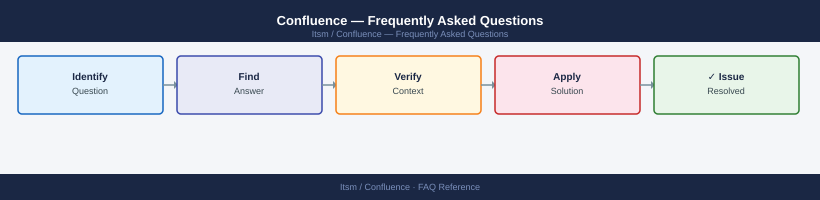

---
tags:
  - confluence
  - faq
  - operations
---
# Confluence — Frequently Asked Questions

Common questions about Confluence operations, configuration, and troubleshooting. For step-by-step procedures, see the <a href="index.md">Operations</a> section.

## General

**Q: What Confluence version is recommended?**
A: Confluence Data Center 8.x for self-hosted. Cloud is always current. Check version via Admin → System Information. Stay within 2 major versions of latest for security support.

**Q: How do I check the current Confluence version?**
A: `Admin → System Information → Confluence version`

## Configuration

**Q: What is the default attachment storage location and when should it change?**
A: Local filesystem by default. For Data Center, switch to shared NFS/object storage immediately — local storage does not support clustering. Configure in Admin → Attachments.

**Q: How do I enable Confluence Analytics?**
A: Analytics is built into Confluence Cloud. For Data Center, install the Confluence Analytics (Beta) app from Marketplace. Requires Data Center license. Enable per-space under Space Settings.

## Operations

**Q: How do I upgrade Confluence Data Center with minimal downtime?**
A: Put Confluence in read-only mode before upgrade. Back up the home directory and database. Run the installer. For clustered DC, stop all nodes, upgrade one, verify, then start remaining nodes. Rolling upgrades are not supported.

**Q: What is the correct procedure to create a new Space with consistent permissions?**
A: Create via Spaces → Create Space. Apply a Space Permission Template if configured. Add the Space to the relevant group permissions. Set the Space home page and description before announcing to users.

## Troubleshooting

**Q: Confluence shows 'Your Confluence installation is approaching its user limit'. What does it mean?**
A: The licensed user count is near the cap. Audit inactive users (Admin → User Management → filter by last login) and deactivate dormant accounts. Or purchase additional user licenses from Atlassian.

**Q: Confluence pages load slowly — where do I start?**
A: Check the Confluence thread dump (Admin → Logging and Profiling → Thread dump). Review JVM heap usage. Check database slow query log. Disable unused plugins (Admin → Manage Apps → filter inactive). Index rebuild may help.

## Backup and Recovery

**Q: How often should I back up Confluence?**
A: Database backup daily (outside backup window). Home directory backup daily (includes attachments). Built-in XML backup is for migration only — not suitable for production backup due to size and restore time.

**Q: Can I restore a single Space without a full Confluence restore?**
A: For Data Center, use the Space Export/Import feature (Space Settings → Export). This exports pages and attachments for that space. For a full point-in-time restore of a space, you need to restore to a separate instance and re-import.

## See Also

- [Confluence Operations](index.md)
- [Confluence Troubleshooting](../../troubleshooting//)
