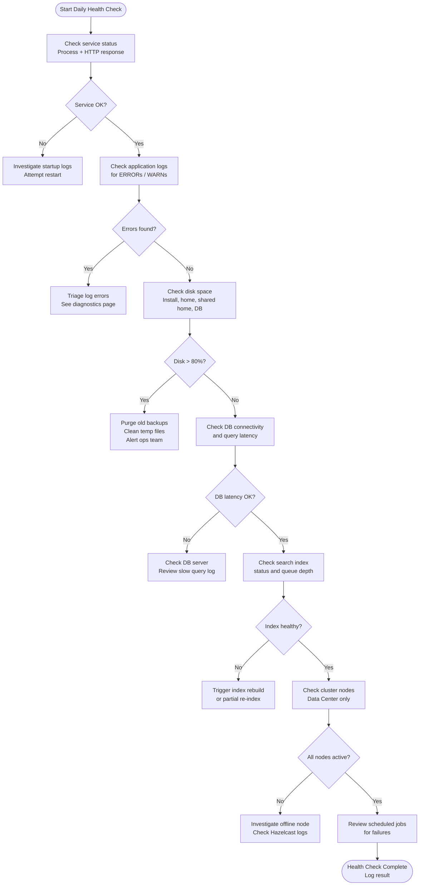

---
tags:
  - confluence
  - operations
---
# Confluence — Health Checks


<div class="kb-summary">
This page defines the daily health check procedure for Confluence Data Center. Run these checks as part of a morning operational routine or automate them with a monitoring script.
</div>

---

## Health Check Flow


```text
┌───────────────────────────────────── Confluence — Health Checks ──────────────────────────────────────┐
│                                                                                                       │
│   ┌──────────────────────────────────────────────┐  ┌─────────────────────────────────────────────┐   │
│   │              Application Health              │  │            Infrastructure Health            │   │
│   │               GET /status → OK               │  │                DB connection                │   │
│   │               Heap usage < 80%               │  │                  Disk < 80%                 │   │
│   │             Thread count normal              │  │               NFS mount check               │   │
│   │                No OOM in logs                │  │               Backup completed              │   │
│   │               Search index OK                │  │                  SMTP test                  │   │
│   └──────────────────────────────────────────────┘  └─────────────────────────────────────────────┘   │
│                                                                                                       │
│  Physical Infrastructure:                                                                             │
│  Confluence server · PostgreSQL · NFS for home dir · SMTP relay · load balancer                       │
│                                                                                                       │
│  Key terms:                                                                                           │
│                                                                                                       │
│  GET /status = Confluence health endpoint; returns RUNNING or error state                             │
│  Heap usage = JVM heap percentage; >80% risks OOM; check via Admin > System Info                      │
│  OOM = OutOfMemoryError; kills Confluence if heap exhausted; check catalina.out                       │
│  Thread count = Active HTTP threads; high count indicates slow requests backing up                    │
│  Search index = Lucene index in CONFLUENCE_HOME/index; trigger reindex if stale                       │
│  DB connection = Confluence checks DB pool; if exhausted, pages fail to load                          │
│  NFS mount = CONFLUENCE_HOME on NFS; if unmounted, attachments return 404                             │
│  SMTP test = Send test email from Admin > Mail Servers; confirms notifications work                   │
│  Backup completed = Check CONFLUENCE_HOME/backups/ for fresh archive                                  │
│  System Info = Admin > System Information; shows memory, JVM version, and config                      │
│                                                                                                       │
└───────────────────────────────────────────────────────────────────────────────────────────────────────┘
```

## Run This Routine

1. **Confluence service status** — On Linux run `systemctl status confluence`; on Windows run `net start | findstr /i confluence`; the service must be active and running; if stopped, check `catalina.out` for the last error before restarting.
2. **Cluster health (Data Center)** — Navigate to **Confluence Admin → General Configuration → Clustering**; confirm all expected nodes appear with state `ACTIVE`; a missing or `OFFLINE` node means the cluster is degraded and failover capacity is reduced.
3. **Database connectivity** — Navigate to **Confluence Admin → General Configuration → Troubleshooting and Support → System Information**; confirm the database connection pool shows active connections and no pool exhaustion; alternatively check via `psql -U confluence -d confluencedb -c "SELECT 1;"` from the app server.
4. **Index status** — Navigate to **Confluence Admin → General Configuration → Content Indexing**; confirm the index state is not currently rebuilding and the queue depth is near zero; a persistently growing queue or a stuck reindex will cause search results to be stale or unavailable.
5. **Disk space** — Run `df -h /var/atlassian/application-data/confluence` and also check the shared home mount if Data Center; alert if any volume exceeds 80%; the shared home fills gradually with attachments and backups and is the most common cause of disk-related outages.
6. **Mail server** — Navigate to **Confluence Admin → Mail Servers** and use the **Send Test Email** function; confirm the test email is received; a failing mail server means all Confluence notifications (page watches, mentions, space admin alerts) are silently dropped.
7. **Recent errors** — Run `tail -100 /var/atlassian/application-data/confluence/logs/atlassian-confluence.log | grep -i error`; review any error lines for patterns such as `OutOfMemoryError`, `Could not get JDBC Connection`, or `LuceneIndex`; recurring errors should be opened as incidents rather than ignored.

Response states:

| State | Meaning |
|---|---|
| `RUNNING` | Fully operational |
| `STARTING` | Startup in progress (wait) |
| `STOPPING` | Shutdown in progress |
| `ERROR` | Failed — check logs immediately |
| `FIRST_RUN` | Awaiting setup wizard |

---

## 2. Log Checks

### Log Locations

| Log File | Purpose |
|---|---|
| `<CONFLUENCE_HOME>/logs/atlassian-confluence.log` | Main application log |
| `<INSTALL>/logs/catalina.out` | Tomcat stdout / JVM output |
| `<CONFLUENCE_HOME>/logs/atlassian-confluence-security.log` | Authentication events |
| `<CONFLUENCE_HOME>/logs/atlassian-confluence-index-recovery.log` | Index recovery events |

### Quick Error Scan

```bash
LOG="/var/atlassian/application-data/confluence/logs/atlassian-confluence.log"

# Count errors in the last 24 hours (assumes log rotation daily)
grep -c "ERROR" "$LOG"

# Show the last 20 error lines with timestamp
grep "ERROR" "$LOG" | tail -20

# Look for OOM indicators
grep -E "(OutOfMemoryError|java.lang.OutOfMemory)" "$LOG" | tail -5

# Check for LDAP/login failures
grep -E "(AuthenticationException|CrowdException|LDAP)" "$LOG" | tail -10

# Check for index errors
grep -E "(IndexException|LuceneIndex|index corrupt)" "$LOG" | tail -10
```

---

## 3. Disk Space

```bash
#!/bin/bash
# confluence-disk-check.sh

WARN_THRESHOLD=80
CRIT_THRESHOLD=90
INSTALL_DIR="/opt/atlassian/confluence"
HOME_DIR="/var/atlassian/application-data/confluence"
SHARED_HOME="/mnt/confluence-shared"

check_disk() {
  local path="$1"
  local label="$2"
  local pct
  pct=$(df -h "$path" | awk 'NR==2 {gsub(/%/,"",$5); print $5}')
  if [ "$pct" -ge "$CRIT_THRESHOLD" ]; then
    echo "CRITICAL: $label at ${pct}% ($path)"
  elif [ "$pct" -ge "$WARN_THRESHOLD" ]; then
    echo "WARNING: $label at ${pct}% ($path)"
  else
    echo "OK: $label at ${pct}% ($path)"
  fi
}

check_disk "$INSTALL_DIR"  "Install directory"
check_disk "$HOME_DIR"     "Local home"
check_disk "$SHARED_HOME"  "Shared home (attachments/index)"

# Show largest directories under shared home
echo ""
echo "Top 10 directories in shared home:"
du -sh "${SHARED_HOME}/"* 2>/dev/null | sort -rh | head -10
```

---

## 4. Database Connectivity and Latency

### Connectivity Test

```bash
# PostgreSQL connectivity from app server
psql -h db.internal.example.com -U confluence -d confluencedb \
  -c "SELECT version();" 2>&1 | grep -E "(PostgreSQL|error|FATAL)"

# Connection count (compare to max_connections)
psql -h db.internal.example.com -U confluence -d confluencedb \
  -c "SELECT count(*) AS active_connections FROM pg_stat_activity WHERE state = 'active';"

# Check max connections setting
psql -h db.internal.example.com -U confluence -d confluencedb \
  -c "SHOW max_connections;"
```

### Latency Test

```bash
# Simple query latency measurement
time psql -h db.internal.example.com -U confluence -d confluencedb \
  -c "SELECT id, title FROM content WHERE contenttype = 'PAGE' LIMIT 100;" \
  > /dev/null
```

| Metric | OK | Warning | Critical |
|---|---|---|---|
| DB connect time | < 100 ms | 100–500 ms | > 500 ms |
| Simple query time | < 200 ms | 200 ms–1 s | > 1 s |
| Active connections | < 70% of max | 70–90% of max | > 90% of max |

---

## 5. Search Index Status

```bash
# REST API — check indexing queue size
curl -s -H "Authorization: Bearer $CF_TOKEN" \
  "https://confluence.example.com/rest/api/search/index" | jq '.'

# Admin UI equivalents:
# Admin > General Configuration > Content Indexing
# Admin > General Configuration > Troubleshooting and Support > Index Tracker
```

Via the admin console, check:

- **Index state**: Should be `CONNECTED` or `NORMAL`
- **Queue size**: Should be near 0 during off-peak; a persistently growing queue indicates the indexer is falling behind
- **Last reindex time**: Should match the last content modification time

### Trigger a Re-index (if needed)

```bash
# Trigger re-indexing via REST
curl -s -X POST -H "Authorization: Bearer $CF_TOKEN" \
  "https://confluence.example.com/rest/api/search/index/reindex"
```

---

## 6. Cluster Node Status (Data Center)

```bash
# Admin UI: Admin > General Configuration > Clustering

# REST API — cluster node info
curl -s -H "Authorization: Bearer $CF_TOKEN" \
  "https://confluence.example.com/rest/api/cluster/nodes" | jq '.'

# Expected output structure:
# {
#   "nodes": [
#     { "id": "...", "address": "10.0.1.11", "state": "ACTIVE", "version": "8.5.4" },
#     { "id": "...", "address": "10.0.1.12", "state": "ACTIVE", "version": "8.5.4" },
#     { "id": "...", "address": "10.0.1.13", "state": "ACTIVE", "version": "8.5.4" }
#   ]
# }
```

Cluster checks:

| Check | Expected | Alert If |
|---|---|---|
| All nodes present | N nodes active | Any node absent |
| Hazelcast membership | N members | Member count < N |
| Node version | All identical | Version mismatch |
| Cache sync status | In sync | Drift > 1 min |

### Hazelcast Port Connectivity

```bash
# From node-2, verify port 5801 is reachable on node-1
nc -zv 10.0.1.11 5801 && echo "OK" || echo "FAIL"
```

---

## 7. Scheduled Jobs

**Admin > General Configuration > Scheduled Jobs**

Jobs to verify are not failing:

| Job | Default Schedule | Failure Impact |
|---|---|---|
| Send Batch Notification Email | Every 10 min | Delayed email notifications |
| Flush Edit Sessions | Every 30 min | Stale collaborative edits |
| Clean Temporary Directory | Daily 01:00 | Disk fill up |
| Storage Optimisation | Weekly | Increased DB/attachment storage |
| Cluster Safety Check | Every 5 min (DC) | Split-brain risk undetected |

---

## Key Metrics Reference Table

| Metric | Collection Method | Healthy Range | Action if Breached |
|---|---|---|---|
| JVM heap used | JMX / `/status` endpoint | < 80% Xmx | Increase heap or tune |
| GC pause time | GC log / JMX | < 500 ms | Tune G1GC settings |
| HTTP response time | Synthetic monitor | < 3 s (page load) | Investigate DB / plugin |
| DB active connections | `pg_stat_activity` | < 70% of max_connections | Increase pool or max_conn |
| Disk usage (shared home) | `df -h` | < 80% | Archive old content, expand vol |
| Index queue depth | Admin UI | 0–10 (off-peak) | Trigger re-index |
| Cluster nodes active | Admin > Clustering | = expected node count | Investigate offline node |
| Error rate in log | `grep -c ERROR` | 0–5 / hour | Triage each error |
| Mail queue depth | Admin > Mail | 0 (queue clears) | Check SMTP connectivity |

---

## Health Check Script (Automated)

```bash
#!/bin/bash
# confluence-healthcheck.sh — run via cron, output to log / alerting system

CF_URL="https://confluence.example.com"
CF_TOKEN="<PAT>"
REPORT="/var/log/confluence-health-$(date +%Y%m%d).log"
FAILURES=0

check() {
  local label="$1"
  local result="$2"
  local expected="$3"
  if [[ "$result" == *"$expected"* ]]; then
    echo "OK  | $label" | tee -a "$REPORT"
  else
    echo "FAIL| $label — got: $result" | tee -a "$REPORT"
    ((FAILURES++))
  fi
}

# 1. HTTP status
status=$(curl -sf "${CF_URL}/status" | jq -r '.state' 2>/dev/null)
check "HTTP status" "$status" "RUNNING"

# 2. Disk space
disk_pct=$(df /mnt/confluence-shared | awk 'NR==2 {gsub(/%/,"",$5); print $5}')
[ "$disk_pct" -lt 80 ] && check "Disk space (shared home)" "OK" "OK" \
  || check "Disk space (shared home)" "FAIL (${disk_pct}%)" "OK"

# 3. DB connectivity
db_ok=$(psql -h db.internal.example.com -U confluence -d confluencedb \
  -c "SELECT 1;" -t 2>&1 | grep -c "1")
[ "$db_ok" -eq 1 ] && check "DB connectivity" "OK" "OK" \
  || check "DB connectivity" "FAIL" "OK"

# 4. Error count in log
error_count=$(grep -c "ERROR" \
  /var/atlassian/application-data/confluence/logs/atlassian-confluence.log 2>/dev/null)
[ "$error_count" -lt 10 ] && check "Log error count" "OK (${error_count})" "OK" \
  || check "Log error count" "FAIL (${error_count} errors)" "OK"

echo "---" | tee -a "$REPORT"
echo "Health check complete. Failures: $FAILURES" | tee -a "$REPORT"

# Exit non-zero so cron / monitoring detects failures
exit $FAILURES
```
