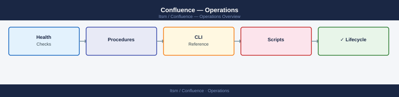

---
tags:
  - confluence
  - operations
---
# Confluence — Operations

Confluence day-to-day operations — space administration, permissions, content maintenance, and user management.

*Applies to: Confluence Cloud / Data Center*

<a class="kb-card" href="cli-reference/">
  <strong>CLI Reference</strong>
  REST API commands and CLI tooling.
</a>

<a class="kb-card" href="health-checks/">
  <strong>Health Checks</strong>
  Instance health monitoring and validation.
</a>

<a class="kb-card" href="procedures/">
  <strong>Procedures</strong>
  Page management, cleanup, and search procedures.
</a>

<a class="kb-card" href="install-upgrade/">
  <strong>Install & Upgrade</strong>
  Installation and upgrade procedures.
</a>

<a class="kb-card" href="backup-restore/">
  <strong>Backup & Restore</strong>
  Backup strategies and restore procedures.
</a>

<a class="kb-card" href="scripts/">
  <strong>Scripts</strong>
  Automation scripts and utilities.
</a>

