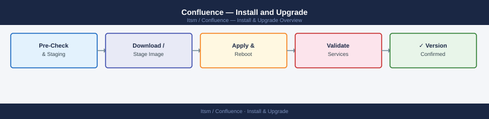

---
tags:
  - confluence
  - operations
---
# Confluence — Install and Upgrade



```bash
# Record current version
curl -s -H "Authorization: Bearer $CF_TOKEN" \
  "https://confluence.example.com/rest/api/settings/systemInfo" \
  | jq '{version, buildNumber}'

# List installed apps and versions
curl -s -H "Authorization: Bearer $CF_TOKEN" \
  "https://confluence.example.com/rest/api/plugins/1.0/" \
  | jq '.plugins[] | {key: .key, version: .version, enabled: .enabled}'
```

```bash
# Back up the install directory
TIMESTAMP=$(date +%Y%m%d_%H%M%S)
cp -rp /opt/atlassian/confluence /opt/atlassian/confluence_backup_${TIMESTAMP}

# Back up the local home
cp -rp /var/atlassian/application-data/confluence \
  /var/atlassian/application-data/confluence_backup_${TIMESTAMP}

echo "Backup created: confluence_backup_${TIMESTAMP}"
```
```bash
# Make the installer executable
chmod +x atlassian-confluence-9.x.x-x64.bin

# Run the installer (interactive)
./atlassian-confluence-9.x.x-x64.bin

# The installer will:
# 1. Detect existing installation
# 2. Offer "Upgrade existing installation"
# 3. Confirm install directory and home directory
# 4. Upgrade application files

# For unattended/automated upgrades, use a response file:
./atlassian-confluence-9.x.x-x64.bin -q -varfile response.varfile
```
```properties
app.install.service$Boolean=true
existingInstallationDir=/opt/atlassian/confluence
sys.confirmedUpdateInstallationString=true
launch.application$Boolean=false
```
```bash
INSTALL_DIR="/opt/atlassian/confluence"
BACKUP_DIR="/opt/atlassian/confluence_backup_${TIMESTAMP}"

# Compare and restore JVM settings
diff "${BACKUP_DIR}/bin/setenv.sh" "${INSTALL_DIR}/bin/setenv.sh"
# Manually apply custom -Xmx, -Xms, -D flags to the new setenv.sh

# Compare and restore server.xml
diff "${BACKUP_DIR}/conf/server.xml" "${INSTALL_DIR}/conf/server.xml"
# Re-apply: port overrides, TLS config, AJP settings, proxyName/proxyPort
```
```bash
# Start the application
/opt/atlassian/confluence/bin/start-confluence.sh

# Tail the startup log
tail -f /var/atlassian/application-data/confluence/logs/atlassian-confluence.log

# For Data Center: Confluence will run database schema migrations on first start
# This can take 10–60 minutes for large databases — do NOT interrupt
```
```text
INFO  [main] [DatabaseUpgradeTask] Running upgrade task: UpgradeTask_Build_XXXXX
INFO  [main] [DatabaseUpgradeTask] Upgrade task completed in 12345ms
INFO  [main] [ConfluenceBootstrapManager] Bootstrap complete
```
```bash
# On each remaining node:
# 1. Run installer (same procedure as above)
# 2. Start Confluence
# 3. Verify it joins the cluster: Admin > Clustering

# Verify cluster membership via REST
curl -s -H "Authorization: Bearer $CF_TOKEN" \
  "https://confluence.example.com/rest/api/cluster/nodes" \
  | jq '.nodes[] | {address, state}'
```
```bash
# View upgrade task history in the database
psql -h db.internal.example.com -U confluence -d confluencedb \
  -c "SELECT classname, ranon FROM JIRAACTION ORDER BY ranon DESC LIMIT 20;"

# Check for failed upgrade tasks
grep -E "(UpgradeTask.*FAILED|upgrade.*failed)" \
  /var/atlassian/application-data/confluence/logs/atlassian-confluence.log
```
```bash
# Export current plugin list with versions
curl -s -H "Authorization: Bearer $CF_TOKEN" \
  "https://confluence.example.com/rest/api/plugins/1.0/" \
  | jq -r '.plugins[] | select(.userInstalled == true) | "\(.key)\t\(.version)\t\(.enabled)"' \
  > plugins_before_upgrade.tsv

cat plugins_before_upgrade.tsv
```
```bash
# Check for plugins that failed to start post-upgrade
grep -E "(Plugin.*FAILED|PluginException|osgi.*error)" \
  /var/atlassian/application-data/confluence/logs/atlassian-confluence.log \
  | grep -i plugin | tail -30

# Admin UI: Admin > Manage Apps — filter by "Needs update" or "Incompatible"
```
```bash
# Disable a plugin
curl -s -X PUT -H "Authorization: Bearer $CF_TOKEN" \
  -H "Content-Type: application/vnd.atl.plugins+json" \
  "https://confluence.example.com/rest/api/plugins/1.0/plugins/com.example.plugin/enabled" \
  -d '{"enabled": false}'

# Re-enable
curl -s -X PUT -H "Authorization: Bearer $CF_TOKEN" \
  -H "Content-Type: application/vnd.atl.plugins+json" \
  "https://confluence.example.com/rest/api/plugins/1.0/plugins/com.example.plugin/enabled" \
  -d '{"enabled": true}'
```
```bash
# 1. Stop Confluence on all nodes
/opt/atlassian/confluence/bin/stop-confluence.sh

# 2. Restore the application install directory
rm -rf /opt/atlassian/confluence
cp -rp /opt/atlassian/confluence_backup_${TIMESTAMP} /opt/atlassian/confluence

# 3. Restore the database (if schema was mutated)
psql -U postgres -c "DROP DATABASE confluencedb;"
psql -U postgres -c "CREATE DATABASE confluencedb OWNER confluence ENCODING 'UTF8';"
pg_restore \
  --host=db.internal.example.com \
  --username=postgres \
  --dbname=confluencedb \
  --jobs=4 \
  /backup/confluence/db/confluence_pre_upgrade.dump

# 4. Restore shared home if attachments changed (usually not needed for rollback)
# rsync /backup/confluence/shared-home/pre_upgrade/ /mnt/confluence-shared/

# 5. Start Confluence on the primary node
/opt/atlassian/confluence/bin/start-confluence.sh

# 6. Verify service returns to RUNNING state
curl -s "https://confluence.example.com/status" | jq '.state'
```

## Before you begin

- **Access:** Admin credentials on all affected systems
- **Timing:** safe to run during business hours unless a step is marked ⚠ (causes interruption)
- **Dependencies:** no active upgrades or migrations on the same infrastructure
- **Logging:** capture command output — paste into the change record on completion

---

---

## Verify

- Confirm the operation completed without errors in the log or management UI
- Verify the expected state change is visible (service running, object created, config applied)
- Document the outcome in the change record

---

## See also

- [Confluence — Deploy](../../deploy/)
