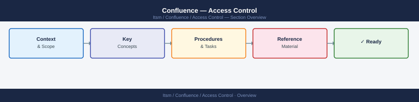

---
tags:
  - confluence
  - security
---
# Confluence — Access Control



```text

### Removing Default "All Logged-In Users" Access

Many spaces default to allowing all logged-in users to view and edit. Restrict this for sensitive spaces:

1. Go to **Space Settings** > **Permissions**.
2. Under **Individual Users / Groups**, find the entry for **confluence-users** or **All logged-in users**.
3. Remove or reduce their permissions to View only.
4. Add explicit group entries for editors.

```

```bash
## Before you begin

- **Access:** Admin credentials on all affected systems
- **Change management:** security changes require CAB approval in most environments
- **Rollback plan:** document current state before any security control change
- **Testing:** validate in a non-production environment first where possible

---

## Audit space permissions via REST API
curl -u admin:password \
  "https://confluence.example.local/rest/api/space/INFRA/permission" \
  | python3 -m json.tool
```
```yaml
When to use page restrictions:
- HR or salary information within a general IT space
- Security incident pages (restricted to Security team)
- Confidential customer data within a project space
- Draft pages not ready for general viewing
```
```text
Avoid over-restricting individual pages — it creates maintenance overhead.
Prefer separate restricted spaces for consistently sensitive content.
```
```bash
## Check if any spaces allow anonymous access via REST API
curl -u admin:password \
  "https://confluence.example.local/rest/api/space?limit=50" \
  | python3 -m json.tool | grep "key"

## Then for each space key, check for anonymous permissions:
curl -u admin:password \
  "https://confluence.example.local/rest/api/space/SPACKEY/permission" \
  | python3 -m json.tool | grep -A5 "anonymous"
```
```yaml
AD Group Design for Confluence:
- GG-Confluence-Users          → Maps to: confluence-users (can log in)
- GG-Confluence-Admins         → Maps to: confluence-administrators
- GG-Confluence-INFRA-Editors  → Maps to: confluence-infra-editors
- GG-Confluence-HR-Viewers     → Maps to: confluence-hr-viewers

These AD groups are managed in Active Directory; membership synced to Confluence via LDAP.
```
```bash
## Trigger manual LDAP sync (Confluence admin)
## Administration > User Directories > Synchronise

## Or via API
curl -u admin:password -X PUT \
  "https://confluence.example.local/rest/api/user-directory/1/sync" \
  -H "Content-Type: application/json"
```
```bash
## List System Administrators
curl -u admin:password \
  "https://confluence.example.local/rest/api/group/confluence-administrators/member?limit=200" \
  | python3 -m json.tool | grep "username"

## List users with Create Space permission
curl -u admin:password \
  "https://confluence.example.local/rest/api/group/confluence-space-creators/member?limit=200" \
  | python3 -m json.tool | grep "username"
```
```bash
## Confluence audit log records permission changes, space creation, and admin actions
## Administration > Audit Log > Filter by category: Permissions

## Via REST API — filter for permission-related audit events
curl -u admin:password \
  "https://confluence.example.local/rest/api/audit?limit=100" \
  | python3 -m json.tool | grep -B2 -A5 "permission"

## Application log — space access errors (403 events)
grep -i "403\|permission denied\|access denied" \
  /var/atlassian/application-data/confluence/logs/atlassian-confluence.log | tail -20
```

---

## See also

- [Confluence — Authentication](../authentication/)
- [Confluence — Hardening](../hardening/)
- [Confluence — Encryption](../encryption/)
