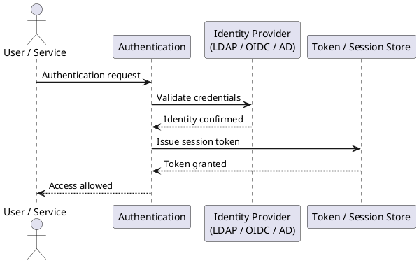

---
tags:
  - confluence
  - security
---
# Confluence — Authentication

```yaml
Recommended SAML configuration:
- Sign Authentication Requests: Enabled
- Require Signed Assertions: Enabled
- Require Signed Response: Enabled
- Signature Algorithm: RSA-SHA256 minimum
- Session timeout: Align with IdP session timeout (e.g., 8 hours for corporate SSO)
```

```yaml
Local account policy:
- Minimum: 3 local accounts (primary sysadmin, secondary sysadmin, monitoring service account)
- All local admin accounts: password managed in PAM vault
- Non-admin local accounts: not permitted; use LDAP/SSO for all regular users
- Review local accounts quarterly; disable unused accounts
```
```bash
# Audit local users via Confluence REST API
curl -u admin:password -H "Content-Type: application/json" \
  https://confluence.example.local/rest/api/user?type=known \
  | python3 -m json.tool | grep -E "username|userKey"
```
```text
Plugin configuration (Midori TOTP example):
1. Install plugin from Marketplace
2. Go to Administration > Two-Factor Authentication
3. Enforce 2FA for: All users / Administrators only (minimum: administrators)
4. Allow: TOTP apps (Google Authenticator, Authy)
5. Backup codes: Generate and store in PAM vault for each admin account
6. Grace period: 0 days (enforce immediately)
```
```yaml
Recommended session settings (General Configuration > Security Configuration):
- Maximum Authentication Attempts: 5 (then lock account for 30 minutes)
- Session Timeout: 480 minutes (8 hours) or match IdP session length
- Secure flag on cookies: Enabled (requires HTTPS)
- HttpOnly flag on cookies: Enabled (prevents JavaScript access)
- SameSite cookie attribute: Lax or Strict
- Remember Me: Disabled on shared/kiosk systems
```
```bash
# View Confluence audit log (Data Center)
# Administration > Audit Log

# Or query via REST API
curl -u admin:password \
  "https://confluence.example.local/rest/api/audit?startDate=$(date -d '-7 days' +%Y-%m-%d)&limit=100" \
  | python3 -m json.tool | grep -E '"user"|"type"|"description"'

# Check failed login events in Confluence application log
grep -i "authentication failure\|invalid credentials\|failed login" \
  /var/atlassian/application-data/confluence/logs/atlassian-confluence.log | tail -50

# Check if any users are using local auth when SSO should be enforced
# In Confluence Admin: User Directories > review which directory each user authenticates against
```



## Before you begin

- **Access:** Admin credentials on all affected systems
- **Change management:** security changes require CAB approval in most environments
- **Rollback plan:** document current state before any security control change
- **Testing:** validate in a non-production environment first where possible

---

---

## See also

- [Confluence — Access Control](../access-control/)
- [Confluence — Hardening](../hardening/)
- [Confluence — Encryption](../encryption/)
