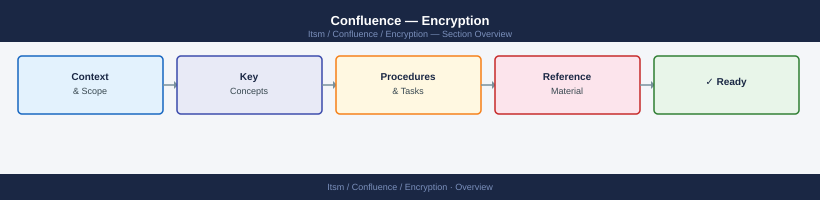

---
tags:
  - confluence
  - security
---
# Confluence — Encryption



```nginx
# /etc/nginx/conf.d/confluence.conf
server {
    listen 80;
    server_name confluence.example.local;
    return 301 https://$host$request_uri;
}

server {
    listen 443 ssl;
    server_name confluence.example.local;

    ssl_certificate     /etc/pki/tls/certs/confluence.crt;
    ssl_certificate_key /etc/pki/tls/private/confluence.key;

    ssl_protocols TLSv1.2 TLSv1.3;
    ssl_ciphers 'ECDHE-ECDSA-AES256-GCM-SHA384:ECDHE-RSA-AES256-GCM-SHA384:ECDHE-ECDSA-CHACHA20-POLY1305';
    ssl_prefer_server_ciphers on;
    ssl_session_cache shared:SSL:10m;
    ssl_session_timeout 1d;
    ssl_session_tickets off;

    add_header Strict-Transport-Security "max-age=63072000; includeSubDomains" always;
    add_header X-Frame-Options DENY;
    add_header X-Content-Type-Options nosniff;

    location / {
        proxy_pass http://127.0.0.1:8090;
        proxy_set_header Host $host;
        proxy_set_header X-Real-IP $remote_addr;
        proxy_set_header X-Forwarded-For $proxy_add_x_forwarded_for;
        proxy_set_header X-Forwarded-Proto https;
    }
}
```

```text

## Before you begin

- **Access:** Admin credentials on all affected systems
- **Change management:** security changes require CAB approval in most environments
- **Rollback plan:** document current state before any security control change
- **Testing:** validate in a non-production environment first where possible

---

## Database Encryption

Confluence stores all content (pages, comments, attachments metadata) in its database. Protect the database connection and data at rest.

### Encrypted Database Connection

```

```xml
<!-- /opt/atlassian/confluence/confluence/WEB-INF/classes/confluence-init.properties -->
<!-- Ensure JDBC URL uses SSL -->
```
```bash
## /var/atlassian/application-data/confluence/confluence.cfg.xml
## Ensure the JDBC URL includes SSL parameters:
jdbc:postgresql://dbserver.example.local:5432/confluence?ssl=true&sslmode=require

## For MySQL:
jdbc:mysql://dbserver.example.local:3306/confluence?useSSL=true&requireSSL=true
```
```bash
## Store the database password encrypted in confluence.cfg.xml
## Use Confluence's built-in password encoding tool
/opt/atlassian/confluence/bin/atlas-util.sh encrypt-password

## The encoded password is stored in confluence.cfg.xml as:
## <property name="hibernate.connection.password">{AES}EncryptedValue=</property>
```
```sql
-- PostgreSQL with pgcrypto (column-level encryption example)
-- Prefer Transparent Data Encryption (TDE) at the storage layer

-- MySQL InnoDB TDE (MySQL Enterprise)
-- ALTER TABLE tablespace ENCRYPTION='Y';

-- PostgreSQL — use filesystem-level encryption (LUKS on the data partition)
-- or pgcrypto for sensitive column encryption
```
```bash
## The attachment directory should be on an encrypted volume (LUKS)
## Verify the attachment directory location
grep "attachments" /var/atlassian/application-data/confluence/confluence.cfg.xml

## Check if the directory is on an encrypted mount
df /var/atlassian/application-data/confluence/attachments/
mount | grep "$(df /var/atlassian/application-data/confluence/attachments/ | tail -1 | awk '{print $1}')"

## If not on encrypted storage, move attachments to an encrypted mount:
## 1. Stop Confluence
systemctl stop confluence

## 2. Move attachments to encrypted mount
rsync -avz /var/atlassian/application-data/confluence/attachments/ /secure/confluence-attachments/

## 3. Update attachment path in confluence.cfg.xml
## <property name="attachments.dir">/secure/confluence-attachments</property>

## 4. Start Confluence
systemctl start confluence
```
```powershell
## If Confluence is running on Windows, ensure the attachment volume is BitLocker-encrypted
Get-BitLockerVolume -MountPoint "D:" | Select-Object VolumeStatus, ProtectionStatus

## Verify attachment directory location
Get-Content "C:\ProgramData\Atlassian\Application Data\Confluence\confluence.cfg.xml" |
  Select-String "attachments.dir"
```
```bash
## Encrypt a Confluence backup archive with GPG
gpg --symmetric --cipher-algo AES256 /backups/confluence-backup-2026-05-07.zip

## Or use openssl for encryption
openssl enc -aes-256-cbc -salt -in /backups/confluence-backup.zip \
  -out /backups/confluence-backup.zip.enc \
  -pass file:/secure/backup-passphrase.txt

## Verify the encrypted backup can be decrypted
openssl enc -d -aes-256-cbc \
  -in /backups/confluence-backup.zip.enc \
  -out /tmp/test-decrypt.zip \
  -pass file:/secure/backup-passphrase.txt
ls -la /tmp/test-decrypt.zip
```
```yaml
Confluence security properties (General Configuration > Security Configuration):
- Secure flag on cookies: Enabled (cookies sent only over HTTPS)
- HttpOnly flag: Enabled (JavaScript cannot read session cookies)
- Content Security Policy: Configure via reverse proxy headers
```
```nginx
## Nginx — security headers for Confluence
add_header Content-Security-Policy "default-src 'self'; script-src 'self' 'unsafe-inline' 'unsafe-eval'; style-src 'self' 'unsafe-inline';" always;
add_header X-Content-Type-Options "nosniff" always;
add_header Referrer-Policy "strict-origin-when-cross-origin" always;
```
```bash
## Verify HTTPS enforced (HTTP redirects to HTTPS)
curl -I http://confluence.example.local/ 2>/dev/null | grep "Location:"
## Should redirect to https://

## Verify TLS version
nmap --script ssl-enum-ciphers -p 443 confluence.example.local | grep -E "TLS|SSLv"

## Verify certificate is valid and not self-signed
openssl s_client -connect confluence.example.local:443 </dev/null 2>/dev/null | \
  openssl x509 -noout -issuer -subject -dates

## Verify database connection uses SSL
grep -i "ssl\|encrypt" /var/atlassian/application-data/confluence/confluence.cfg.xml

## Verify attachment directory is on encrypted storage
lsblk -o NAME,TYPE,MOUNTPOINT | grep crypt
mount | grep "/secure\|/encrypted"

## Check backup files are encrypted (should not be plain zip)
file /backups/confluence-backup-*.zip* | grep -v "Zip archive"
```

---

## See also

- [Confluence — Hardening](../hardening/)
- [Confluence — Authentication](../authentication/)
- [Confluence — Access Control](../access-control/)
