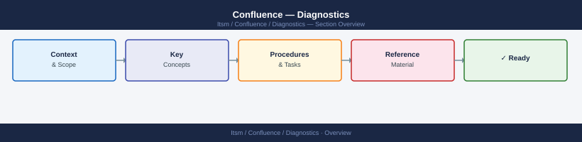
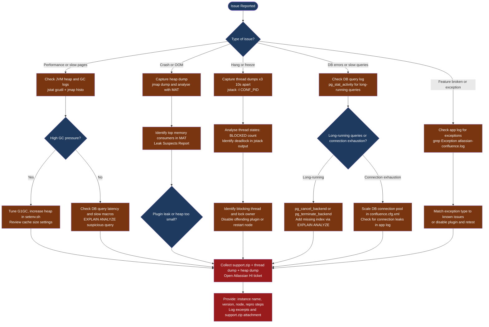

---
tags:
  - confluence
  - troubleshooting
search:
  boost: 1.5
---
# Confluence — Diagnostics

<div class="kb-summary">
Confluence diagnostic commands: check instance health via the /status endpoint, inspect JVM heap with jstat and jmap to identify memory leaks, capture three thread dumps 10 seconds apart to diagnose deadlocks, run PostgreSQL pg_stat_activity and EXPLAIN ANALYZE to identify slow macro and page-render queries, and generate support.zip from Admin for Atlassian escalation.

*Applies to: Confluence Data Center / Cloud*
</div>





## Before you begin

- **Access:** SSH to Confluence server(s) as root or confluence OS user; PostgreSQL admin access; Confluence Admin account for the web UI and support tools
- **Gather first:** the exact error message or slow operation, the Confluence version from Admin > General Configuration > System Information, the number of affected users, and whether the issue started after a specific change (plugin install, upgrade, index rebuild, NFS change)
- **Scope:** confirm whether the issue affects one space, one user, or all users — a single slow space often points to a macro or attachment index issue, while all-user slowness points to JVM or DB saturation

---

## Step 1 — Check instance health

```bash
# Confirm the Confluence application is running
curl -s http://localhost:8090/status
# Expected: {"state":"RUNNING"}

# Recent application errors
LOG="/var/atlassian/application-data/confluence/logs/atlassian-confluence.log"
grep "Exception\|Error" "$LOG" | grep -v "DEBUG" | tail -30

# Slow page render warnings
grep -E "Slow|took [0-9]{4,}ms" "$LOG" | tail -20

# OOM events
grep "OutOfMemoryError" "$LOG"

# Plugin failures
grep -E "(BundleException|PluginException|Failed to start bundle)" "$LOG" | tail -20

# Database errors
grep -E "(JDBCException|SQL.*Exception|cannot acquire.*connection)" "$LOG" | tail -20

# Disk usage
df -h /var/atlassian/application-data/confluence/
ls -lh /var/atlassian/application-data/confluence/attachments/ | tail -5

# System memory
free -h
top -b -n1 | grep java | head -5
```

---

## Step 2 — JVM heap analysis

### Check current heap usage

```bash
CONF_PID=$(pgrep -f "atlassian-confluence\|confluence\.home" | head -1)

# Summary heap stats (every 5 seconds, 5 samples)
jstat -gcutil "$CONF_PID" 5000 5
# Columns: S0, S1, E (Eden), O (Old), M (Metaspace), YGC, YGCT, FGC, FGCT, GCT
# Alert if O > 90% between GC cycles

# Full GC info
jstat -gc "$CONF_PID" 5000 3
```

### Capture an on-demand heap dump

```bash
CONF_PID=$(pgrep -f "atlassian-confluence\|confluence\.home" | head -1)
DUMP_FILE="/tmp/confluence-heap-$(date +%Y%m%d%H%M).hprof"

jmap -dump:format=b,file="$DUMP_FILE" "$CONF_PID"
echo "Heap dump: $DUMP_FILE ($(du -sh $DUMP_FILE | cut -f1))"
```

### Analyse heap dump with Eclipse MAT

1. Download [Eclipse Memory Analyzer (MAT)](https://www.eclipse.org/mat/)
2. Open the `.hprof` file in MAT
3. Run **Leak Suspects Report** (automatic analysis)
4. Key views:
   - **Dominator tree**: largest retained object graphs
   - **Histogram**: object counts by class
   - **OQL**: query object heap (e.g., `SELECT * FROM com.atlassian.plugin.* WHERE @retainedHeapSize > 1000000`)

Common findings:

| Retained Object | Likely Cause |
|---|---|
| Large `CacheManager` or `EhCache` objects | Cache size misconfigured or unbounded |
| Many `PageImpl` or `ContentEntityObject` | Bulk page render or large export in progress |
| Plugin class instances | Plugin memory leak — disable and retest |
| String arrays > 100 MB | Attachment content loaded into heap |

---

## Step 3 — Thread dump capture and analysis

Thread dumps reveal what all JVM threads are doing at a point in time. Capture 3 dumps 10 seconds apart to identify patterns — stuck threads repeat across dumps; busy threads appear in different states.

### Capture thread dumps

```bash
CONF_PID=$(pgrep -f "atlassian-confluence\|confluence\.home" | head -1)

for i in 1 2 3; do
  DUMP_FILE="/tmp/threaddump_${i}_$(date +%H%M%S).txt"
  jstack -l "$CONF_PID" > "$DUMP_FILE"
  echo "Captured: $DUMP_FILE"
  [ $i -lt 3 ] && sleep 10
done

# Merge for analysis
cat /tmp/threaddump_*.txt > /tmp/threaddump_merged.txt
```

### Thread dump quick analysis

```bash
# Count threads by state
grep "java.lang.Thread.State:" /tmp/threaddump_1_*.txt \
  | awk '{print $2}' | sort | uniq -c | sort -rn

# Find all BLOCKED threads
grep -A 10 "java.lang.Thread.State: BLOCKED" /tmp/threaddump_1_*.txt | head -60

# Find all threads waiting on a lock
grep -B 5 "waiting to lock" /tmp/threaddump_1_*.txt | grep "\"" | head -20

# Find deadlocks (jstack outputs these at the end)
grep -A 20 "DEADLOCK" /tmp/threaddump_1_*.txt
```

### Thread states reference

| State | Meaning | Normal? |
|---|---|---|
| `RUNNABLE` | Actively executing | Yes |
| `WAITING` | Waiting for notify/join | Yes (idle threads) |
| `TIMED_WAITING` | Sleeping / scheduled wait | Yes |
| `BLOCKED` | Waiting to acquire a monitor lock | Occasional OK; many = problem |
| `DEADLOCK` | Circular lock dependency | Never — immediate action required |

High counts of blocked `http-nio-8090-exec-N` threads indicate HTTP request queue build-up. Root cause is usually DB or lock contention.

---

## Step 4 — Database query performance

### Identify slow queries

```bash
# Enable slow query logging in PostgreSQL (threshold: 500ms)
psql -h "$DB_HOST" -U postgres \
  -c "ALTER SYSTEM SET log_min_duration_statement = '500';"
psql -h "$DB_HOST" -U postgres \
  -c "SELECT pg_reload_conf();"

# View slow queries from pg log
tail -100 /var/log/postgresql/postgresql-*.log | grep "duration:"

# Real-time active query monitoring
psql -h "$DB_HOST" -U "$DB_USER" -d "$DB_NAME" \
  -c "SELECT pid,
             round(extract(epoch from now() - query_start)::numeric, 2) AS elapsed_s,
             state,
             left(query, 100) AS query_snippet
      FROM pg_stat_activity
      WHERE state != 'idle'
        AND query_start < now() - interval '5 seconds'
      ORDER BY elapsed_s DESC;"
```

### Table bloat check

```bash
psql -h "$DB_HOST" -U "$DB_USER" -d "$DB_NAME" \
  -c "SELECT tablename,
             pg_size_pretty(pg_relation_size(tablename::regclass)) AS table_size,
             pg_size_pretty(pg_total_relation_size(tablename::regclass)) AS total_size,
             n_dead_tup AS dead_tuples
      FROM pg_stat_user_tables
      ORDER BY n_dead_tup DESC
      LIMIT 15;"
```

High `dead_tuples` → run `VACUUM ANALYZE <tablename>;`

### EXPLAIN ANALYZE a suspicious query

```sql
-- Prefix the slow query from pg_stat_activity with EXPLAIN (ANALYZE, BUFFERS)
EXPLAIN (ANALYZE, BUFFERS, FORMAT TEXT)
SELECT id, title, version
FROM content
WHERE spacekey = 'OPS'
  AND contenttype = 'PAGE'
  AND prevver IS NULL
ORDER BY title;
```

Look for: **Seq Scan** on large tables (missing index), high **actual rows** vs **estimated rows** (stale statistics — run `ANALYZE`).

---

## Step 5 — Support ZIP collection

Atlassian Support requires a **support.zip** when raising a ticket for complex issues.

### Generate via Admin UI

**Admin > General Configuration > Troubleshooting and Support Tools > Create Support Zip**

Select: Application Logs, Thread Dumps, System Information, Configuration Files.

### Generate via command line

```bash
# The support zip script (ships with Confluence)
/opt/atlassian/confluence/bin/confluence-support-zip.sh \
  --output /tmp/confluence-support-$(date +%Y%m%d).zip

# If the script is unavailable, manually collect:
SUPPORT_DIR="/tmp/confluence-support-$(date +%Y%m%d)"
mkdir -p "$SUPPORT_DIR"

# Logs
cp -r /var/atlassian/application-data/confluence/logs/ "${SUPPORT_DIR}/logs/"

# Thread dumps
CONF_PID=$(pgrep -f confluence | head -1)
for i in 1 2 3; do
  jstack -l "$CONF_PID" > "${SUPPORT_DIR}/threaddump_${i}.txt"
  sleep 10
done

# Heap histogram (non-invasive)
jmap -histo:live "$CONF_PID" > "${SUPPORT_DIR}/heap_histo.txt"

zip -r "${SUPPORT_DIR}.zip" "$SUPPORT_DIR/"
echo "Support zip: ${SUPPORT_DIR}.zip"
```

### What support will ask for

| Artifact | Collected By |
|---|---|
| atlassian-confluence.log (full, not truncated) | Support zip |
| catalina.out | Support zip |
| Thread dumps × 3 (10s apart) | Support zip / jstack |
| Heap dump or histogram | jmap |
| Confluence version and build number | Admin > System Information |
| DB version and table sizes | psql |
| Steps to reproduce | Your ticket description |
| Time of issue occurrence (with timezone) | Your ticket description |

---

## Log locations

| Log | Path | What to look for |
|---|---|---|
| Application log | `CONFLUENCE_HOME/logs/atlassian-confluence.log` | Plugin errors, macro failures, auth exceptions |
| Tomcat stdout | `CONFLUENCE_INSTALL/logs/catalina.out` | JVM startup, OOM, thread dump output |
| PostgreSQL slow queries | `/var/log/postgresql/postgresql-*.log` | Queries exceeding `log_min_duration_statement` |
| Hazelcast log | `catalina.out` (Data Center) | Cluster membership changes, split-brain events |
| Access log | `CONFLUENCE_INSTALL/logs/confluence-access.log` | HTTP request timing per URL |
| Support ZIP | `/tmp/confluence-support-*.zip` | All-in-one — required for Atlassian SR |

---

## See also

- [Confluence — Common Issues](../common-issues/)
- [Confluence — Escalation](../escalation/)
- [Confluence — Health Checks](../../operations/health-checks/)

## Verify resolution

- `curl -s http://localhost:8090/status` returns `{"state":"RUNNING"}`
- `jstat -gcutil $CONF_PID 5000 3` shows Old generation (O) below 80% between GC cycles
- `grep -c "BLOCKED" /tmp/threaddump_1_*.txt` returns a low count (< 5)
- A Confluence page in the affected space renders in under 3 seconds
- `grep -i "OOM\|OutOfMemoryError" /opt/atlassian/confluence/logs/catalina.out` returns no new entries after the fix
- PostgreSQL active query count is normal: `SELECT count(*) FROM pg_stat_activity WHERE state != 'idle'`
