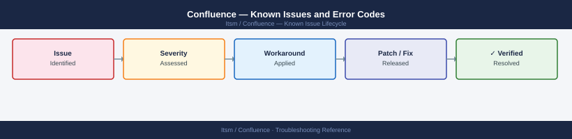

---
tags:
  - troubleshooting
  - confluence
  - itsm
  - known-issues
---
# Confluence — Known Issues and Error Codes

<div class="kb-summary">
Catalog of known Confluence Data Center bugs, error codes, and workarounds covering Synchrony (collaborative editing), clustering, and database issues.

*Applies to: Confluence Data Center 8.x*
</div>



```d2
direction: down

symptom: Identify Symptom {shape: diamond}
synchrony_collaborative_editing: "Synchrony (Collaborative Editing)" {shape: rectangle}
clustering: "Clustering" {shape: rectangle}
database: "Database" {shape: rectangle}
resolution: Resolve or Escalate {shape: oval}

symptom -> synchrony_collaborative_editing: investigate
symptom -> clustering: investigate
symptom -> database: investigate
synchrony_collaborative_editing -> resolution
clustering -> resolution
database -> resolution
```

## Before you begin

- Confluence logs: `<confluence-home>/logs/atlassian-confluence.log`.
- Synchrony (collaborative editing) logs: `<confluence-home>/logs/atlassian-synchrony.log`.
- Most collaborative editing failures are Synchrony (port 8091) connectivity issues.

## Synchrony (Collaborative Editing)

| Error / Symptom | Affected Versions | Cause | Workaround / Fix | Fixed In |
|---|---|---|---|---|
| `Cannot collaborate — Synchrony not available` | Confluence DC 8.x | Synchrony process not running or port 8091 blocked | Restart Synchrony; verify TCP 8091 between browser and Confluence server | N/A |
| Collaborative editing not syncing between users | Confluence DC 8.x | Synchrony cluster split — nodes not communicating | Check `<confluence-home>/synchrony-args.properties` cluster config; verify TCP 25500 between nodes | N/A |

## Clustering

| Error / Symptom | Affected Versions | Cause | Workaround / Fix | Fixed In |
|---|---|---|---|---|
| `Node joining cluster failed` | Confluence DC 8.x | Hazelcast port 5701 blocked | Verify TCP 5701 between all Confluence DC nodes | N/A |
| Cache inconsistency after node restart | Confluence DC 8.x | Node rejoined cluster with stale cache | Full node restart; cache refreshes automatically on join | N/A |

## Database

| Error / Symptom | Affected Versions | Cause | Workaround / Fix | Fixed In |
|---|---|---|---|---|
| Confluence startup fails: `Cannot connect to database` | Confluence DC 8.x | Database server unreachable or wrong credentials in `confluence.cfg.xml` | Verify DB connectivity; update credentials in `<confluence-home>/confluence.cfg.xml` | N/A |

## See also

- [Confluence — Common Issues](../common-issues/)
- [Jira — Known Issues](../../jira/troubleshooting/known-issues.md)
- [PostgreSQL — Known Issues](../../../compute/linux/postgresql/troubleshooting/known-issues.md)
