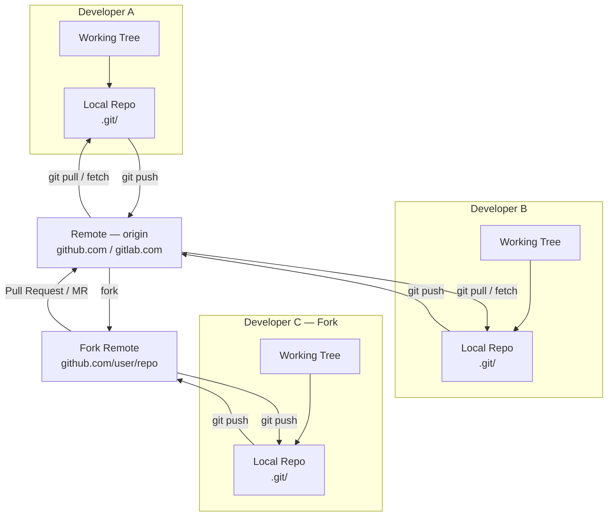
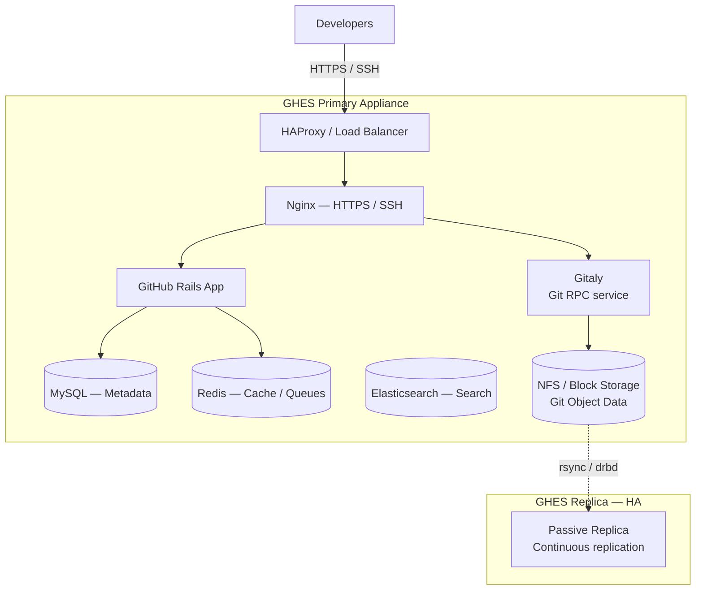
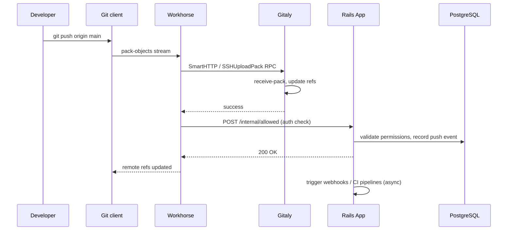

---
tags:
  - architecture
  - git
---
# Git — How It Works


<div class="kb-summary">
Git is a distributed version control system where every working copy is a full repository with complete history.

*Applies to: Git 2.x*
</div>

---

## Distributed Model

Unlike centralised VCS tools, every Git clone contains the entire repository history. By convention teams designate one remote (GitHub, GitLab, Bitbucket) as the integration point.


```text
┌───────────────────────────────────────── Git — How It Works ──────────────────────────────────────────┐
│                                                                                                       │
│  Git commit lifecycle: working tree → index → local repo → remote repo.                               │
│                                                                                                       │
│   ┌──────────────────────────────────────────────┐  ┌─────────────────────────────────────────────┐   │
│   │               Commit Creation                │  │              Branch Operations              │   │
│   │       git add → writes blob to objects       │  │          Create: git branch <name>          │   │
│   │      git add → updates index with tree       │  │      Switch: git checkout / git switch      │   │
│   │       git commit → creates commit obj        │  │         Merge: 3-way or fast-forward        │   │
│   │         HEAD ref moves to new commit         │  │         Delete: git branch -d <name>        │   │
│   └──────────────────────────────────────────────┘  └─────────────────────────────────────────────┘   │
│                                                                                                       │
│    Commits chain via parent pointers; branches are just movable pointers                              │
│                                                                                                       │
│                          ▼                                                 ▼                          │
│                                                                                                       │
│   ┌──────────────────────────────────────────────┐  ┌─────────────────────────────────────────────┐   │
│   │               Merge vs Rebase                │  │                 Remote Sync                 │   │
│   │        Merge: preserves history fork         │  │        git fetch: update remote refs        │   │
│   │          Merge commit: two parents           │  │        git pull: fetch + merge/rebase       │   │
│   │          Rebase: linearises history          │  │     git push: send commits + update ref     │   │
│   │         Rebase rewrites SHA-1 hashes         │  │       Force push: dangerous on shared       │   │
│   └──────────────────────────────────────────────┘  └─────────────────────────────────────────────┘   │
│                                                                                                       │
│  Physical Infrastructure (the hardware everything above runs on):                                     │
│  Developer workstation · Git remote server · CI trigger on push event                                 │
│                                                                                                       │
│  Key terms:                                                                                           │
│                                                                                                       │
│  3-way merge  = git identifies common ancestor to resolve two diverged branches                       │
│  Fast-forward = no merge commit; branch pointer advances along linear history                         │
│  Rebase       = moves or re-applies commits; produces new SHAs; rewrites history                      │
│  Force push   = overwrites remote history; use only on personal/feature branches                      │
│  Reflog       = local recovery log; git reflog finds commits after accidental reset                   │
│  Detached HEAD= HEAD points to commit, not branch; commits not attached to branch                     │
│  Conflict     = overlapping changes in same file; must resolve manually                               │
│  Squash merge = combine PR commits into single commit on target branch                                │
│  Cherry-pick  = applies diff of specific commit onto current branch                                   │
│  Bisect       = binary search through history to find commit that introduced bug                      │
│  Amend        = rewrites last commit; do not amend pushed commits                                     │
│  Stash        = stores dirty working tree temporarily; git stash pop restores                         │
│                                                                                                       │
└───────────────────────────────────────────────────────────────────────────────────────────────────────┘
```

---

## Refs and Branches

```text
.git/
├── HEAD                    → ref: refs/heads/main
├── refs/
│   ├── heads/              → local branches
│   ├── remotes/
│   │   └── origin/
│   └── tags/
└── packed-refs             → bulk storage for many refs
```

| Ref | Purpose |
|-----|---------|
| `HEAD` | Currently checked-out commit or branch pointer |
| `ORIG_HEAD` | Previous HEAD before a merge/rebase/reset |
| `MERGE_HEAD` | The commit being merged in |
| `FETCH_HEAD` | Last fetched commit from a remote |

---

## GitHub Enterprise / GitLab Self-Managed Architecture

### GitHub Enterprise Server (GHES)



### Key Server Components

| Component | Role |
|-----------|------|
| **Gitaly** | gRPC service that owns all Git repository access |
| **Puma / Rails** | Web application, API, and business logic |
| **Sidekiq** | Asynchronous job processing (webhooks, emails, CI scheduling) |
| **Workhorse** | Reverse proxy for large payloads (git push/pull, uploads) |
| **PostgreSQL** | Relational metadata (users, projects, MRs, CI records) |
| **Redis** | Session cache, queues, rate limiting, ActionCable |
| **MinIO / S3** | Object storage for LFS, CI artifacts, container registry layers |

---

## Data Flow — git push



---

## Storage Layout

```text
# GitLab on-disk layout (default Omnibus)
/var/opt/gitlab/
├── git-data/
│   └── repositories/
│       └── <namespace>/
│           └── <project>.git/
│               ├── objects/
│               ├── refs/
│               └── hooks/
└── gitlab-rails/
    └── uploads/
```

---

## See also

- [Git — Design Standards](../design-standards/)
- [Git — Integrations](../integrations/)
- [Git — Deploy](../../deploy/)
