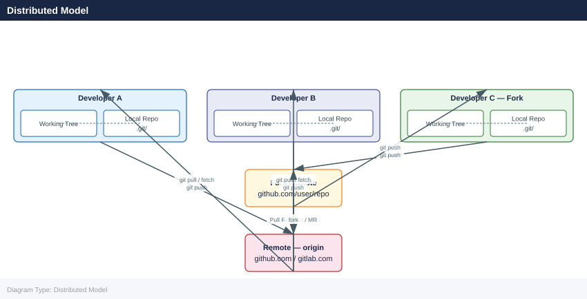
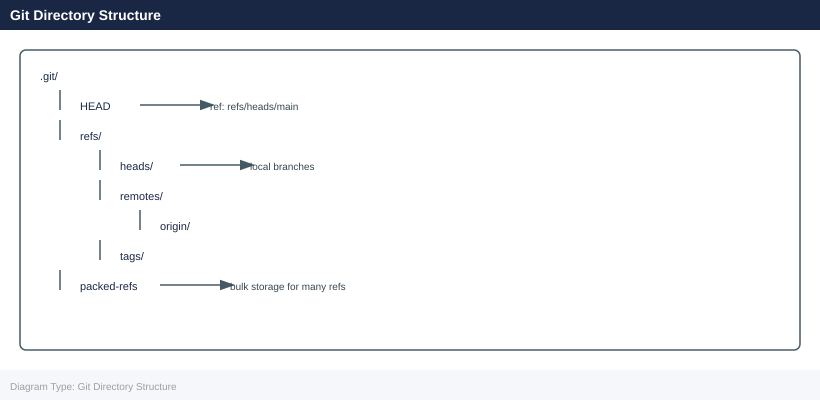
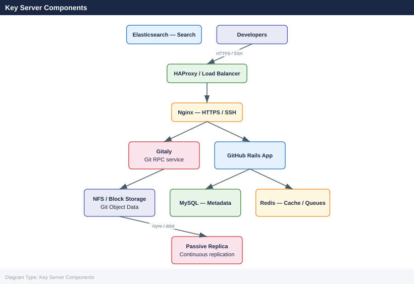
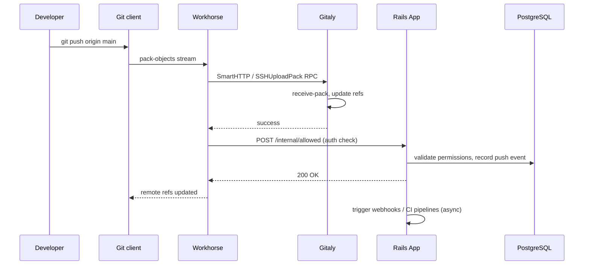
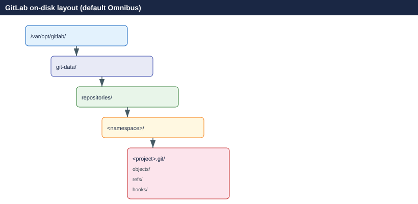

---
tags:
  - architecture
  - git
---
# Git — How It Works

Git is a distributed version control system where every working copy is a full repository with complete history.

*Applies to: Git 2.x*

---

## Distributed Model

Unlike centralised VCS tools, every Git clone contains the entire repository history. By convention teams designate one remote (GitHub, GitLab, Bitbucket) as the integration point.

---

## Refs and Branches

| Ref | Purpose |
|-----|---------|
| `HEAD` | Currently checked-out commit or branch pointer |
| `ORIG_HEAD` | Previous HEAD before a merge/rebase/reset |
| `MERGE_HEAD` | The commit being merged in |
| `FETCH_HEAD` | Last fetched commit from a remote |

---

## GitHub Enterprise / GitLab Self-Managed Architecture

### GitHub Enterprise Server (GHES)

### Key Server Components

| Component | Role |
|-----------|------|
| **Gitaly** | gRPC service that owns all Git repository access |
| **Puma / Rails** | Web application, API, and business logic |
| **Sidekiq** | Asynchronous job processing (webhooks, emails, CI scheduling) |
| **Workhorse** | Reverse proxy for large payloads (git push/pull, uploads) |
| **PostgreSQL** | Relational metadata (users, projects, MRs, CI records) |
| **Redis** | Session cache, queues, rate limiting, ActionCable |
| **MinIO / S3** | Object storage for LFS, CI artifacts, container registry layers |

---

## Data Flow — git push

---

## Storage Layout

---

## See also

- [Git — Design Standards](../design-standards/)
- [Git — Integrations](../integrations/)
- [Git — Deploy](../../deploy/)
