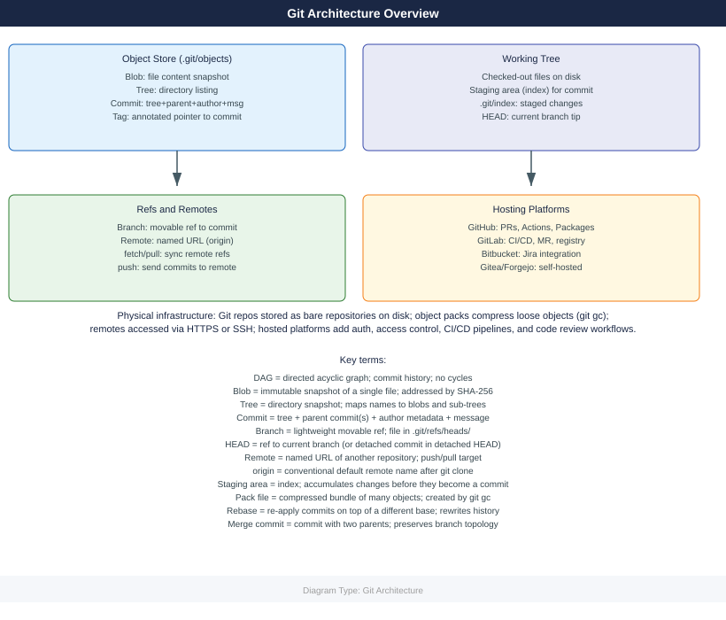
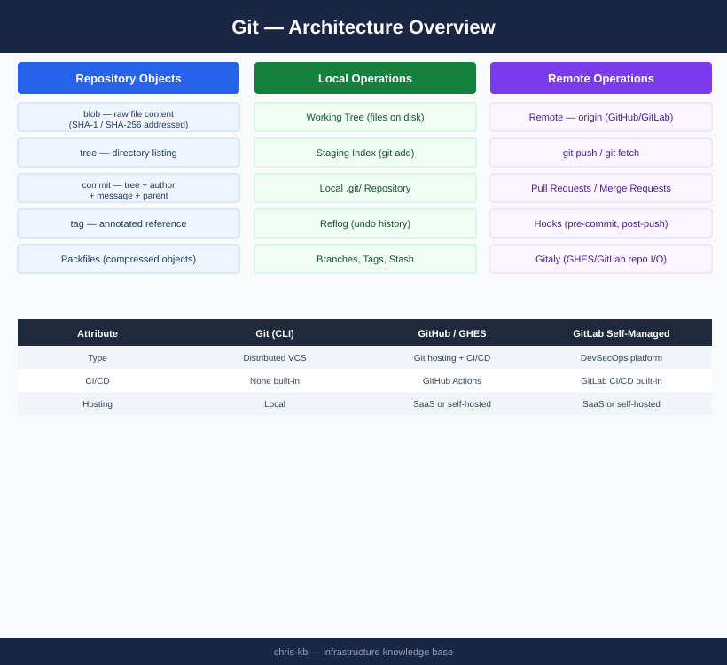

---
tags:
  - architecture
  - git
description: "Git is a distributed version control system where every clone is a complete repository. Enterprise deployments use GitHub Enterprise Server or GitLab..."
---
# Git — Architecture

Git is a distributed version control system where every clone is a complete repository. Enterprise deployments use GitHub Enterprise Server or GitLab Self-Managed as the integration point, with Gitaly handling all repository I/O.

*Applies to: Git 2.x*

<a class="kb-card" href="how-it-works/"><strong>How It Works</strong>Object model, ref system, GHES/GitLab topology, and git push data flow.</a>
<a class="kb-card" href="integrations/"><strong>Integrations</strong>Integration with other platforms and external systems.</a>
<a class="kb-card" href="design-standards/"><strong>Design Standards</strong>Branching standards, repository conventions, and best practices.</a>

---

## Object Model Summary

| Object | Description |
|--------|-------------|
| **blob** | Raw file content |
| **tree** | Directory listing mapping names to blob/tree SHAs |
| **commit** | Points to a tree; records author, message, parent commits |
| **tag** | Annotated reference to another object |

---

## Distributed Architecture

