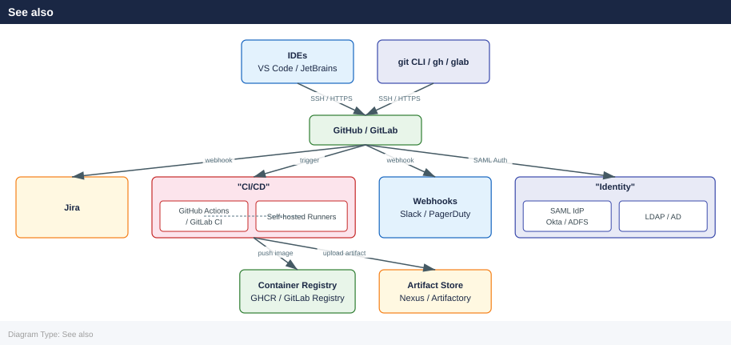

---
tags:
  - architecture
  - git
---
# Git — Integrations

```yaml
# .github/workflows/ci.yml
name: CI

on:
  push:
    branches: ["main", "release/**"]
  pull_request:
    branches: ["main"]

jobs:
  build:
    runs-on: ubuntu-latest
    steps:
      - uses: actions/checkout@v4
        with:
          fetch-depth: 0          # full history for tools like git describe

      - name: Set up Go
        uses: actions/setup-go@v5
        with:
          go-version: "1.22"

      - name: Build
        run: go build ./...

      - name: Test
        run: go test -race ./...
```

```yaml
git commit -m "PROJ-123 Add retry logic for payment API

- Exponential backoff with 3 retries
- PROJ-123 #comment Fixed the race condition
- PROJ-123 #time 2h"
```
```yaml
# gitlab.rb (Omnibus) — system-wide Jira configuration
# Or configure per-project: Settings > Integrations > Jira

# Fields required in the UI:
# URL: https://yourcompany.atlassian.net
# Username: service-account@company.com
# Password/Token: <Jira API token>
# Transition IDs: 31 (In Progress), 41 (Done)
```
```bash
# Verify integration via GitLab API
curl -s --header "PRIVATE-TOKEN: $GITLAB_TOKEN" \
  "https://gitlab.example.com/api/v4/projects/:id/integrations/jira"
```

```text title="Expected output"
{
  "id": 7,
  "title": "Jira",
  "slug": "jira",
  "created_at": "2024-01-15T09:32:44.521Z",
  "updated_at": "2024-01-15T09:32:44.521Z",
  "active": true,
  "commit_events": true,
  "push_events": true,
  "issues_events": true,
  "merge_requests_events": true,
  "wiki_page_events": false,
  "deployment_events": false,
  "job_events": false,
  "pipeline_events": true,
  "url": "https://jira.example.com",
  "username": "gitlab-bot",
  "api_url": "https://jira.example.com/rest/api/2"
}
```

!!! warning "Common errors"
    **`{"message":"401 Unauthorized"}`** — Verify the `GITLAB_TOKEN` environment variable is set and contains a valid personal access token with `api` scope.
    **`{"message":"404 Project Not Found"}`** — Replace `:id` with the actual numeric project ID or URL-encoded project path (e.g., `group%2Fproject`).
    **`curl: (6) Could not resolve host: gitlab.example.com`** — Confirm network connectivity to the GitLab instance and update the hostname to match your actual GitLab URL.
```bash
# Create webhook via API
curl -X POST \
  -H "Authorization: Bearer $GITHUB_TOKEN" \
  -H "Accept: application/vnd.github+json" \
  https://api.github.com/repos/ORG/REPO/hooks \
  -d '{
    "name": "web",
    "active": true,
    "events": ["push", "pull_request", "release"],
    "config": {
      "url": "https://hooks.example.com/github",
      "content_type": "json",
      "secret": "'"$WEBHOOK_SECRET"'",
      "insecure_ssl": "0"
    }
  }'
```

```text title="Expected output"
{
  "id": 487392156,
  "name": "web",
  "active": true,
  "events": [
    "push",
    "pull_request",
    "release"
  ],
  "config": {
    "url": "https://hooks.example.com/github",
    "content_type": "json",
    "insecure_ssl": "0"
  },
  "updated_at": "2024-01-15T09:42:31Z",
  "created_at": "2024-01-15T09:42:31Z",
  "url": "https://api.github.com/repos/ORG/REPO/hooks/487392156",
  "test_url": "https://api.github.com/repos/ORG/REPO/hooks/487392156/test",
  "ping_url": "https://api.github.com/repos/ORG/REPO/hooks/487392156/pings",
  "deliveries_url": "https://api.github.com/repos/ORG/REPO/hooks/487392156/deliveries"
}
```

!!! warning "Common errors"
    **`"message": "Bad credentials", "documentation_url": "https://docs.github.com/rest"`** — Verify `$GITHUB_TOKEN` is set, valid, and has `admin:repo_hook` permissions.
    **`"message": "Validation Failed", "errors": [{"message": "Webhook URL is not reachable"}]`** — Ensure the endpoint `https://hooks.example.com/github` is publicly accessible and returns HTTP 200 on a GET request.
    **`"message": "Not Found", "documentation_url": "https://docs.github.com/rest/reference/repos"`** — Confirm `ORG/REPO` exists and the token has access to that repository.
```bash
# Create project webhook via API
curl -X POST \
  --header "PRIVATE-TOKEN: $GITLAB_TOKEN" \
  --header "Content-Type: application/json" \
  "https://gitlab.example.com/api/v4/projects/:id/hooks" \
  --data '{
    "url": "https://hooks.example.com/gitlab",
    "push_events": true,
    "merge_requests_events": true,
    "pipeline_events": true,
    "token": "'"$WEBHOOK_SECRET"'",
    "enable_ssl_verification": true
  }'
```

```text title="Expected output"
{
  "id": 42,
  "url": "https://hooks.example.com/gitlab",
  "project_id": 8,
  "push_events": true,
  "issues_events": false,
  "confidential_issues_events": false,
  "merge_requests_events": true,
  "wiki_page_events": false,
  "deployment_events": false,
  "job_events": false,
  "pipeline_events": true,
  "push_events_branch_filter": "",
  "issues_events_confidential": false,
  "token": "****",
  "enable_ssl_verification": true,
  "created_at": "2024-01-15T09:42:17.384Z",
  "token_encrypted": true
}
```

!!! warning "Common errors"
    **`{"message":"401 Unauthorized"}`** — Verify `$GITLAB_TOKEN` is set and valid with `echo $GITLAB_TOKEN` and check token permissions include `api` scope.
    **`{"message":"404 Project Not Found"}`** — Replace `:id` with the actual numeric project ID (e.g., `8`) or use URL-encoded project path like `group%2Fproject`.
    **`{"message":"422 Unprocessable Entity","errors":["Url is invalid"]}`** — Ensure the webhook URL is publicly accessible and uses HTTPS; test connectivity with `curl -I https://hooks.example.com/gitlab`.
```bash
# Bash — verify GitHub webhook signature
verify_signature() {
  local payload="$1"
  local signature="$2"        # X-Hub-Signature-256 header value
  local secret="$WEBHOOK_SECRET"

  expected="sha256=$(echo -n "$payload" | openssl dgst -sha256 -hmac "$secret" | awk '{print $2}')"
  [ "$signature" = "$expected" ]
}
```
```ruby
# /etc/gitlab/gitlab.rb
gitlab_rails['ldap_enabled'] = true
gitlab_rails['prevent_ldap_sign_in'] = false

gitlab_rails['ldap_servers'] = {
  'main' => {
    'label' => 'Corporate AD',
    'host' =>  'ldap.example.com',
    'port' => 636,
    'uid' => 'sAMAccountName',
    'bind_dn' => 'CN=gitlab-svc,OU=Service Accounts,DC=example,DC=com',
    'password' => ENV['LDAP_BIND_PASSWORD'],
    'encryption' => 'simple_tls',   # 'start_tls' or 'plain'
    'verify_certificates' => true,
    'base' => 'OU=Users,DC=example,DC=com',
    'user_filter' => '(memberOf=CN=GitLab-Users,OU=Groups,DC=example,DC=com)',
    'attributes' => {
      'username' => ['uid', 'userid', 'sAMAccountName'],
      'email'    => ['mail', 'email', 'userPrincipalName'],
      'name'     => 'cn',
    },
    'group_base' => 'OU=Groups,DC=example,DC=com',
    'admin_group' => 'GitLab-Admins',
    'sync_ssh_keys' => false,
  }
}
```
```bash
# Test LDAP configuration
sudo gitlab-rake gitlab:ldap:check

# Force LDAP group sync
sudo gitlab-rake gitlab:ldap:group_sync
```
```ruby
# /etc/gitlab/gitlab.rb
gitlab_rails['omniauth_providers'] = [
  {
    name: "saml",
    label: "Company SSO",
    args: {
      assertion_consumer_service_url: "https://gitlab.example.com/users/auth/saml/callback",
      idp_cert_fingerprint: "AB:CD:EF:...",
      idp_sso_target_url: "https://idp.example.com/sso/saml",
      issuer: "https://gitlab.example.com",
      name_identifier_format: "urn:oasis:names:tc:SAML:2.0:nameid-format:persistent",
      attribute_statements: {
        email: ["http://schemas.xmlsoap.org/ws/2005/05/identity/claims/emailaddress"],
        name:  ["http://schemas.xmlsoap.org/ws/2005/05/identity/claims/name"],
        groups: ["Groups"]
      }
    }
  }
]
```
```bash
# Authenticate
docker login registry.gitlab.example.com -u $USER -p $GITLAB_TOKEN

# Push image using CI variables
docker build -t "$CI_REGISTRY_IMAGE/$CI_COMMIT_REF_SLUG:$CI_COMMIT_SHORT_SHA" .
docker push "$CI_REGISTRY_IMAGE/$CI_COMMIT_REF_SLUG:$CI_COMMIT_SHORT_SHA"

# Tag latest
docker tag "$CI_REGISTRY_IMAGE/$CI_COMMIT_REF_SLUG:$CI_COMMIT_SHORT_SHA" \
           "$CI_REGISTRY_IMAGE/$CI_COMMIT_REF_SLUG:latest"
docker push "$CI_REGISTRY_IMAGE/$CI_COMMIT_REF_SLUG:latest"

# List tags via API
curl -s --header "PRIVATE-TOKEN: $GITLAB_TOKEN" \
  "https://gitlab.example.com/api/v4/projects/:id/registry/repositories" | jq .
```

```text title="Expected output"
Login Succeeded
Sending build context to Docker daemon  2.048 kB
Step 1/10 : FROM ubuntu:22.04
Step 10/10 : RUN apt-get clean
Successfully built a1f2b3c4d5e6
Successfully tagged registry.gitlab.example.com/myteam/myapp/main:7a8b9c0d
The push refers to repository [registry.gitlab.example.com/myteam/myapp/main]
7a8b9c0d: Pushed
main: digest sha256:e3b0c44298fc1c149afbf4c8996fb92427ae41e4649b934ca495991b7852b855 size: 1234
Successfully tagged registry.gitlab.example.com/myteam/myapp/main:latest
The push refers to repository [registry.gitlab.example.com/myteam/myapp/main]
latest: digest sha256:e3b0c44298fc1c149afbf4c8996fb92427ae41e4649b934ca495991b7852b855 size: 1234
[
  {
    "id": 42,
    "name": "myapp",
    "path": "myteam/myapp",
    "project_id": 156,
    "location": "registry.gitlab.example.com/myteam/myapp",
    "created_at": "2024-01-15T10:32:18.123Z"
  }
]
```

!!! warning "Common errors"
    **`Error response from daemon: Get "https://registry.gitlab.example.com/v2/": unauthorized: HTTP Basic: Access Denied`** — Verify `$GITLAB_TOKEN` is set correctly and has `api` and `read_registry` scopes.
    **`denied: requested access to the resource is denied`** — Ensure the GitLab project ID in the API endpoint matches your actual project and the token has `api` scope.
    **`jq: parse error: Unexpected end of JSON input`** — Check that the API endpoint URL contains the correct numeric project ID (not a slug) and the token is valid.
```bash
# Authenticate
echo "$GITHUB_TOKEN" | docker login ghcr.io -u "$GITHUB_ACTOR" --password-stdin

# Push
docker build -t ghcr.io/$GITHUB_REPOSITORY:$GITHUB_SHA .
docker push ghcr.io/$GITHUB_REPOSITORY:$GITHUB_SHA
```
```jsonc
// .vscode/settings.json
{
  "git.autofetch": true,
  "git.autofetchPeriod": 180,
  "git.pruneOnFetch": true,
  "git.decorations.enabled": true,
  "git.openRepositoryInParentFolders": "always",
  // Disable for very large monorepos:
  "git.detectSubmodules": false,
  "search.followSymlinks": false
}
```


---

## See also

- [Git — Design Standards](../design-standards/)
