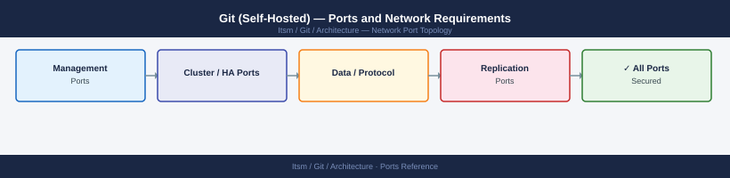

---
tags:
  - git
  - itsm
  - version-control
  - networking
  - firewall
  - ports
description: "Firewall port reference for self-hosted Git platforms (GitLab, Bitbucket Data Center). Covers web/API, SSH Git operations, CI/CD runner connections, and..."
---
# Git (Self-Hosted) — Ports and Network Requirements

<div class="kb-summary">
Firewall port reference for self-hosted Git platforms (GitLab, Bitbucket Data Center). Covers web/API, SSH Git operations, CI/CD runner connections, and webhook delivery.

*Applies to: GitLab CE/EE 16.x / Bitbucket Data Center 8.x*
</div>


## Inbound — Client Access

| Port | Protocol | Source | Purpose |
|---|---|---|---|
| 443 | TCP | Developers, CI/CD pipelines, API clients | HTTPS — web UI, REST API, HTTPS Git clone/push/pull |
| 80 | TCP | Clients | HTTP — redirects to 443 |
| 22 | TCP | Developers, CI/CD runners | SSH — Git clone/push/pull via SSH protocol |

## CI/CD Runner to GitLab/Bitbucket

| Port | Protocol | Source | Destination | Purpose |
|---|---|---|---|---|
| 443 | TCP | GitLab Runner / Bamboo | GitLab / Bitbucket server | Job polling, artifact upload |
| 443 | TCP | GitLab / Bitbucket | Deployment targets (via webhook) | Webhook delivery to external services |

## Database

| Port | Protocol | Destination | Purpose |
|---|---|---|---|
| 5432 | TCP | PostgreSQL | GitLab primary database |
| 6379 | TCP | Redis | GitLab Sidekiq job queue, caching |

## GitLab Cluster (Gitaly, Praefect)

| Port | Protocol | Between | Purpose |
|---|---|---|---|
| 8075 | TCP | GitLab app → Gitaly | Gitaly gRPC — Git repository operations |
| 2305 | TCP | Praefect nodes ↔ Praefect nodes | Praefect cluster (HA Gitaly) |

## Outbound — Server to External

| Port | Protocol | Destination | Purpose |
|---|---|---|---|
| 25 | TCP | SMTP relay | Email notifications (MR, pipeline, issue alerts) |
| 443 | TCP | External webhook receivers, Slack, Jira | Outbound webhooks and integrations |
| 443 | TCP | Container registry (gcr.io, DockerHub) | Pipeline image pulls (if no local registry) |

## Firewall Zone Summary

| From | To | Ports | Notes |
|---|---|---|---|
| Developers | Git server | 443, 22 | HTTPS and SSH Git |
| CI/CD runners | Git server | 443 | Job coordination |
| Git server | PostgreSQL | 5432 | Database |
| Git server | Redis | 6379 | Queue and cache |
| Git app | Gitaly | 8075 | Git operations |
| Git server | SMTP | 25 | Email notifications |

## Verify

```bash
# From developer workstation — test HTTPS clone
git clone https://<gitlab-host>/test/repo.git /tmp/test-clone

# From developer workstation — test SSH
ssh -T git@<gitlab-host>

# From CI runner — test API connectivity
curl -sk -o /dev/null -w "%{http_code}" https://<gitlab-host>/api/v4/projects

# From GitLab app server — test Gitaly
nc -zv <gitaly-host> 8075
```


```text title="Expected output"
Cloning into '/tmp/test-clone'...
remote: Enumerating objects: 1247, done.
remote: Counting objects: 100% (1247/1247), done.
remote: Compressing objects: 100% (892/892), done.
Receiving objects: 100% (1247/1247), 3.2 MiB | 8.4 MiB/s, done.
Resolving deltas: 100% (445/445), done.

Welcome to GitLab, @developer!

200

Connection to gitaly-prod-01.internal 8075 port [tcp/*] succeeded!
```

!!! warning "Common errors"
    **`fatal: unable to access 'https://<gitlab-host>/test/repo.git/': SSL certificate problem: self signed certificate`** — Add `git config --global http.sslVerify false` or use a valid CA-signed certificate on the GitLab host.
    **`Permission denied (publickey). fatal: Could not read from remote repository.`** — Verify the SSH public key is added to the GitLab user account and the runner's SSH private key has correct permissions (`chmod 600 ~/.ssh/id_rsa`).
    **`Connection refused`** — Confirm Gitaly service is running on the target host with `systemctl status gitaly` and verify the firewall allows port 8075 from the GitLab app server.
## See also

- [Git — Architecture](../how-it-works/)
- [Git — Operations](../../operations/)
- [Jira — Ports](../../jira/architecture/ports.md)
- [GitHub Actions — Ports](../../../automation/github-actions/architecture/ports.md)
