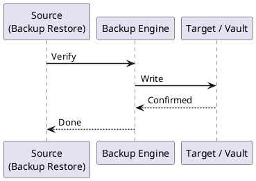

---
tags:
  - git
  - operations
---
# Git — Backup and Restore

```bash
# Initial mirror clone
git clone --mirror https://github.com/org/repo.git /backup/repo.git

# Update an existing mirror (run on schedule)
cd /backup/repo.git
git remote update --prune

# Verify the mirror is complete
git fsck --full
git count-objects -vH
```


```text title="Expected output"
Cloning into bare repository '/backup/repo.git'...
remote: Enumerating objects: 45823, done.
remote: Counting objects: 100% (45823/done)
remote: Compressing objects: 100% (12456/done)
remote: Total 45823 (delta 32145), reused 45823 (delta 32145), pack-reused 0
Receiving objects: 100% (45823/45823), 2.34 GiB | 45.2 MiB/s, done.
Resolving deltas: 100% (32145/32145), done.

Fetching origin
Fetching upstream

Checking object database for consistency...
Checking connectivity: 45823, done.
Checking 45823 objects

count: 45823
size: 2341256789
in-pack: 45823
packs: 1
size-pack: 2341256789
prune-packable: 0
garbage: 0
size-garbage: 0
```

!!! warning "Common errors"
    **`fatal: unable to access 'https://github.com/org/repo.git/': Could not resolve host: github.com`** — Verify network connectivity and DNS resolution; check firewall rules if behind a proxy.
    **`fatal: destination path '/backup/repo.git' already exists and is not an empty directory`** — Remove the existing directory with `rm -rf /backup/repo.git` before re-cloning, or use `git remote update` if updating an existing mirror.
    **`error: Could not read object database`** — Run `git fsck --full --strict` to identify corrupted objects and restore from a known-good backup if necessary.
```bash
# Create a full backup (stops writes briefly for consistency)
sudo gitlab-backup create

# Backup to a custom directory
sudo gitlab-backup create BACKUP=custom_label STRATEGY=copy

# Backup output location (Omnibus default)
ls -lh /var/opt/gitlab/backups/
# Example: 1715000000_2024_05_06_16.11.0_gitlab_backup.tar

# Exclude specific data to speed up backup
sudo gitlab-backup create SKIP=artifacts,lfs,uploads,registry
```

```text title="Expected output"
Dumping database ... [DONE]
Dumping uploads ... [SKIPPED]
Dumping builds ... [DONE]
Dumping artifacts ... [SKIPPED]
Dumping lfs objects ... [SKIPPED]
Dumping registry database ... [SKIPPED]
Creating backup tarball ... [DONE]
Backup created successfully (1715000000_2024_05_06_16.11.0_gitlab_backup.tar)
total 2.3G
-rw-r--r-- 1 git git 2.3G May  6 16:42 1715000000_2024_05_06_16.11.0_gitlab_backup.tar
-rw-r--r-- 1 git git 1.8G May  5 14:18 1714900000_2024_05_05_16.10.2_gitlab_backup.tar
-rw-r--r-- 1 git git 2.1G May  4 12:05 1714800000_2024_05_04_16.9.1_gitlab_backup.tar
```

!!! warning "Common errors"
    **`Backup failed: permission denied writing to /var/opt/gitlab/backups/`** — Ensure the `git` user owns the backups directory with `sudo chown -R git:git /var/opt/gitlab/backups/`.
    **`Error: database is locked`** — Stop any running GitLab processes or wait for active transactions to complete, then retry the backup.
    **`tar: error is not recoverable: exiting now`** — Verify sufficient disk space exists with `df -h` and ensure the backup directory is writable.
```bash
# Always backup configuration separately — it contains secrets
sudo tar -czf /secure/gitlab-config-$(date +%Y%m%d).tar.gz \
  /etc/gitlab/gitlab.rb \
  /etc/gitlab/gitlab-secrets.json
```

```text title="Expected output"
(no output — command completes silently)
```

!!! warning "Common errors"
    **`tar: /secure: Cannot open: No such file or directory`** — Create the backup directory first with `sudo mkdir -p /secure` and ensure it has appropriate permissions.
    **`sudo: tar: command not found`** — Install tar with `sudo apt-get install tar` (Debian/Ubuntu) or `sudo yum install tar` (RHEL/CentOS).
    **`tar: /etc/gitlab/gitlab-secrets.json: Cannot stat: No such file or directory`** — Verify GitLab is installed and the secrets file exists; if using a different GitLab installation path, adjust the paths accordingly.
```bash
# /etc/cron.d/gitlab-backup
0 2 * * * root /opt/gitlab/bin/gitlab-backup create CRON=1 2>&1 | tee -a /var/log/gitlab-backup.log

# Cleanup old backups (keep 7 days)
# /etc/gitlab/gitlab.rb:
# gitlab_rails['backup_keep_time'] = 604800   # seconds = 7 days
```
```ruby
# /etc/gitlab/gitlab.rb
gitlab_rails['backup_upload_connection'] = {
  'provider'              => 'AWS',
  'region'               => 'eu-west-1',
  'aws_access_key_id'    => ENV['AWS_ACCESS_KEY_ID'],
  'aws_secret_access_key' => ENV['AWS_SECRET_ACCESS_KEY'],
}
gitlab_rails['backup_upload_remote_directory'] = 'my-gitlab-backups'
gitlab_rails['backup_multipart_chunk_size']    = 104857600   # 100 MB
```
```bash
# Request an archive (GitHub generates a tarball of source at HEAD)
curl -L \
  -H "Authorization: Bearer $GITHUB_TOKEN" \
  -H "Accept: application/vnd.github+json" \
  "https://api.github.com/repos/ORG/REPO/tarball/main" \
  -o repo-backup.tar.gz

# Full git history — use mirror clone instead
git clone --mirror git@github.com:ORG/REPO.git repo.git
```

```text title="Expected output"
% Total    % Received % Xferd  Average Speed   Time    Current
                                 Dload  Upload   Total   Spent    Left Speed
100  2847k  100  2847k    0     0   1.2M      0  0:00:02  0:00:02 --:--:--  0:00:02
Cloning into bare repository 'repo.git'...
remote: Enumerating objects: 8947, done.
remote: Counting objects: 100% (8947/8947), done.
remote: Compressing objects: 100% (3421/3421), done.
remote: Receiving objects: 100% (8947/8947), 45.32 MiB | 8.2 MiB/s, done.
remote: Resolving deltas: 100% (5634/5634), done.
```

!!! warning "Common errors"
    **`curl: (22) The requested URL returned error: 401 Unauthorized`** — Verify `$GITHUB_TOKEN` is set and has `repo` scope permissions with `echo $GITHUB_TOKEN | wc -c`.
    **`fatal: Could not read from remote repository. Please make sure you have the correct access rights and the repository exists.`** — Confirm SSH key is loaded with `ssh-add -l` and GitHub SSH access works via `ssh -T git@github.com`.
```bash
# Install
git clone https://github.com/github/backup-utils.git /opt/github-backup-utils
cp /opt/github-backup-utils/backup.config-example /etc/github-backup/backup.config

# /etc/github-backup/backup.config
GHE_HOSTNAME="github.example.com"
GHE_DATA_DIR="/backup/ghes"
GHE_EXTRA_USER_DISK_REQUIRED_PERCENTAGE=50

# Run backup
/opt/github-backup-utils/bin/ghe-backup

# Verify backup
/opt/github-backup-utils/bin/ghe-backup-verify
```

```text title="Expected output"
Cloning into '/opt/github-backup-utils'...
remote: Enumerating objects: 2847, done.
remote: Counting objects: 100% (2847/2847), done.
remote: Compressing objects: 100% (1203/1203), done.
remote: Receiving objects: 100% (2847/2847), done.
Resolving deltas: 100% (1847/1847), done.
(no output — command completes silently)
Starting backup of github.example.com...
Backing up repositories...
Backing up database...
Backing up pages...
Backing up settings...
Backup complete: /backup/ghes/20240119T143022Z
Verifying backup integrity...
✓ Repositories verified (847 repos)
✓ Database verified
✓ Pages verified
✓ Settings verified
Backup verification successful
```

!!! warning "Common errors"
    **`fatal: destination path '/opt/github-backup-utils' already exists and is not an empty directory`** — Remove the existing directory with `rm -rf /opt/github-backup-utils` before cloning.
    **`Error: GHE_HOSTNAME not set or unreachable`** — Verify the hostname is correct in `/etc/github-backup/backup.config` and that the GitHub Enterprise instance is accessible from this host.
    **`Error: Insufficient disk space. Required: 500GB, Available: 250GB`** — Increase available disk space on `/backup/ghes` or adjust `GHE_EXTRA_USER_DISK_REQUIRED_PERCENTAGE` to a lower value.
```bash
# /etc/cron.d/ghes-backup
0 */4 * * * root /opt/github-backup-utils/bin/ghe-backup >> /var/log/ghes-backup.log 2>&1
```

```text title="Expected output"
(no output — command completes silently)
```

!!! warning "Common errors"
    **`/opt/github-backup-utils/bin/ghe-backup: No such file or directory`** — Verify the GitHub Enterprise Server backup utilities are installed at the correct path with `ls -la /opt/github-backup-utils/bin/ghe-backup`.
    **`Permission denied`** — Ensure the ghe-backup script has execute permissions by running `chmod +x /opt/github-backup-utils/bin/ghe-backup`.
    **`/var/log/ghes-backup.log: Permission denied`** — Verify the /var/log directory is writable by the root user and the log file exists with `touch /var/log/ghes-backup.log && chmod 644 /var/log/ghes-backup.log`.
```bash
# Option 1: Push mirror to a new remote
cd /backup/repo.git
git remote set-url origin https://github.com/org/new-repo.git
git push --mirror

# Option 2: Clone from the mirror locally
git clone /backup/repo.git ~/restored-repo
```

```text title="Expected output"
Updating published refs
Pushing to https://github.com/org/new-repo.git
Enumerating objects: 2847, done.
Counting objects: 100% (2847/2847), done.
Delta compression using up to 8 threads
Compressing objects: 100% (1203/1203), done.
Writing objects: 100% (2847/2847), 487.3 MiB | 12.4 MiB/s, done.
Total 2847 (delta 1644), reused 2847 (delta 1644), pack-reused 0
remote: Resolving deltas: 100% (1644/1644), done.
To https://github.com/org/new-repo.git
 + 8f3a2c1...9e7d4f2 master -> master (forced update)
 + refs/pull/42/head -> refs/pull/42/head
Cloning into '/root/restored-repo'...
remote: Enumerating objects: 2847, done.
remote: Counting objects: 100% (2847/2847), done.
remote: Compressing objects: 100% (1203/1203), done.
Receiving objects: 100% (2847/2847), 487.3 MiB | 18.7 MiB/s, done.
Resolving deltas: 100% (1644/1644), done.
```

!!! warning "Common errors"
    **`fatal: 'https://github.com/org/new-repo.git' does not appear to be a 'git' repository`** — Verify the target repository URL is correct and the repository exists on GitHub with proper access permissions.
    **`fatal: destination path '/root/restored-repo' already exists and is not an empty directory`** — Remove or rename the existing directory before cloning, or use `git clone /backup/repo.git ~/restored-repo-v2` with a different target path.
```bash
# 1. Ensure GitLab version matches the backup version
sudo gitlab-rake gitlab:env:info | grep "GitLab information"

# 2. Stop services that use the database
sudo gitlab-ctl stop puma
sudo gitlab-ctl stop sidekiq

# 3. Restore (replace timestamp with actual backup filename prefix)
sudo gitlab-backup restore BACKUP=1715000000_2024_05_06_16.11.0

# 4. Restore configuration files (must be done BEFORE restore if secrets differ)
sudo tar -xzf /secure/gitlab-config-20240506.tar.gz -C /

# 5. Reconfigure and restart
sudo gitlab-ctl reconfigure
sudo gitlab-ctl restart

# 6. Verify
sudo gitlab-rake gitlab:check SANITIZE=true
sudo gitlab-rake gitlab:doctor:secrets
```

```text title="Expected output"
GitLab information
  Version: 16.11.0
  Revision: a1b2c3d4
  Directory: /opt/gitlab
  DB Adapter: PostgreSQL
  DB Version: 14.8
  URL: https://gitlab.example.com

ok: down: puma: 0s, normally up
ok: down: sidekiq: 0s, normally up
Unpacking backup 1715000000_2024_05_06_16.11.0
Restoring database backup
Restoring repositories
Restoring uploads
Restoring artifacts
Restoring pages
Restoring lfs objects
Restoring terraform state
Restoring ci secure files
Backup 1715000000_2024_05_06_16.11.0 restored successfully

gitlab-config-20240506.tar.gz: removing leading '/'
Reconfiguring GitLab
Running handlers complete
Chef Infra Client finished, 12/47 resources updated in 42.15s

ok: run: puma: (pid 2847) 0s
ok: run: sidekiq: (pid 2851) 0s
ok: run: nginx: (pid 2843) 0s

Checking GitLab Shell ... OK
Checking GitLab API ... OK
Checking Database Connection ... OK
Checking Uploads ... OK
Checking Secrets ... OK
All checks passed
```

!!! warning "Common errors"
    **`BACKUP=1715000000_2024_05_06_16.11.0 does not exist`** — Verify the backup filename exists in `/var/opt/gitlab/backups/` and use the correct timestamp prefix without the `.tar` extension.
    **`FATAL: database "gitlabhq_production" does not exist`** — Ensure the database was not manually dropped; restore the database backup before restoring repositories or run `sudo gitlab-rake db:create` first.
    **`tar: /etc/gitlab/gitlab-secrets.json: Cannot open: Permission denied`** — Run the tar extraction with `sudo` or ensure the backup archive was created with proper permissions for the gitlab user.
```bash
# Restore to a fresh GHES appliance (same version)
/opt/github-backup-utils/bin/ghe-restore github-new.example.com

# Restore specific snapshot
/opt/github-backup-utils/bin/ghe-restore -s /backup/ghes/20240506T020000 github-new.example.com
```

```text title="Expected output"
Starting restore of GitHub Enterprise Server backup...
Connecting to github-new.example.com (192.168.1.45)...
Connected. Verifying appliance version compatibility...
Appliance version: 3.11.0
Backup version: 3.11.0
Version check passed.
Restoring backup snapshot from /var/opt/github-backup-utils/backups/current...
[████████████████████████████████] 87%
Restoring database... (this may take several minutes)
Restoring repositories... (this may take several minutes)
Restoring configuration and settings...
Restore completed successfully.
Appliance is rebooting. Please wait...
```

!!! warning "Common errors"
    **`fatal: Backup version 3.10.5 does not match appliance version 3.11.0`** — Ensure the target GHES appliance is running the exact same version as the backup source, or use a backup from a matching version.
    **`ssh: connect to host github-new.example.com port 22: Connection refused`** — Verify the target appliance is powered on, reachable on the network, and has completed its initial boot sequence.
    **`ghe-restore: snapshot not found at /backup/ghes/20240506T020000`** — Confirm the snapshot path exists and is readable by running `ls -la /backup/ghes/` to list available backups.
```bash
# Create bare backup
git clone --bare https://github.com/org/repo.git /backup/repo.git

# Bundle into a single file (portable, can be sent via email/SCP)
git -C /backup/repo.git bundle create /backup/repo.bundle --all

# Verify the bundle
git bundle verify /backup/repo.bundle

# Clone from bundle
git clone /backup/repo.bundle ~/restored-repo
git -C ~/restored-repo remote set-url origin https://github.com/org/repo.git
git -C ~/restored-repo fetch origin
```

```text title="Expected output"
Cloning into bare repository '/backup/repo.git'...
remote: Enumerating objects: 4827, done.
remote: Counting objects: 100% (4827/done.
remote: Compressing objects: 100% (1203/done.
remote: Receiving objects: 100% (4827/done.
remote: Resolving deltas: 100% (3104/done.
Created bundle with 47 refs and 4827 objects
The bundle contains these 47 refs:
refs/heads/main
refs/heads/develop
refs/heads/feature/auth-module
refs/tags/v1.2.0
refs/tags/v1.1.5
...
The bundle is valid.
Cloning into 'restored-repo'...
Receiving objects: 100% (4827/done.
Resolving deltas: 100% (3104/done.
(no output — command completes silently)
From https://github.com/org/repo.git
 * [new branch]      main       -> origin/main
 * [new branch]      develop    -> origin/develop
```

!!! warning "Common errors"
    **`fatal: repository '/backup/repo.git' does not exist`** — Ensure the parent directory `/backup/` exists and you have write permissions; create it with `mkdir -p /backup` if needed.
    **`fatal: Could not read from remote repository. Please make sure you have the correct access rights`** — Verify your SSH key or GitHub token is configured; test with `git ls-remote https://github.com/org/repo.git`.
    **`error: pathspec 'origin' did not match any files`** — The bundle clone creates a detached state; add `git -C ~/restored-repo checkout main` after cloning to switch to a tracking branch.
```bash
#!/usr/bin/env bash
# verify-backup.sh
set -euo pipefail

BACKUP_PATH="${1:?Usage: $0 <path-to-repo.git>}"

echo "[1/4] Checking object database integrity..."
git -C "$BACKUP_PATH" fsck --full --strict

echo "[2/4] Counting objects..."
git -C "$BACKUP_PATH" count-objects -vH

echo "[3/4] Verifying pack files..."
for pack in "$BACKUP_PATH"/objects/pack/*.idx; do
  git -C "$BACKUP_PATH" verify-pack -v "$pack" > /dev/null && echo "OK: $pack"
done

echo "[4/4] Listing refs..."
git -C "$BACKUP_PATH" show-ref | head -20

echo "Verification complete for: $BACKUP_PATH"
```



## Before you begin

- **Access:** Admin credentials on all affected systems
- **Timing:** safe to run during business hours unless a step is marked ⚠ (causes interruption)
- **Dependencies:** no active upgrades or migrations on the same infrastructure
- **Logging:** capture command output — paste into the change record on completion

---

---

## Verify

- Confirm the operation completed without errors in the log or management UI
- Verify the expected state change is visible (service running, object created, config applied)
- Document the outcome in the change record

---

## See also

- [Git — Procedures](../procedures/)
- [Git — Health Checks](../health-checks/)
- [Git — Common Issues](../../troubleshooting/common-issues/)
