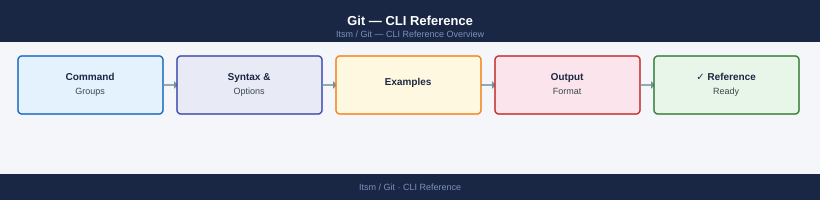

---
tags:
  - git
  - operations
---
# Git — CLI Reference



```bash
# Identity (required — used in every commit you make)
git config --global user.name "Your Name"
git config --global user.email "you@example.com"
git config --global core.editor vim
git config --list

# Useful alias
git config --global alias.st status

# Initialize and clone
git init
git clone <url>
git clone <url> <directory>
git clone --depth 1 <url>       # shallow clone — just the latest snapshot, no full history

# Remotes
git remote -v
git remote add origin <url>
git remote remove <name>
git remote set-url origin <new_url>
```

```bash
# List
git branch
git branch -a                   # include remote-tracking branches
git branch -v                   # with last commit

# Create / switch
git branch <name>
git checkout -b <name>          # create and switch (classic syntax)
git switch -c <name>            # create and switch (modern syntax)
git switch <name>               # switch to existing branch

# Rename
git branch -m <old> <new>

# Delete
git branch -d <name>            # safe delete (refuses if unmerged)
git branch -D <name>            # force delete
git push origin --delete <name> # delete the remote branch

# Set upstream (track remote branch)
git branch --set-upstream-to=origin/<name>
```
```bash
# Merge
git merge <branch>
git merge --no-ff <branch>      # always create a merge commit (even if fast-forward possible)
git merge --squash <branch>     # squash all branch commits into one unstaged change
git merge --abort               # abort a conflicted merge

# Rebase (replay current branch commits on top of <branch>)
git rebase <branch>
git rebase -i HEAD~3            # interactive rebase of last 3 commits (squash, reword, drop)
git rebase --continue           # after resolving conflicts
git rebase --abort
git rebase --skip
```
```bash
git fetch
git fetch --all                 # fetch all remotes
git fetch --prune               # also remove remote-tracking branches that no longer exist

git pull
git pull --rebase               # rebase instead of merge (keeps linear history)
git pull origin <branch>

git push
git push -u origin <branch>     # push and set upstream tracking
git push --force-with-lease     # safe force push — fails if remote has changes you haven't seen
git push --tags                 # push all tags
git push origin :<branch>       # delete a remote branch (older syntax)
```
```bash
git stash
git stash push -m "description"  # stash with a label
git stash list
git stash pop                    # apply top stash and remove it from the stack
git stash apply stash@{0}        # apply without removing from stack
git stash drop stash@{0}         # remove a specific stash
git stash clear                  # remove all stashes
git stash show -p stash@{0}      # view the diff of a stash
```
```bash
git tag                          # list all tags
git tag <name>                   # create lightweight tag at HEAD
git tag -a <name> -m "msg"       # create annotated tag (preferred for releases)
git tag -a <name> <commit>       # annotate a specific past commit
git push origin <tag>            # push a single tag
git push --tags                  # push all tags
git tag -d <name>                # delete local tag
git push origin --delete <tag>   # delete remote tag
```
```bash
# Unstage a file (keep the changes in working directory)
git restore --staged <file>

# Discard working directory changes (permanent — gone immediately)
git restore <file>

# Move branch pointer back N commits
git reset --soft HEAD~1          # move pointer back, keep changes staged
git reset --mixed HEAD~1         # move pointer back, keep changes unstaged (default)
git reset --hard HEAD~1          # move pointer back, discard all changes

# Reset to match the remote branch exactly
git fetch && git reset --hard origin/<branch>
```
```bash
git cherry-pick <commit>
git cherry-pick <commit1>..<commit2>   # range (exclusive start)
git cherry-pick --no-commit <commit>   # apply changes without committing
git cherry-pick --abort
```
```bash
git bisect start
git bisect bad                   # mark current commit as broken
git bisect good <commit>         # mark last known working commit
# Git checks out the midpoint — test it, then:
git bisect good                  # or: git bisect bad
git bisect reset                 # end bisect session
```
```bash
git submodule add <url> <path>
git submodule update --init --recursive   # after cloning a repo with submodules
git submodule foreach git pull            # update all submodules to latest
```
```bash
git config --global alias.lg "log --oneline --graph --all --decorate"
git config --global alias.undo "reset --soft HEAD~1"
git config --global alias.unstage "restore --staged"
git config --global alias.aliases "config --get-regexp alias"
```

```d2
direction: right

center: "Cli Reference" {shape: rectangle}
verify: "Verify" {shape: rectangle}

center -> verify
```

## Before you begin

- **Access:** Admin credentials on all affected systems
- **Timing:** safe to run during business hours unless a step is marked ⚠ (causes interruption)
- **Dependencies:** no active upgrades or migrations on the same infrastructure
- **Logging:** capture command output — paste into the change record on completion

---

---

## Verify

- Confirm the operation completed without errors in the log or management UI
- Verify the expected state change is visible (service running, object created, config applied)
- Document the outcome in the change record

---

## See also

- [Git — Procedures](../procedures/)
- [Git — Scripts](../scripts/)
- [Git — Health Checks](../health-checks/)
