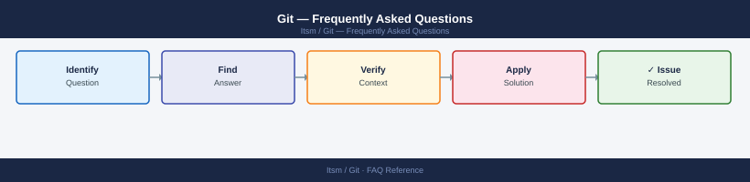

---
tags:
  - git
  - faq
  - operations
---
# Git — Frequently Asked Questions

Common questions about Git operations, configuration, and troubleshooting. For step-by-step procedures, see the <a href="index.md">Operations</a> section.

## General

**Q: What Git version is recommended?**
A: Git 2.40+ for new installations. Check with `git --version`. Older versions lack security fixes and features like `git switch`/`git restore`. Update via OS package manager.

**Q: How do I check the current Git version?**
A: `git --version`

## Configuration

**Q: What is the default branch name and when should it be changed?**
A: Historically `master`, now `main` is the default in Git 2.28+. Set globally: `git config --global init.defaultBranch main`. Update existing repos with `git branch -m master main`.

**Q: How do I enable GPG commit signing?**
A: `git config --global commit.gpgsign true` and `git config --global user.signingkey <key-id>`. Verify with `git log --show-signature`. GitHub/GitLab display 'Verified' badge on signed commits.

## Operations

**Q: How do I update Git across all servers without disrupting CI pipelines?**
A: Update Git via OS package manager during a low-traffic window. Git is backward compatible — newer Git reads older repos without issue. Test with `git --version` and a basic `git status` after updating.

**Q: What is the correct procedure to add a new remote to an existing repository?**
A: `git remote add <name> <url>`. Verify with `git remote -v`. For mirrors: `git remote add mirror git@internal:repo.git` and push with `git push mirror --all --tags`.

## Troubleshooting

**Q: Git shows 'warning: LF will be replaced by CRLF'. What does it mean?**
A: Line ending conversion is configured via `core.autocrlf`. On Windows, `autocrlf=true` converts LF to CRLF on checkout. Set `.gitattributes` to enforce consistent line endings across the team.

**Q: Git operations are slow on large repositories — where do I start?**
A: Enable partial clone (`git clone --filter=blob:none`). Use `git sparse-checkout` for large monorepos. Run `git gc --aggressive` to compact object store. Shallow clones (`--depth=1`) speed up CI pipelines.

## Backup and Recovery

**Q: How often should I back up Git repositories?**
A: Mirror to a secondary Git server (Gitea, internal GitLab) with `git push --mirror`. For GitHub/GitLab SaaS, use the platform's built-in backup features or a third-party tool like Gitprotect.

**Q: Can I restore a deleted branch without a full repository restore?**
A: Yes — if the commits are still in the reflog: `git reflog | grep 'checkout: moving from branchname'`. Find the commit SHA and `git checkout -b branchname <sha>`. Reflog expires after 90 days by default.

## See Also

- [Git Operations](index.md)
- [Git Troubleshooting](../../troubleshooting/index.md)
