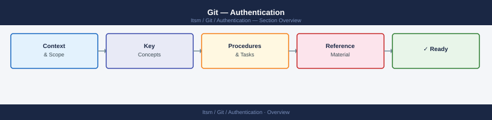
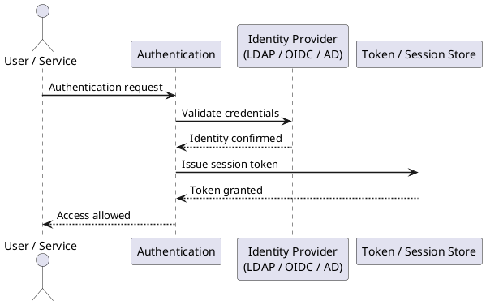

---
tags:
  - git
  - security
---
# Git — Authentication



```bash
# Generate Ed25519 key (preferred)
ssh-keygen -t ed25519 -C "user@corp.example.com" -f ~/.ssh/id_ed25519_git

# Generate RSA 4096 (fallback for legacy systems)
ssh-keygen -t rsa -b 4096 -C "user@corp.example.com" -f ~/.ssh/id_rsa_git

# Verify key fingerprint before uploading
ssh-keygen -lf ~/.ssh/id_ed25519_git.pub
```

```bash
# Display public key for upload to GitHub/GitLab/Bitbucket
cat ~/.ssh/id_ed25519_git.pub

# Test connection
ssh -T git@github.com
ssh -T git@gitlab.corp.example.com
```
```bash
# Generate a deploy key (no passphrase — stored securely in CI)
ssh-keygen -t ed25519 -C "deploy-key-repo-name" -f ~/.ssh/deploy_key_reponame -N ""
```
```bash
# Store a PAT securely using Git credential helper
git config --global credential.helper osxkeychain          # macOS
git config --global credential.helper manager              # Windows (Git Credential Manager)
git config --global credential.helper libsecret            # Linux GNOME keyring

# Verify stored credential
git credential fill <<'EOF'
protocol=https
host=github.com
EOF
```
```text
Token expiry: 90 days maximum (enforce via org policy)
Repository access: Selected repositories only
Permissions: Contents: Read and write, Metadata: Read
```
```bash
# Generate a GPG key (RSA 4096 or Ed25519)
gpg --full-generate-key
# Choose: (1) RSA and RSA, 4096 bits, 2y expiry

# List keys and get key ID
gpg --list-secret-keys --keyid-format=long

# Configure Git to use the key
git config --global user.signingkey <KEY_ID>
git config --global commit.gpgsign true
git config --global tag.gpgsign true

# Export public key for upload to GitHub/GitLab
gpg --armor --export <KEY_ID>
```
```bash
# Verify a specific commit
git verify-commit HEAD

# Show signature status in log
git log --show-signature -5

# Verify a signed tag
git verify-tag v1.2.3
```
```bash
# Sign a user key with an SSH CA (on the CA host)
ssh-keygen -s /etc/ssh/ca_key \
  -I "user@corp.example.com" \
  -n git \
  -V +8h \
  ~/.ssh/id_ed25519_git.pub

# The resulting certificate is id_ed25519_git-cert.pub
# Configure SSH to present it automatically
# ~/.ssh/config
Host gitlab.corp.example.com
    CertificateFile ~/.ssh/id_ed25519_git-cert.pub
    IdentityFile ~/.ssh/id_ed25519_git
```
```bash
# List all SSH keys registered on GitHub via API
gh api /user/keys --jq '.[].title'

# List all PATs (GitHub)
gh api /user/tokens --paginate

# Revoke a PAT by ID
gh api --method DELETE /user/tokens/<token_id>

# Find hardcoded credentials in repo history (use truffleHog)
trufflehog git https://github.com/org/repo.git --only-verified
```



## Before you begin

- **Access:** Admin credentials on all affected systems
- **Change management:** security changes require CAB approval in most environments
- **Rollback plan:** document current state before any security control change
- **Testing:** validate in a non-production environment first where possible

---

---

## See also

- [Git — Access Control](../access-control/)
- [Git — Hardening](../hardening/)
- [Git — Encryption](../encryption/)
