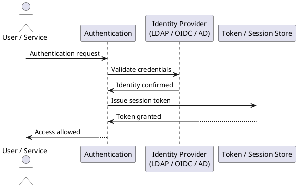

---
tags:
  - git
  - security
---
# Git — Authentication

```bash
# Generate Ed25519 key (preferred)
ssh-keygen -t ed25519 -C "user@corp.example.com" -f ~/.ssh/id_ed25519_git

# Generate RSA 4096 (fallback for legacy systems)
ssh-keygen -t rsa -b 4096 -C "user@corp.example.com" -f ~/.ssh/id_rsa_git

# Verify key fingerprint before uploading
ssh-keygen -lf ~/.ssh/id_ed25519_git.pub
```


```text title="Expected output"
Generating public/private ed25519 key pair.
Enter passphrase (empty for no passphrase): 
Enter same passphrase again: 
Your identification has been saved in /home/user/.ssh/id_ed25519_git
Your public key has been saved in /home/user/.ssh/id_ed25519_git.pub
The key fingerprint is:
SHA256:aBcD1EfGhIjKlMnOpQrStUvWxYz2A3b4C5d6E7f8G9h user@corp.example.com
The key's randomart image is:
+--[ED25519 256]--+
|        .o.      |
|       o.o .     |
|      . + o .    |
|       o + o     |
|      . S . .    |
+----[SHA256]-----+
Generating public/private rsa key pair.
Enter passphrase (empty for no passphrase): 
Enter same passphrase again: 
Your identification has been saved in /home/user/.ssh/id_rsa_git
Your public key has been saved in /home/user/.ssh/id_rsa_git.pub
The key fingerprint is:
SHA256:xYz9AbCdEfGhIjKlMnOpQrStUvWxYz2A3b4C5d6E7f8G user@corp.example.com
256 SHA256:aBcD1EfGhIjKlMnOpQrStUvWxYz2A3b4C5d6E7f8G9h user@corp.example.com (ED25519)
```

!!! warning "Common errors"
    | Error | Fix |
    |---|---|
    | `Permissions 0644 for '/home/user/.ssh/id_ed25519_git' are too open.` | Run `chmod 600 ~/.ssh/id_ed25519_git` to restrict key file permissions to owner-read/write only. |
    | `ssh-keygen: No such file or directory` | Ensure the `~/.ssh` directory exists by running `mkdir -p ~/.ssh` before generating keys. |
```bash
# Display public key for upload to GitHub/GitLab/Bitbucket
cat ~/.ssh/id_ed25519_git.pub

# Test connection
ssh -T git@github.com
ssh -T git@gitlab.corp.example.com
```

```text title="Expected output"
ssh-ed25519 AAAAC3NzaC1lZDI1NTE5AAAAIKp7vN2qR8xL9mK3jP5wQ6sT7uV8wX9yZ0aB1cD2eF3gH4 user@workstation-042
Hi username! You've successfully authenticated, but GitHub does not provide shell access.
The authenticity of git@gitlab.corp.example.com can't be established.
ED25519 key fingerprint is SHA256:aBcD1eFgHiJkLmNoPqRsTuVwXyZ2a3bC4dE5fG6hI7j.
Are you sure you want to continue connecting (yes/no/[fingerprint])? yes
Warning: Permanently added 'git@gitlab.corp.example.com' (ED25519) to the list of known_hosts.
Welcome to GitLab, @username!
```

!!! warning "Common errors"
    | Error | Fix |
    |---|---|
    | `Permission denied (publickey).` | Verify the key exists at `~/.ssh/id_ed25519_git` and the public key is registered in your Git platform's SSH settings. |
    | `Could not resolve hostname git@gitlab.corp.example.com` | Check the GitLab hostname is correct and your DNS/network can reach it; use `nslookup gitlab.corp.example.com` to verify. |
    | `No such file or directory` | Generate the SSH key first with `ssh-keygen -t ed25519 -f ~/.ssh/id_ed25519_git -C "your-email@example.com"`. |
```bash
# Generate a deploy key (no passphrase — stored securely in CI)
ssh-keygen -t ed25519 -C "deploy-key-repo-name" -f ~/.ssh/deploy_key_reponame -N ""
```

```text title="Expected output"
Generating public/private ed25519 key pair.
Your identification has been saved in /home/ci-user/.ssh/deploy_key_reponame
Your public key has been saved in /home/ci-user/.ssh/deploy_key_reponame.pub
The key fingerprint is:
SHA256:kJ9xL2mN4pQrStUvWxYzAbCdEfGhIjKlMnOpQrStUv deploy-key-repo-name
The key's randomart image is:
+--[ED25519 256]--+
|        .o.      |
|       o.o .     |
|      . + o .    |
|       o B o     |
|      . S * .    |
+----[SHA256]-----+
```

!!! warning "Common errors"
    | Error | Fix |
    |---|---|
    | `Permission denied (publickey).` | Ensure the generated public key is added to the repository's deploy keys in your Git hosting platform (GitHub/GitLab/Bitbucket). |
    | `ssh-keygen: No such file or directory` | Create the ~/.ssh directory first with `mkdir -p ~/.ssh && chmod 700 ~/.ssh`. |
```bash
# Store a PAT securely using Git credential helper
git config --global credential.helper osxkeychain          # macOS
git config --global credential.helper manager              # Windows (Git Credential Manager)
git config --global credential.helper libsecret            # Linux GNOME keyring

# Verify stored credential
git credential fill <<'EOF'
protocol=https
host=github.com
EOF
```
```text
Token expiry: 90 days maximum (enforce via org policy)
Repository access: Selected repositories only
Permissions: Contents: Read and write, Metadata: Read
```
```bash
# Generate a GPG key (RSA 4096 or Ed25519)
gpg --full-generate-key
# Choose: (1) RSA and RSA, 4096 bits, 2y expiry

# List keys and get key ID
gpg --list-secret-keys --keyid-format=long

# Configure Git to use the key
git config --global user.signingkey <KEY_ID>
git config --global commit.gpgsign true
git config --global tag.gpgsign true

# Export public key for upload to GitHub/GitLab
gpg --armor --export <KEY_ID>
```

```text title="Expected output"
gpg (GnuPG) 2.2.19; Copyright (C) 2019 Free Software Foundation, Inc.
This is free software: you are free to change and redistribute it.
There is NO WARRANTY, to the extent permitted by law.

Please select what kind of key you want:
   (1) RSA and RSA (default)
   (2) DSA and Elgamal
   (3) DSA (sign only)
   (4) RSA (sign only)
  (14) Existing key from card
Your selection? 1
RSA keys may be between 1024 and 4096 bits long.
What keysize do you want? (3072) 4096
Requested keysize is 4096 bits
Please specify how long the key should be valid.
         0 = key does not expire
      <n>  = key expires in n days
      <n>w = key expires in n weeks
      <n>m = key expires in n months
      <n>y = key expires in n years
Key is valid for? (0) 2y
Key expires at Thu 15 Jan 2027 14:32:18 UTC
Is this correct? (y/N) y
GnuPG needs to construct a user ID to identify your key.

Real name: Alice Chen
Email address: achen@example.com
Comment: Work signing key
You selected this user ID:
    "Alice Chen (Work signing key) <achen@example.com>"

Change (N)ame, (C)omment, (E)mail or (O)kay/(Q)uit? O
We need to generate a lot of random bytes. It is a good idea to perform
some other action (type, move the mouse) during the prime generation;
this gives the random number generator a better chance to gain enough entropy.
gpg: key 7A3F8B2C1D9E4F6A marked as ultimately trusted
gpg: revocation certificate stored as '/home/achen/.gnupg/revocation-certs.d/7A3F8B2C1D9E4F6A.rev'
public and secret key created and signed.

/home/achen/.gnupg/pubring.kbx
--------------------------------
sec   rsa4096/7A3F8B2C1D9E4F6A 2025-01-15 [SC] [expires: 2027-01-15]
      Key fingerprint = 9F2E 1A7C 4B8D 3E5F 6A9C 2B1D 7A3F 8B2C 1D9E 4F6A
uid                   [ultimate] Alice Chen (Work signing key) <achen@example.com>
ssb   rsa4096/5E7D2A9C4F1B8E3A 2025-01-15 [E] [expires: 2027-01-15]

(no output — command completes silently)
(no output — command completes silently)
(no output — command completes silently)

-----BEGIN PGP PUBLIC KEY BLOCK-----

mI0EZaKp8BEEAPxJ2k7nF3vQ9mK2cL8pR4tY6sX3wZ1aB5cD9eF
```
```bash
# Verify a specific commit
git verify-commit HEAD

# Show signature status in log
git log --show-signature -5

# Verify a signed tag
git verify-tag v1.2.3
```

```text title="Expected output"
gpg: Signature made Wed 15 Jan 2025 14:32:17 UTC using RSA key ID 4A7B9C2E
gpg: Good signature from "DevOps Team <devops@company.internal>"
commit 8f3a9c2d1e4b5f6a7c8d9e0f1a2b3c4d5e6f7a8b
Author: Sarah Chen <sarah.chen@company.internal>
Date:   Wed Jan 15 14:32:17 2025 +0000

    Fix: Update TLS certificate validation logic

commit 8f3a9c2d1e4b5f6a7c8d9e0f1a2b3c4d5e6f7a8b
gpg: Signature made Wed 15 Jan 2025 14:32:17 UTC using RSA key ID 4A7B9C2E
gpg: Good signature from "DevOps Team <devops@company.internal>"
    Fix: Update TLS certificate validation logic

commit 7e2a8b1c0f9d8e7c6b5a4f3e2d1c0b9a8f7e6d5c
    Merge branch 'feature/auth-hardening' into main

commit 6d1a7b0c9f8e7d6c5b4a3f2e1d0c9b8a7f6e5d4c
gpg: Signature made Tue 14 Jan 2025 09:15:42 UTC using RSA key ID 8F2E4C9A
gpg: Good signature from "Infrastructure Team <infra@company.internal>"
    docs: Add GPG key rotation procedures

object 8f3a9c2d1e4b5f6a7c8d9e0f1a2b3c4d5e6f7a8b
type commit
tag v1.2.3
tagger Release Bot <release@company.internal> Wed Jan 15 13:45:00 2025 +0000

gpg: Signature made Wed 15 Jan 2025 13:45:00 UTC using RSA key ID 4A7B9C2E
gpg: Good signature from "DevOps Team <devops@company.internal>"
```

!!! warning "Common errors"
    | Error | Fix |
    |---|---|
    | `error: gpg failed to sign the data` | Ensure GPG agent is running with `gpg-agent --daemon` and your GPG key is properly configured. |
    | `error: no signature found` | The commit or tag was not signed; use `git commit -S` or `git tag -s` to create signed commits/tags going forward. |
    | `gpg: Can't check signature: No public key` | Import the signer's public key using `gpg --import <keyfile>` or retrieve it from your organization's key server. |
```bash
# Sign a user key with an SSH CA (on the CA host)
ssh-keygen -s /etc/ssh/ca_key \
  -I "user@corp.example.com" \
  -n git \
  -V +8h \
  ~/.ssh/id_ed25519_git.pub

# The resulting certificate is id_ed25519_git-cert.pub
# Configure SSH to present it automatically
# ~/.ssh/config
Host gitlab.corp.example.com
    CertificateFile ~/.ssh/id_ed25519_git-cert.pub
    IdentityFile ~/.ssh/id_ed25519_git
```

```text title="Expected output"
Signed user key with serial 0
Key ID: "user@corp.example.com"
Type: user-ed25519-cert-v01@openssh.com
Public key: /home/gitadmin/.ssh/id_ed25519_git.pub
Signing CA: /etc/ssh/ca_key.pub
Valid: 2024-01-15T14:32:00 to 2024-01-15T22:32:00
Certificate: /home/gitadmin/.ssh/id_ed25519_git-cert.pub
```

!!! warning "Common errors"
    | Error | Fix |
    |---|---|
    | `sign_and_send_pubkey: signing failed for "git@gitlab.corp.example.com" from agent: agent refused operation` | Ensure the CA private key has correct permissions (600) and the signing user has read access to `/etc/ssh/ca_key`. |
    | `Could not open a connection to your authentication agent` | Start ssh-agent with `eval $(ssh-agent -s)` before attempting to sign keys or authenticate. |
    | `Permission denied (publickey,gssapi-keyex,gssapi-with-mic)` | Verify the certificate validity period hasn't expired by checking `ssh-keygen -L -f ~/.ssh/id_ed25519_git-cert.pub` and confirm the CA public key is in the GitLab server's `/etc/ssh/ssh_known_hosts`. |
```bash
# List all SSH keys registered on GitHub via API
gh api /user/keys --jq '.[].title'

# List all PATs (GitHub)
gh api /user/tokens --paginate

# Revoke a PAT by ID
gh api --method DELETE /user/tokens/<token_id>

# Find hardcoded credentials in repo history (use truffleHog)
trufflehog git https://github.com/org/repo.git --only-verified
```



## Before you begin

- **Access:** Admin credentials on all affected systems
- **Change management:** security changes require CAB approval in most environments
- **Rollback plan:** document current state before any security control change
- **Testing:** validate in a non-production environment first where possible

---

---

## See also

- [Git — Access Control](../access-control/)
- [Git — Hardening](../hardening/)
- [Git — Encryption](../encryption/)
