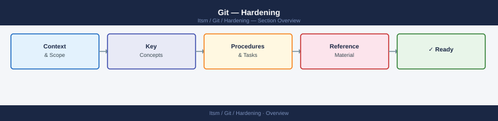

---
tags:
  - git
  - security
---
# Git — Hardening



```bash
# Install pre-commit
pip install pre-commit
# or
brew install pre-commit

# Install hooks into the repository
cd /path/to/repo
pre-commit install

# Also install for commit-msg and push hooks
pre-commit install --hook-type commit-msg
pre-commit install --hook-type pre-push
```

```bash
# Scan full history with gitleaks
gitleaks detect \
  --source . \
  --report-format json \
  --report-path gitleaks-report.json \
  --log-level debug

# Scan a single commit
gitleaks detect --log-opts "HEAD~1..HEAD"

# Scan with truffleHog (verified secrets only)
trufflehog git file://. --only-verified --json

# Initialise detect-secrets baseline (mark known false positives)
detect-secrets scan > .secrets.baseline
detect-secrets audit .secrets.baseline
```
```bash
# Check if secret scanning is enabled on a repo
gh api /repos/{org}/{repo} --jq '.security_and_analysis.secret_scanning.status'

# Enable secret scanning via API
gh api --method PATCH /repos/{org}/{repo} \
  --field security_and_analysis='{"secret_scanning":{"status":"enabled"},"secret_scanning_push_protection":{"status":"enabled"}}'

# List detected secrets
gh api /repos/{org}/{repo}/secret-scanning/alerts \
  --jq '.[] | [.secret_type, .state, .html_url] | @tsv'
```
```gitattributes
# .gitattributes

# Enforce LF line endings (prevent CRLF injection)
* text=auto eol=lf

# Mark binary files as binary (prevent diff poisoning)
*.png binary
*.jpg binary
*.pdf binary
*.zip binary
*.exe binary

# Encrypt sensitive files with git-crypt
secrets/**         filter=git-crypt diff=git-crypt
*.pem              filter=git-crypt diff=git-crypt
*.pfx              filter=git-crypt diff=git-crypt
.env               filter=git-crypt diff=git-crypt
config/prod*.yaml  filter=git-crypt diff=git-crypt

# Export-ignore (exclude from git archive)
.github/           export-ignore
tests/             export-ignore
Makefile           export-ignore
```
```gitignore
# .gitignore — security-critical entries

# Secret files
.env
.env.*
*.pem
*.key
*.pfx
*.p12
*.jks
*.keystore
id_rsa
id_ed25519
*.gpg
secrets/
vault-token

# Credentials and config with secrets
.aws/credentials
.aws/config
.kube/config
kubeconfig
terraform.tfstate
terraform.tfstate.backup
*.tfvars
.terraform/

# IDE and OS files that can leak paths/config
.idea/
.vscode/settings.json
.DS_Store
Thumbs.db

# Build artefacts with embedded secrets
*.log
*.dump
core.*
```
```yaml
# .github/workflows/build.yml
name: Build

on:
  push:
    branches: [main]
  pull_request:
    branches: [main]

# Restrict default token permissions — least privilege
permissions:
  contents: read

jobs:
  build:
    runs-on: ubuntu-latest
    permissions:
      contents: read
      id-token: write  # Only if OIDC auth needed

    steps:
      # Pin actions to full commit SHA — not mutable tags
      - uses: actions/checkout@11bd71901bbe5b1630ceea73d27597364c9af683  # v4.2.2
        with:
          persist-credentials: false  # Don't persist GitHub token

      # Use OIDC instead of long-lived credentials for cloud auth
      - name: Configure AWS credentials via OIDC
        uses: aws-actions/configure-aws-credentials@e3dd6a429d7300a6a4c196c26e071d42e0343502  # v4.0.2
        with:
          role-to-assume: arn:aws:iam::123456789012:role/GitHubActionsRole
          aws-region: eu-west-1

      - name: Run security scan
        run: |
          # Never print secrets even in debug mode
          set +x
          echo "Build step"
```
```bash
# Audit GitHub Actions workflow permissions
gh api /repos/{org}/{repo}/actions/permissions/workflow \
  --jq '.default_workflow_permissions'

# List third-party actions used across workflows
grep -r "uses:" .github/workflows/ | awk '{print $2}' | sort -u

# Identify actions not pinned to a commit SHA
grep -r "uses:" .github/workflows/ | grep -v "@[0-9a-f]\{40\}"
```
```bash
# Store a secret in GitHub Actions
gh secret set DATABASE_PASSWORD --body "$(cat /dev/stdin)" <<< "$SECRET_VALUE"

# List secrets (names only — values never shown)
gh secret list

# Remove a secret
gh secret delete DATABASE_PASSWORD

# Environment-scoped secret (only available in specific environments)
gh secret set PROD_API_KEY --env production --body "$SECRET_VALUE"
```
```bash
#!/bin/bash
ORG="your-org"

# Check security settings for all repos
gh api /orgs/$ORG/repos --paginate --jq '
  .[] | {
    name,
    private,
    delete_branch_on_merge,
    allow_force_pushes: .allow_force_pushes,
    vulnerability_alerts: .has_vulnerability_alerts
  }
'

# Enable vulnerability alerts and auto-security fixes
for repo in $(gh api /orgs/$ORG/repos --paginate --jq '.[].name'); do
  gh api --method PUT /repos/$ORG/$repo/vulnerability-alerts
  gh api --method PUT /repos/$ORG/$repo/automated-security-fixes
done
```
```yaml
# .github/dependabot.yml
version: 2
updates:
  - package-ecosystem: "pip"
    directory: "/"
    schedule:
      interval: "weekly"
    open-pull-requests-limit: 10
    labels:
      - "security"
      - "dependencies"

  - package-ecosystem: "github-actions"
    directory: "/"
    schedule:
      interval: "weekly"
    open-pull-requests-limit: 5
```
```bash
# Step 1: Immediately revoke the exposed credential
# (GitHub PAT, AWS key, etc.) — do this BEFORE anything else

# Step 2: Determine blast radius
git log --all --oneline | head -20
trufflehog git file://. --only-verified

# Step 3: Remove from history with git-filter-repo
pip install git-filter-repo
git filter-repo --path path/to/secret-file --invert-paths

# Step 4: Force-push rewritten history
# Coordinate with all repository users — they must re-clone
git push --force-with-lease origin --all

# Step 5: Invalidate all clones
# Notify team to delete local clones and re-clone from remote

# Step 6: Add file to .gitignore and pre-commit hooks
echo "path/to/secret-file" >> .gitignore
git add .gitignore && git commit -m "Prevent re-commit of secret file"
```

```d2
direction: down

network_controls: "Network Controls" {shape: rectangle}
os_hardening: "OS Hardening" {shape: rectangle}
application_security: "Application Security" {shape: rectangle}
audit_monitoring: "Audit & Monitoring" {shape: rectangle}

network_controls -> os_hardening: hardens
os_hardening -> application_security: hardens
application_security -> audit_monitoring: hardens
```

## Before you begin

- **Access:** Admin credentials on all affected systems
- **Change management:** security changes require CAB approval in most environments
- **Rollback plan:** document current state before any security control change
- **Testing:** validate in a non-production environment first where possible

---

---

## See also

- [Git — Authentication](../authentication/)
- [Git — Access Control](../access-control/)
- [Git — Encryption](../encryption/)
