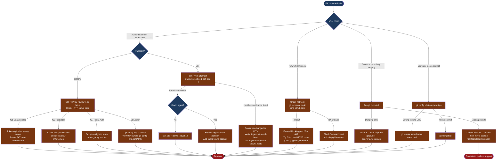

---
tags:
  - git
  - troubleshooting
search:
  boost: 1.5
---
# Git — Diagnostics

<div class="kb-summary">
Git diagnostic techniques: enable GIT_TRACE environment variables for protocol-level debug output, verify remote URLs and connectivity with git ls-remote, use ssh -vvvT to diagnose SSH key and host verification failures, check git config for proxy and credential settings, recover lost commits and branches with git reflog, and collect a sanitised diagnostic bundle for escalation.

*Applies to: Git 2.x*
</div>

```text
┌────────────────────────────────────────── Git — Diagnostics ──────────────────────────────────────────┐
│                                                                                                       │
│   ┌───────────────────────────────────────────────────────────────────────────────────────────────┐   │
│   │   Start here: check the error message category — auth, network, object, or config            │    │
│   │   Auth (SSH): ssh -vvvT git@host → check key offered, server response, known_hosts           │    │
│   │   Auth (HTTPS): GIT_TRACE_CURL=1 git fetch → check HTTP status code and response             │    │
│   │   Network: git ls-remote origin → confirms remote reachability and ref list                  │    │
│   └───────────────────────────────────────────────────────────────────────────────────────────────┘   │
│                                                                                                       │
│   ┌──────────────────────────────────────────────┐  ┌─────────────────────────────────────────────┐   │
│   │            Verbose / Trace Flags             │  │             Object Store Checks             │   │
│   │            GIT_TRACE=1 git <cmd>             │  │              git fsck [--full]              │   │
│   │       GIT_TRACE_PACKET=1: proto debug        │  │            git count-objects -vH            │   │
│   │        GIT_CURL_VERBOSE=1: HTTP trace        │  │  git verify-pack -v .git/objects/pack/*.idx │   │
│   │       GIT_SSH_COMMAND: custom SSH opts       │  │   git cat-file -t/-p sha: inspect object    │   │
│   │     GIT_TRACE_PERFORMANCE=1: perf profiling  │  │   git fsck --lost-found: recover blobs      │   │
│   └──────────────────────────────────────────────┘  └─────────────────────────────────────────────┘   │
│                                                                                                       │
│    Trace env vars show protocol-level detail; fsck validates object integrity                         │
│                                                                                                       │
│                          ▼                                                 ▼                          │
│                                                                                                       │
│   ┌──────────────────────────────────────────────┐  ┌─────────────────────────────────────────────┐   │
│   │               History Analysis               │  │            Performance Profiling            │   │
│   │       git log --all --oneline --graph        │  │         git clone --depth 1: measure        │   │
│   │          git blame -L 10,20 <file>           │  │        git maintenance run --task gc        │   │
│   │       git bisect: find regression SHA        │  │      Large file finder: git lfs migrate     │   │
│   │     git shortlog -sn: contributor count      │  │         git-sizer: repo stats report        │   │
│   │     git reflog: recover lost commits         │  │     git count-objects -vH: pack size        │   │
│   └──────────────────────────────────────────────┘  └─────────────────────────────────────────────┘   │
│                                                                                                       │
│  Physical Infrastructure:                                                                             │
│  Developer workstation · SSH agent (ssh-add) · ~/.ssh/known_hosts and ~/.gitconfig                    │
│  Git remote server (GitHub / GitLab / Bitbucket / Gitea) · HTTPS proxy (if applicable)                │
│  pack file storage in .git/objects/ · credential helper (keychain / git-credential-manager)           │
│                                                                                                       │
│  Key terms:                                                                                           │
│  GIT_TRACE         = env var enabling debug trace output for git commands to stderr                   │
│  GIT_TRACE_PACKET  = logs pack protocol negotiation; useful for clone/fetch issues                    │
│  GIT_CURL_VERBOSE  = logs HTTP request/response headers for HTTPS debugging                           │
│  GIT_TRACE_CURL    = logs curl requests including URL, headers, and response code                     │
│  git fsck          = file system check; verifies object store consistency                             │
│  cat-file -t/-p    = -t shows object type, -p pretty-prints content                                   │
│  verify-pack       = lists all objects in a pack file with their types and sizes                      │
│  git bisect        = binary search commits; mark good/bad to isolate regression                       │
│  git blame         = shows last commit touching each line; -L limits to line range                    │
│  git reflog        = local record of all ref movements; used to recover lost commits                  │
│  git-sizer         = GitHub tool generating report on repo blob/tree/commit sizes                     │
│  lfs migrate       = moves large files from history to LFS; rewrites commits                          │
│  git maintenance   = modern replacement for git gc; safe background maintenance                       │
│  shortlog -sn      = summary of commits per author sorted by count                                    │
│                                                                                                       │
└───────────────────────────────────────────────────────────────────────────────────────────────────────┘
```



## Before you begin

- **Access:** terminal access on the affected workstation; SSH key files in `~/.ssh/`; git config at `~/.gitconfig`; admin access to the remote Git platform (GitHub, GitLab, Bitbucket) to verify key registration and permissions
- **Gather first:** the exact error message text, the git command that failed, the remote URL (`git remote -v`), the transport being used (SSH or HTTPS), and whether the issue is repository-specific or affects all repos
- **Scope:** confirm whether the issue is: one command on one repo, all git operations, a specific remote, or a specific user — this determines whether it is a credential, network, or repository-integrity issue
- **Safety:** `GIT_TRACE_CURL` may expose authorization headers; always redact before sharing outputs with support teams

---

## Step 1 — Enable trace logging

Git environment variables activate protocol-level debug output without modifying config files.

```bash
# Basic command trace — shows every git operation step
GIT_TRACE=1 git fetch origin

# Redirect trace output to a log file (useful for long operations)
GIT_TRACE=/tmp/git-trace.log git push origin main
cat /tmp/git-trace.log

# Enable multiple traces simultaneously
GIT_TRACE=1 GIT_TRACE_PERFORMANCE=1 GIT_TRACE_SETUP=1 git status

# Performance profiling — identify slow operations
GIT_TRACE_PERFORMANCE=1 git log --oneline -100 2>&1 | grep "performance"

# Pack protocol trace — for clone/fetch/push object negotiation
GIT_TRACE_PACKET=1 git fetch origin 2>&1 | head -80

# HTTP/HTTPS header trace
GIT_CURL_VERBOSE=1 git fetch 2>&1 | head -60

# Full curl trace including auth headers (redact before sharing)
GIT_TRACE_CURL=1 git fetch 2>&1 | sed 's/Authorization: Basic .*/Authorization: Basic <REDACTED>/'
```

---

## Step 2 — Verify remote connectivity

```bash
# Show all remotes with fetch and push URLs
git remote -v
# origin  git@github.com:org/repo.git (fetch)
# origin  git@github.com:org/repo.git (push)

# Show full remote configuration
git remote show origin

# Test that the remote is reachable and list its refs (confirms auth + connectivity)
git ls-remote origin

# Check if a specific ref exists on the remote
git ls-remote origin refs/heads/main
git ls-remote origin refs/tags/v1.0.0
```

`git ls-remote origin` is the fastest test — it authenticates and fetches the remote ref list. If this succeeds, the auth and network path are working. If it fails, the error message narrows the problem to DNS, firewall, auth, or permissions.

---

## Step 3 — Inspect git configuration

```bash
# List all effective config (merged: system → global → local → worktree)
git config --list

# Show config with source file for each key
git config --list --show-origin

# Show only local repo config
git config --local --list

# Show only global user config
git config --global --list

# Get a specific key
git config user.email
git config --get remote.origin.url
git config --get core.sshCommand

# Key config items to verify during troubleshooting
git config user.name
git config user.email
git config core.autocrlf
git config http.proxy
git config http.sslVerify
git config credential.helper
git config core.sshCommand

# Safe config dump — redact secrets before sharing
git config --list --show-origin | grep -v -i "password\|secret\|token\|key"
```

---

## Step 4 — Diagnose SSH authentication

```bash
# Basic verbose SSH test to GitHub
ssh -vT git@github.com

# Triple-verbose for full protocol trace
ssh -vvvT git@github.com

# Test to GitLab
ssh -vvvT git@gitlab.example.com

# Test to GitLab on a non-standard port
ssh -vvvT -p 2222 git@gitlab.example.com
```

Key signatures in `ssh -vvvT` output:

```yaml
# Key being offered
debug1: Offering public key: /Users/user/.ssh/id_ed25519 ED25519
# Platform's response to the offered key:
debug1: Authentications that can continue: publickey
# Successful auth:
debug1: Authentication succeeded (publickey).

# Common failure signatures:
# "Permission denied (publickey)" — key not registered on remote
# "No supported authentication methods available" — server config issue
# "Host key verification failed" — known_hosts mismatch
# "Connection refused" — wrong host/port or firewall block
# "Connection timed out" — firewall or network routing issue
```

```bash
# Check the SSH config being applied
ssh -G git@github.com | grep -E "^(hostname|user|port|identityfile|identitiesonly)"

# List keys currently loaded in the SSH agent
ssh-add -l

# If no agent is running or no keys loaded:
eval "$(ssh-agent -s)"
ssh-add ~/.ssh/id_ed25519

# Test with explicit key (bypass agent)
ssh -i ~/.ssh/id_ed25519 -vT git@github.com

# Check known_hosts
ssh-keygen -F github.com
ssh-keygen -F gitlab.example.com

# Regenerate known_hosts entry if server key changed (after verifying legitimacy)
ssh-keygen -R github.com
ssh-keyscan -H github.com >> ~/.ssh/known_hosts

# Use custom SSH flags for a single git command
GIT_SSH_COMMAND="ssh -vvv -i ~/.ssh/id_ed25519" git fetch origin

# Set permanently in repo config for troubleshooting session
git config core.sshCommand "ssh -vvv -i ~/.ssh/id_ed25519"
# Remember to unset when done
git config --unset core.sshCommand
```

---

## Step 5 — Diagnose HTTPS authentication and proxy

```bash
# Show HTTP credential helper in use
git config credential.helper

# Test HTTPS connectivity with full header trace
GIT_TRACE_CURL=1 git ls-remote origin 2>&1 | grep -E "^> |^< HTTP"

# Check if a proxy is set (relevant in corporate environments)
git config http.proxy
echo $http_proxy
echo $https_proxy

# Test HTTPS through a proxy explicitly
git config http.proxy http://proxy.corp.example.com:8080
git ls-remote origin   # test
git config --unset http.proxy   # revert

# SSL verification
git config http.sslVerify       # should be true
git config http.sslCAInfo       # custom CA bundle path if set

# Disable SSL verify temporarily to test if cert is the issue (TESTING ONLY — revert immediately)
git -c http.sslVerify=false ls-remote origin

# Refresh GitHub PAT credential
git credential reject <<'EOF'
protocol=https
host=github.com
EOF
# Next git operation will prompt for new credentials
```

---

## Step 6 — Recover lost work

### Recover a lost commit

```bash
# See what HEAD was before the reset
git reflog | head -10
# abc1234 HEAD@{0}: reset: moving to HEAD~1
# def5678 HEAD@{1}: commit: Add important feature   <-- this is the lost commit

# Show reflog with timestamps
git reflog --format='%C(auto)%h %gd %gs %cr%Creset' | head -30

# Restore it
git cherry-pick def5678
# or create a branch at that point
git branch recover/lost-commit def5678
```

### Recover a deleted branch

```bash
# Find the commit the branch pointed to
git reflog | grep "checkout: moving from deleted-branch"
# or search by branch name
git reflog --all | grep deleted-branch | head -5

# Recreate the branch
git branch recovered-branch <sha-from-reflog>
git switch recovered-branch
```

### Recover a dropped stash

```bash
# List unreachable commits (includes dropped stashes)
git fsck --unreachable | grep commit | awk '{print $3}' | \
  xargs git log --merges --no-walk --oneline

# Apply a recovered stash by SHA
git stash apply <sha>
```

### Recover staged content discarded by checkout

```bash
# If content was staged (git add) before checkout:
git fsck --lost-found
ls .git/lost-found/other/   # blobs that were staged but not committed
```

---

## Step 7 — Collect diagnostic bundle

Run this script from within the affected repository. Review the output before sharing — it sanitises secrets but verify manually.

```bash
#!/usr/bin/env bash
# collect-git-diagnostics.sh — run from within the affected repository
OUTPUT_FILE="git-diagnostics-$(date +%Y%m%d-%H%M%S).txt"

{
  echo "=== Git Diagnostics ==="
  echo "Collected: $(date -u)"
  echo ""

  echo "--- Git Version ---"
  git version

  echo ""
  echo "--- Config (sanitized) ---"
  git config --list --show-origin | grep -v -iE "password|secret|token|key"

  echo ""
  echo "--- Remote URLs ---"
  git remote -v

  echo ""
  echo "--- Branch Status ---"
  git branch -vv

  echo ""
  echo "--- Last 10 Reflog Entries ---"
  git reflog -10

  echo ""
  echo "--- Object Count ---"
  git count-objects -vH

  echo ""
  echo "--- SSH Config ---"
  ssh -G git@github.com 2>/dev/null | grep -E "^(hostname|user|port|identityfile)"

  echo ""
  echo "--- SSH Keys in Agent ---"
  ssh-add -l 2>&1

  echo ""
  echo "--- Network: github.com ---"
  curl -sv --max-time 10 https://github.com 2>&1 | head -30

} > "$OUTPUT_FILE" 2>&1

echo "Diagnostics written to: $OUTPUT_FILE"
echo "Review before sharing to ensure no secrets are present."
```

---

## Log locations

| Source | Path / Command | What to look for |
|---|---|---|
| Trace log | `GIT_TRACE=/tmp/git-trace.log git <cmd>` | Internal operation sequence, timing |
| Curl trace | `GIT_TRACE_CURL=1 git fetch 2>&1` | HTTP status codes, auth headers |
| SSH trace | `ssh -vvvT git@host 2>&1` | Key offered, auth method, host key |
| Pack protocol | `GIT_TRACE_PACKET=1 git fetch 2>&1` | Object negotiation, pack statistics |
| Reflog | `git reflog` | History of all ref movements including lost commits |
| Object store | `git fsck --full` | Missing objects, dangling refs, corrupt packs |
| Config | `git config --list --show-origin` | Proxy, SSL, credential, SSH settings |
| Diagnostic bundle | `collect-git-diagnostics.sh` | All-in-one — attach to support ticket |

---

## See also

- [Git — Common Issues](../common-issues/)
- [Git — Escalation](../escalation/)
- [Git — Health Checks](../../operations/health-checks/)

## Verify resolution

- `git ls-remote origin` succeeds and returns the current ref list with no errors
- `ssh -vT git@github.com` returns `Hi <user>! You've successfully authenticated` (GitHub) or equivalent
- The git command that was failing now completes successfully: `git fetch origin`, `git push origin main`
- `git fsck --full` shows no missing or corrupt objects
- `git config --get remote.origin.url` shows the correct remote URL for the repository
