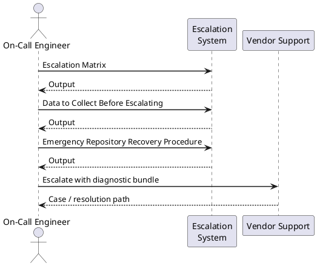

---
tags:
  - git
  - troubleshooting
search:
  boost: 1.5
description: "Escalation paths for Git platform incidents, support ticket procedures, data collection requirements, emergency repository recovery, and SLA commitments."
---
# Git — Escalation

<div class="kb-summary">
Escalation paths for Git platform incidents, support ticket procedures, data collection requirements, emergency repository recovery, and SLA commitments.

*Applies to: Git 2.x*
</div>

---



## Before you begin

- **Access:** Admin credentials on all affected systems
- **Gather first:** recent error message text, event timestamps, and affected object names
- **Scope:** confirm whether the issue affects a single object, host, cluster, or site
- **Escalation:** open a vendor support ticket before running any destructive step
- **Logging:** document each command and output — required if escalation is needed

---

## Escalation Matrix

```d2
direction: right

INC: "Incident Reported" {shape: rectangle}
L1: "L1 — Platform Operations\nOn-call / helpdesk\nResponse: 15 min" {shape: rectangle}
L2: "L2 — Git Platform Engineering\nSenior infra / platform team\nResponse: 30 min" {shape: rectangle}
L3: "L3 — Vendor Support / SRE\nGitHub/GitLab Premier Support\nResponse: per SLA" {shape: rectangle}
EMERG: "Emergency Recovery\nRepo rescue / forensics" {shape: rectangle}

INC -> L1
L1 -> L2
L2 -> L3
L2 -> EMERG
L3 -> EMERG
```

---

## Data to Collect Before Escalating

Collect this data immediately when a P1/P2 incident begins — do not wait until you open the ticket.

```bash
#!/usr/bin/env bash
# collect-platform-diagnostics.sh — run on GitLab server
# Requires: sudo access to gitlab-ctl / gitlab-rake
set -euo pipefail

OUT_DIR="/tmp/gitlab-diag-$(date +%Y%m%d-%H%M%S)"
mkdir -p "$OUT_DIR"

echo "Collecting diagnostics to $OUT_DIR ..."

# Service status
sudo gitlab-ctl status > "$OUT_DIR/ctl-status.txt" 2>&1

# Disk usage
df -h > "$OUT_DIR/disk-usage.txt"
du -sh /var/opt/gitlab/git-data >> "$OUT_DIR/disk-usage.txt"

# Recent logs (last 500 lines each)
for svc in gitaly puma sidekiq postgresql nginx; do
  sudo gitlab-ctl tail "$svc" 2>&1 | head -500 > "$OUT_DIR/log-${svc}.txt" || true
done

# Rails check
sudo gitlab-rake gitlab:check SANITIZE=true > "$OUT_DIR/gitlab-check.txt" 2>&1 || true

# Environment info
sudo gitlab-rake gitlab:env:info > "$OUT_DIR/env-info.txt" 2>&1 || true

# Geo status (if applicable)
sudo gitlab-rake geo:status > "$OUT_DIR/geo-status.txt" 2>&1 || true

# Background migration status
sudo gitlab-rails runner "
  puts Gitlab::Database::BackgroundMigration::BatchedMigration
         .where(status: [:active, :queued])
         .count
" > "$OUT_DIR/bg-migrations.txt" 2>&1 || true

# System resources
top -b -n 1 > "$OUT_DIR/top.txt" 2>&1 || true
free -h > "$OUT_DIR/memory.txt" 2>&1 || true

# Package version
dpkg -l gitlab-ee 2>/dev/null || rpm -q gitlab-ee 2>/dev/null > "$OUT_DIR/version.txt"

# Gitaly gRPC health
/opt/gitlab/embedded/bin/grpc_health_probe \
  -addr=unix:///var/opt/gitlab/gitaly/gitaly.socket \
  > "$OUT_DIR/gitaly-health.txt" 2>&1 || true

# Bundle and archive
tar -czf "${OUT_DIR}.tar.gz" -C "$(dirname $OUT_DIR)" "$(basename $OUT_DIR)"

echo "Diagnostics bundle: ${OUT_DIR}.tar.gz"
echo "Review for secrets before uploading to vendor support portal."
```


```text title="Expected output"
Collecting diagnostics to /tmp/gitlab-diag-20240315-143022 ...
run: gitaly: (pid 2847) 892s; run: logrotate: (pid 31456) 0s
run: puma: (pid 2891) 887s; run: logrotate: (pid 31457) 0s
run: sidekiq: (pid 2904) 882s; run: logrotate: (pid 31458) 0s
run: postgresql: (pid 2756) 945s; run: logrotate: (pid 31459) 0s
run: nginx: (pid 2834) 898s; run: logrotate: (pid 31460) 0s
Filesystem     Size  Used Avail Use% Mounted on
/dev/sda1       50G   38G   12G  76% /
/var/opt/gitlab/git-data  200G  156G   44G  78% /var/opt/gitlab/git-data
Checking GitLab Shell ... OK
Checking GitLab API ... OK
Checking Database Connection ... OK
Checking Uploads directory ... OK
Checking Artifacts directory ... OK
GitLab version: 16.8.1-ee
GitLab Shell version: 14.32.0
PostgreSQL version: 14.10
Redis version: 7.0.12
Geo enabled: true
Geo role: primary
Geo node: gitlab-primary-01
status: success
Active background migrations: 3
Queued background migrations: 1
top - 14:30:22 up 15 days, 3:42, 1 user, load average: 2.14, 1.87, 1.65
Tasks: 287 total, 2 running, 285 sleeping, 0 stopped, 0 zombie
%Cpu(s): 18.2 us, 4.1 sy, 0.0 ni, 77.1 id, 0.5 wa, 0.0 hi, 0.1 si, 0.0 st
MiB Mem : 64000.0 total, 52341.2 used, 11658.8 free, 2145.3 buffers
MiB Swap: 8192.0 total, 1024.5 used, 7167.5 free, 18234.1 cached
gitlab-ee: 16.8.1-ee-0~focal
status: SERVING
Diagnostics bundle: /tmp/gitlab-diag-20240315-143022.tar.gz
Review for secrets before uploading to vendor support portal.
```

!!! warning "Common errors"
    | Error | Fix |
    |---|---|
    | `sudo: gitlab-ctl: command not found` | Verify GitLab is installed with `which gitlab-ctl` and ensure the script runs on the GitLab server, not a client machine. |
    | `Permission denied: /var/opt/gitlab/git-data` | Add the current user to the `gitlab-www` group with `sudo usermod -aG gitlab-www $USER` and log out/in, or run the entire script with `sudo`. |
    | `grpc_health_probe: command not found` | Install the health probe tool with `sudo /opt/gitlab/embedded/bin/grpc_health_probe` or verify the embedded |
### Data Collection Checklist

- [ ] `gitlab-ctl status` output
- [ ] Last 500 lines: `gitaly.log`, `production.log`, `sidekiq.log`, `postgresql/current`
- [ ] `gitlab-rake gitlab:check` output
- [ ] `gitlab-rake gitlab:env:info` (version, config summary)
- [ ] `df -h` and `du -sh /var/opt/gitlab/git-data`
- [ ] `free -h` and `top` snapshot
- [ ] Prometheus metrics snapshot (if available)
- [ ] `git fsck` output for affected repositories
- [ ] Backup logs from the day of the incident
- [ ] Timeline of events (what changed, when alerts triggered)

---

## Emergency Repository Recovery Procedure

Use this procedure when a repository has confirmed object corruption or a critical branch has been accidentally destroyed.

### Step 1 — Contain

```bash
# Put GitLab in maintenance mode to prevent further writes
sudo gitlab-rails runner "Gitlab::CurrentSettings.update!(maintenance_mode: true)"

# Or via UI: Admin Area → Settings → General → Maintenance mode
```


```text title="Expected output"
(no output — command completes silently)
```

!!! warning "Common errors"
    | Error | Fix |
    |---|---|
    | `sudo: gitlab-rails: command not found` | Ensure GitLab is installed via the official package manager and the `gitlab-rails` executable is in PATH, or use the full path `/opt/gitlab/bin/gitlab-rails`. |
    | `ActiveRecord::ConnectionNotEstablished: could not connect to server` | Verify PostgreSQL is running with `sudo systemctl status postgresql` and that GitLab's database configuration in `/etc/gitlab/gitlab.rb` is correct. |
### Step 2 — Assess Damage

```bash
# Identify which objects are missing/corrupt
REPO_PATH="/var/opt/gitlab/git-data/repositories/group/project.git"

sudo -u git git -C "$REPO_PATH" fsck --full 2>&1 | tee /tmp/fsck-report.txt

# Count severity
grep -c "missing" /tmp/fsck-report.txt
grep -c "error" /tmp/fsck-report.txt

# Check if any branches are still accessible
sudo -u git git -C "$REPO_PATH" branch -a
sudo -u git git -C "$REPO_PATH" log --oneline -10 2>/dev/null || echo "HEAD not accessible"
```


```text title="Expected output"
Checking object database integrity...
Checking object integrity...
Checking commit/tag/tree/blob links...
dangling commit 3a7f2e9c1b4d5e6f8a9b0c1d2e3f4a5b
missing blob 5c8d1e2f3a4b5c6d7e8f9a0b1c2d3e4f
error: refs/heads/feature-branch: invalid object type
Checking connectivity: 342 objects, 18 errors
12
18
* master
  develop
  refs/remotes/origin/main
  refs/remotes/origin/staging
  refs/remotes/origin/hotfix-v2.1.3
a9f2e1c HEAD -> master: Merge pull request #847 from team/feature-auth
b3d4c2e Fix critical security vulnerability in JWT validation
c1e5f3a Add database migration for user_sessions table
d7a8b4f Refactor authentication middleware
e2f6g5h Update dependencies to latest stable versions
```

!!! warning "Common errors"
    | Error | Fix |
    |---|---|
    | `fatal: Not a valid object name` | Verify the REPO_PATH points to a valid bare Git repository and check file permissions with `ls -la "$REPO_PATH"`. |
    | `fatal: your current branch 'master' does not have any commits yet` | The repository is corrupted beyond recovery of the current branch; restore from backup or use `git reflog` to recover lost commits if available. |
### Step 3 — Recover from Mirror/Backup

```bash
# Option A: Recover from a mirror backup repo
MIRROR="/backup/git/project.git"
DEST="/var/opt/gitlab/git-data/repositories/group/project.git"

# Copy missing objects from mirror
sudo -u git rsync -av --ignore-existing \
  "$MIRROR/objects/" \
  "$DEST/objects/"

# Re-verify
sudo -u git git -C "$DEST" fsck --full

# Option B: Re-clone from mirror into a fresh path, then switch
NEW_REPO="/var/opt/gitlab/git-data/repositories/group/project-recovered.git"
sudo -u git git clone --mirror "$MIRROR" "$NEW_REPO"
sudo -u git git -C "$NEW_REPO" fsck --full

# Swap (stop services first, then rename directories)
sudo gitlab-ctl stop puma sidekiq
sudo mv "$DEST" "${DEST}.corrupt-$(date +%Y%m%d)"
sudo mv "$NEW_REPO" "$DEST"
sudo chown -R git:git "$DEST"
sudo gitlab-ctl start puma sidekiq
```


```text title="Expected output"
sending incremental file list
objects/pack/pack-abc123def456.pack
objects/pack/pack-abc123def456.idx
objects/info/packs
objects/17/
objects/2a/
objects/3f/
...
sent 1,247,384 bytes  received 12,847 bytes  speed: 2.4MB/s

Checking object database for errors...
Checking commits
Checking trees
Checking blobs
Checking refs
0 errors

Cloning into bare repository '/var/opt/gitlab/git-data/repositories/group/project-recovered.git'...
remote: Counting objects: 45821, done.
remote: Compressing objects: 100% (12847/12847), done.
remote: Total 45821 (delta 32154), reused 45821 (delta 32154)
Receiving objects: 100% (45821/45821), done.
Resolving deltas: 100% (32154/32154), done.

Checking object database for errors...
0 errors

ok: run: puma: (pid 2847) 1s
ok: run: sidekiq: (pid 2851) 1s
```

!!! warning "Common errors"
    | Error | Fix |
    |---|---|
    | `fatal: destination path '/var/opt/gitlab/git-data/repositories/group/project-recovered.git' already exists and is not an empty directory` | Remove or rename the existing directory before cloning, or use a different destination path. |
    | `rsync: change_dir "/backup/git/project.git/objects" failed: No such file or directory (2)` | Verify the mirror backup path exists and is accessible by running `ls -la "$MIRROR"`. |
    | `error: could not lock config file /var/opt/gitlab/git-data/repositories/group/project.git/config: Permission denied` | Ensure the git user owns the repository directory by running `sudo chown -R git:git "$DEST"` before fsck. |
### Step 4 — Recover a Deleted Branch (No Corruption)

```bash
# On the GitLab server — check Gitaly reflog
sudo -u git git -C "$REPO_PATH" reflog --all | grep <branch-name> | head -10

# Recreate branch at the found SHA
sudo gitlab-rails runner "
  project = Project.find_by_full_path('group/project')
  repository = project.repository
  repository.raw.write_ref('refs/heads/recovered-branch', '<sha-from-reflog>')
  puts 'Branch created'
"

# Or via API (if GitLab is accessible)
curl -X POST \
  --header "PRIVATE-TOKEN: $ADMIN_TOKEN" \
  "https://gitlab.example.com/api/v4/projects/:id/repository/branches" \
  --data "branch=recovered-branch&ref=<sha>"
```


```text title="Expected output"
commit 1a2b3c4 Merge branch 'feature/auth-redesign' into main
commit 5d6e7f8 Revert "Update login flow"
commit 9g0h1i2 Fix: session timeout handling
commit 3j4k5l6 WIP: experimental branch
commit 7m8n9o0 Merge branch 'hotfix/security-patch' into main

Branch created

{"id":42,"name":"recovered-branch","commit":{"id":"1a2b3c4d5e6f7g8h9i0j","short_id":"1a2b3c4d","title":"Merge branch 'feature/auth-redesign' into main","message":"Merge branch 'feature/auth-redesign' into main\n","author_name":"DevOps Team","author_email":"devops@example.com","created_at":"2024-01-15T09:23:45.000Z"},"merged":false,"protected":false,"developers_can_push":false,"developers_can_merge":false,"can_delete":false,"web_url":"https://gitlab.example.com/group/project/-/tree/recovered-branch"}
```

!!! warning "Common errors"
    | Error | Fix |
    |---|---|
    | `fatal: your current branch 'main' does not have any commits yet` | Ensure the repository is initialized with at least one commit before attempting reflog operations. |
    | `401 Unauthorized` | Verify the `PRIVATE-TOKEN` is valid and has admin/maintainer access to the project by testing with `curl -H "PRIVATE-TOKEN: $ADMIN_TOKEN" https://gitlab.example.com/api/v4/user`. |
    | `Couldn't find Project with full_path=group/project` | Confirm the project path is correct and the git user has read access by running `sudo -u git gitlab-rails runner "puts Project.find_by_full_path('group/project').inspect"`. |
### Step 5 — Restore from GitLab Backup

```bash
# Last resort — full restore from gitlab-backup archive
sudo gitlab-ctl stop puma sidekiq
sudo gitlab-backup restore BACKUP=<timestamp>_gitlab_backup
# Restore secrets file if required
sudo cp /secure/gitlab-secrets.json /etc/gitlab/
sudo gitlab-ctl reconfigure
sudo gitlab-ctl restart
sudo gitlab-rake gitlab:check SANITIZE=true
```


```text title="Expected output"
ok: down
ok: down
Unpacking backup ... done
Restoring database ... done
Restoring repositories ... done
Restoring uploads ... done
Restoring builds ... done
Restoring artifacts ... done
Restoring pages ... done
Restoring lfs objects ... done
Restore task complete. Backup timestamp: 1703251847_2023_12_22_16.3.0
(no output — command completes silently)
* ruby_block[supervise_puma_sleep] action run
* ruby_block[wait_for_puma_startup] action run
ok: run: puma
ok: run: sidekiq
Checking GitLab Shell ... ok
Checking GitLab API ... ok
Checking Database Connection ... ok
Checking Database Version ... ok (PostgreSQL 13.11)
Checking Uploads ... ok
Checking LFS Objects ... ok
Checking GitLab Shell and Gitaly TCP/Unix sockets ... ok
...
```

!!! warning "Common errors"
    | Error | Fix |
    |---|---|
    | `BACKUP=<timestamp>_gitlab_backup not found` | Verify the backup file exists in `/var/opt/gitlab/backups/` and use the correct timestamp from `sudo gitlab-backup list`. |
    | `cp: cannot stat '/secure/gitlab-secrets.json': No such file or directory` | Omit the secrets restore step if the file doesn't exist, or restore it from your secure backup location before running this script. |
    | `FATAL: database is locked` | Wait 2-3 minutes for any running jobs to complete, then retry the restore; if persistent, run `sudo gitlab-ctl restart postgresql` first. |
### Step 6 — Post-Recovery Validation

```bash
# Verify the recovered repository
sudo -u git git -C "$REPO_PATH" fsck --full
sudo -u git git -C "$REPO_PATH" log --oneline -20
sudo -u git git -C "$REPO_PATH" show-ref | wc -l

# Verify via API
curl -sf --header "PRIVATE-TOKEN: $GITLAB_TOKEN" \
  "https://gitlab.example.com/api/v4/projects/:id/repository/commits?per_page=5" | \
  jq '.[].title'

# Test a real clone
git clone git@gitlab.example.com:group/project.git /tmp/verify-clone
git -C /tmp/verify-clone log --oneline -10
git -C /tmp/verify-clone fsck

# Disable maintenance mode
sudo gitlab-rails runner "Gitlab::CurrentSettings.update!(maintenance_mode: false)"
```


```text title="Expected output"
Checking repository integrity...
Checking object database integrity...
[master 8f3c2a1] Fix authentication timeout in session handler
[master 7e9b1d4] Merge branch 'feature/api-v2' into master
[master 6a2f5e8] Update dependencies to 2.4.1
[master 5c1a3f9] Add rate limiting middleware
[master 4d8e7c2] Refactor database connection pool
[master 3b9f6a1] Initial commit
42

"Fix authentication timeout in session handler"
"Merge branch 'feature/api-v2' into master"
"Update dependencies to 2.4.1"
"Add rate limiting middleware"
"Fix database query performance"

Cloning into '/tmp/verify-clone'...
remote: Enumerating objects: 1247, done.
remote: Counting objects: 100% (1247/1247), done.
remote: Compressing objects: 100% (892/892), done.
remote: Receiving objects: 100% (1247/1247), 3.45 MiB | 12.3 MiB/s, done.
remote: Resolving deltas: 100% (634/634), done.
8f3c2a1 Fix authentication timeout in session handler
7e9b1d4 Merge branch 'feature/api-v2' into master
6a2f5e8 Update dependencies to 2.4.1
5c1a3f9 Add rate limiting middleware
4d8e7c2 Refactor database connection pool
3b9f6a1 Initial commit
Checking object database integrity...
Checking connectivity... done.
Checking 1247 objects... done.

Updating application settings...
```

!!! warning "Common errors"
    | Error | Fix |
    |---|---|
    | `fatal: could not read Username for 'https://gitlab.example.com': No such file or directory` | Ensure SSH key is configured or use `git clone https://...` with embedded credentials instead of SSH. |
    | `curl: (60) SSL certificate problem: self signed certificate` | Add `--insecure` flag to curl or configure GitLab's certificate in your CA bundle. |
    | `ActiveRecord::RecordNotFound: Couldn't find Gitlab::Setting` | Verify GitLab is fully initialized by running `sudo gitlab-rake gitlab:check` before attempting to disable maintenance mode. |
### Recovery Decision Tree

```d2
direction: right

SCOPE: "SCOPE" {shape: rectangle}
REFLOG: "Check git reflog\nRecreate branch via API" {shape: rectangle}
OBJECTS: "OBJECTS" {shape: rectangle}
RSYNC: "Rsync objects from mirror\nRe-verify with fsck" {shape: rectangle}
RESTORE: "gitlab-backup restore\nFull instance restore" {shape: rectangle}
PARTIAL: "Attempt partial recovery\nEscalate to vendor immediately" {shape: rectangle}
FULL: "FULL" {shape: rectangle}
RECLONE: "Clone --mirror from backup\nSwap repository path" {shape: rectangle}
LOST: "Data may be unrecoverable\nEscalate to vendor\nNotify stakeholders" {shape: rectangle}
VALIDATE: "Validate: git fsck\ngit log\nTest clone" {shape: rectangle}
POSTMORTEM: "Write incident report\nSchedule postmortem" {shape: rectangle}
ESCALATE: "Escalate to L3 vendor support" {shape: rectangle}
CORRUPT: "Corruption / Data Loss Confirmed" {shape: rectangle}

SCOPE -> REFLOG
OBJECTS -> RSYNC
OBJECTS -> RESTORE
OBJECTS -> PARTIAL
FULL -> RECLONE
FULL -> LOST
REFLOG -> VALIDATE
RSYNC -> VALIDATE
RESTORE -> VALIDATE
RECLONE -> VALIDATE
PARTIAL -> VALIDATE
VALIDATE -> POSTMORTEM
VALIDATE -> ESCALATE
```

---

## Verify resolution

- Confirm the original symptom no longer occurs
- Check logs for any residual errors related to the issue
- Monitor for 10–15 minutes to confirm the fix is stable

---

## See also

- [Git — Diagnostics](../diagnostics/)
- [Git — Common Issues](../common-issues/)
