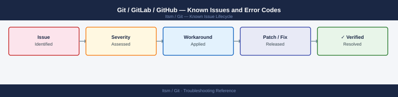

---
tags:
  - troubleshooting
  - git
  - gitlab
  - github
  - itsm
  - known-issues
---
# Git / GitLab / GitHub — Known Issues and Error Codes

<div class="kb-summary">
Catalog of known Git server bugs, error codes, and workarounds covering GitLab self-managed, Gitaly, and common Git operation failures.

*Applies to: GitLab 16.x / 17.x self-managed; GitHub Enterprise*
</div>



```d2
direction: down

symptom: Identify Symptom {shape: diamond}
push_clone_failures: "Push / Clone Failures" {shape: rectangle}
gitaly: "Gitaly" {shape: rectangle}
gitlab_runner: "GitLab Runner" {shape: rectangle}
resolution: Resolve or Escalate {shape: oval}

symptom -> push_clone_failures: investigate
symptom -> gitaly: investigate
symptom -> gitlab_runner: investigate
push_clone_failures -> resolution
gitaly -> resolution
gitlab_runner -> resolution
```

## Before you begin

- GitLab errors appear in `Admin → Monitoring → Logs` or `gitlab-ctl tail gitaly`.
- Most push/clone failures are Gitaly, network, or disk space issues.
- `gitlab-rake gitlab:check` runs health check for GitLab self-managed.

## Push / Clone Failures

| Error / Symptom | Affected Versions | Cause | Workaround / Fix | Fixed In |
|---|---|---|---|---|
| `fatal: repository not found` | GitLab 16.x | Repository moved or Gitaly not serving it | Check Gitaly storage: `gitlab-rake gitlab:gitaly:check` | N/A |
| `remote: error: pack-objects died with error` | GitLab 16.x | Repository disk full or Gitaly memory exhaustion | Free disk on Gitaly storage; check Gitaly pod memory | N/A |
| SSH push `Permission denied (publickey)` | All | SSH key not added to user account or wrong key | Verify key in User → SSH Keys; test: `ssh -T git@<gitlab-host>` | N/A |
| HTTPS clone prompting for password on CI | GitLab 16.x | CI job token not configured | Use `CI_JOB_TOKEN`: `git clone https://gitlab-ci-token:$CI_JOB_TOKEN@<repo>` | N/A |

## Gitaly

| Error / Symptom | Affected Versions | Cause | Workaround / Fix | Fixed In |
|---|---|---|---|---|
| `Gitaly not reachable` in GitLab health | GitLab 16.x | Gitaly service crashed or TCP 8075 blocked from Workhorse | Restart: `gitlab-ctl restart gitaly`; verify TCP 8075 between GitLab and Gitaly | N/A |
| Gitaly RPC timeout on large repo operations | GitLab 16.x | Gitaly default gRPC timeout too short for large repos | Increase Gitaly timeout in `gitlab.rb`: `gitaly['rpc_timeout'] = '120s'` | N/A |

## GitLab Runner

| Error / Symptom | Affected Versions | Cause | Workaround / Fix | Fixed In |
|---|---|---|---|---|
| Runner `offline` in GitLab | GitLab 16.x | Runner process stopped or TCP 443 to GitLab blocked | Restart: `gitlab-runner restart`; verify TCP 443 from runner to GitLab | N/A |

## See also

- [Git — Common Issues](common-issues/)
- [Jira — Known Issues](../../jira/troubleshooting/known-issues.md)
- [Ansible — Known Issues](../../../automation/ansible/troubleshooting/known-issues.md)
