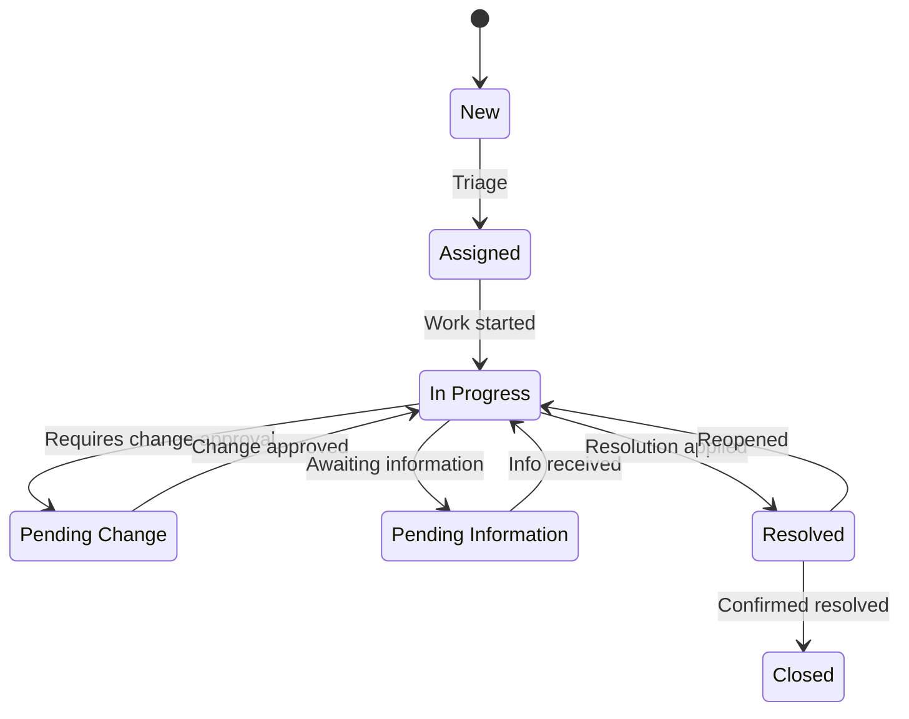

---
tags:
  - architecture
  - jira
description: "Architecture Standards reference covering Project Naming Conventions, Workflow State Standards, Field Configuration Standards, Permission Scheme..."
---
# Jira — Architecture Standards

<div class="kb-summary">
Architecture Standards reference covering Project Naming Conventions, Workflow State Standards, Field Configuration Standards, Permission Scheme Standards, Notification Scheme Standards and 1 more sections.

*Applies to: Jira Cloud / Data Center*
</div>

```d2
direction: down

project_naming_conventions: "Project Naming Conventions" {shape: rectangle}
field_configuration_standards: "Field Configuration Standards" {shape: rectangle}
permission_scheme_standards: "Permission Scheme Standards" {shape: rectangle}
notification_scheme_standards: "Notification Scheme Standards" {shape: rectangle}
dashboard_standards: "Dashboard Standards" {shape: rectangle}

project_naming_conventions -> field_configuration_standards: hardens
field_configuration_standards -> permission_scheme_standards: hardens
permission_scheme_standards -> notification_scheme_standards: hardens
notification_scheme_standards -> dashboard_standards: hardens
```

## Project Naming Conventions

Consistent project keys and names reduce confusion, simplify JQL queries, and enable automation rules that target predictable patterns.

### Project Key Rules

| Rule | Detail |
|---|---|
| Length | 2–10 characters |
| Characters | Uppercase letters only (no numbers, hyphens) |
| Uniqueness | Must be globally unique in the instance |
| Descriptive | Derive from team, product, or domain name |

### Project Key Examples

| Project Type | Example Key | Full Name |
|---|---|---|
| Software product | `AUTH` | Authentication Service |
| Platform team | `PLAT` | Platform Engineering |
| Operations/ITSM | `OPS` | Operations |
| Data engineering | `DATA` | Data Platform |
| Security | `SEC` | Security Engineering |
| Release management | `REL` | Release Management |
| Internal tooling | `TOOL` | Internal Tooling |

### Project Name Format

| Status | Category | Description |
|---|---|---|
| `Backlog` | To Do | Not yet scheduled for a sprint |
| `To Do` | To Do | In sprint, not started |
| `In Progress` | In Progress | Actively being worked on |
| `In Review` | In Progress | PR open, awaiting code review |
| `QA / Testing` | In Progress | In QA or integration testing |
| `Blocked` | In Progress | Work halted, awaiting external dependency |
| `Done` | Done | Complete and verified |

### Operations Workflow



### Transition Conditions and Validators

| Transition | Validator | Post-Function |
|---|---|---|
| To Do → In Progress | None | Set `Start Date` to now |
| In Progress → In Review | PR URL field must not be empty | None |
| In Review → Done | No open sub-tasks | Set `Resolution` = Fixed |
| Any → Blocked | `Blocked Reason` field required | None |
| Any → Done | Assignee must be set | Set `Resolved Date` to now |

---

## Field Configuration Standards

### Mandatory Fields by Issue Type

| Field | Story | Bug | Task | Epic |
|---|---|---|---|---|
| Summary | Required | Required | Required | Required |
| Description | Required | Required | Optional | Required |
| Assignee | Optional | Required | Optional | Required |
| Priority | Optional | Required | Optional | Optional |
| Story Points | Required | Optional | Optional | Required |
| Epic Link | Required | Optional | Optional | N/A |
| Labels | Optional | Optional | Optional | Optional |
| Fix Version | Optional | Required | Optional | Required |
| Components | Optional | Required | Optional | Optional |

### Custom Fields (Global)

| Field Name | Type | Purpose |
|---|---|---|
| `Story Points` | Number | Effort estimation |
| `Epic Link` | Issue Link | Associates Story/Task to Epic |
| `Sprint` | Sprint | Active sprint assignment |
| `Team` | Select | Owning team (cross-project reporting) |
| `Severity` | Select | Bug impact: Critical/High/Medium/Low |
| `Root Cause` | Text | Post-incident root cause description |
| `Service Affected` | Multi-select | For incidents: affected services |
| `Risk Level` | Select | Change request risk: High/Medium/Low |
| `PR URL` | URL | Pull request link |
| `Blocked Reason` | Text | Required when status = Blocked |

### Field Screen Schemes

Map field screens to issue operations:

| Screen | Shown When | Fields |
|---|---|---|
| Default Create Screen | Creating any issue | Summary, Issue Type, Description, Priority, Assignee, Epic Link, Story Points |
| Default Edit Screen | Editing any issue | All fields |
| Default View Screen | Viewing any issue | All fields (read-only layout) |
| Transition: Done | Moving to Done | Resolution, Fix Version |
| Transition: Blocked | Moving to Blocked | Blocked Reason |

---

## Permission Scheme Standards

### Standard Permission Schemes

Define two baseline schemes:

#### 1. Software Project Permissions

| Permission | Grantee |
|---|---|
| Browse Projects | All logged-in users |
| Create Issues | Project Role: Developers, Project Role: PM |
| Edit Issues | Project Role: Developers, Project Role: PM |
| Delete Issues | Project Role: PM, Group: jira-admins |
| Assign Issues | Project Role: Developers, Project Role: PM |
| Close Issues | Project Role: Developers, Project Role: PM |
| Manage Sprints | Project Role: PM, Project Role: Scrum Master |
| Administer Projects | Project Role: PM, Group: jira-admins |
| Move Issues | Group: jira-admins |
| Bulk Change | Group: jira-admins |
| View Development Tools | Project Role: Developers |

#### 2. Operations Project Permissions

| Permission | Grantee |
|---|---|
| Browse Projects | All logged-in users |
| Create Issues | Group: jira-service-desk-users |
| Edit Issues | Project Role: Agents, Group: jira-admins |
| Close Issues | Project Role: Agents |
| Assign Issues | Project Role: Agents |
| Administer Projects | Group: jira-admins |

### Project Roles (Standard)

| Role | Typical Members |
|---|---|
| `Developers` | Engineering team members |
| `PM` | Product managers, delivery leads |
| `Scrum Master` | Scrum masters, agile coaches |
| `Agents` | Service desk agents (ops/ITSM) |
| `Stakeholders` | Read-only business stakeholders |

---

## Notification Scheme Standards

### Principles

1. **Avoid notification fatigue** — only notify actors who need to act
2. **Prefer digest over immediate** for low-priority events where possible
3. **Do not notify on every comment** by default — only on @mention
4. **Use project-specific overrides** sparingly; default to the global scheme

### Standard Notification Events

| Event | Notify |
|---|---|
| Issue Created | Assignee, Watchers |
| Issue Assigned | Assignee |
| Issue Updated (status change) | Assignee, Reporter |
| Comment Added | Assignee, Reporter, Watchers |
| Issue Resolved | Reporter |
| Issue Closed | Reporter |
| Issue Deleted | Current Assignee |
| Due Date Approaching (1 day) | Assignee |
| Sprint Started | All members of Sprint |
| Sprint Completed | Project Lead, Scrum Master |

### Escalation Notifications (Automation)

Configure via Jira Automation for escalation beyond the notification scheme:

```yaml
Trigger:   Scheduled (every 1 hour)
Condition: issue matches: priority = Critical AND status != Done
           AND created < -4h
Action:    Send email to Engineering Manager
Action:    Add comment "@manager — Critical issue overdue"
```

---

## Dashboard Standards

### Team-Level Dashboard (Template)

Each team should maintain a shared dashboard with the following gadgets:

| Gadget | JQL / Config | Purpose |
|---|---|---|
| Sprint Health | Active sprint, team project | Sprint burndown |
| Issue Statistics | `project = PROJ AND sprint in openSprints()` | Status distribution |
| Assigned to Me | `assignee = currentUser() AND status != Done` | Personal queue |
| Recently Updated | `project = PROJ ORDER BY updated DESC` | Recent activity |
| Days in Status | Custom field report | Identify stuck issues |
| Velocity Chart | Board-level | Sprint-over-sprint velocity |

### Management Dashboard (Template)

| Gadget | Purpose |
|---|---|
| Multi-project issue count | Portfolio-level status at a glance |
| Epic progress | Epic → Story completion percentage |
| Open bugs by severity | Risk visibility |
| Unresolved by team | Workload balance |
| SLA adherence (JSM) | Operations performance |

### Dashboard Naming Convention

```text
[SCOPE] - [TEAM/PROJECT] - [PURPOSE]

Examples:
  TEAM - Platform Engineering - Sprint Dashboard
  MGMT - Engineering - Portfolio Overview
  OPS  - Incident Management - SLA Dashboard
```

### Sharing Standards

| Audience | Share With |
|---|---|
| Team dashboard | Project Role: All roles in project |
| Management dashboard | Group: engineering-leads |
| Public dashboards | All logged-in users (read) |

Never share dashboards publicly (unauthenticated) unless the Jira instance is intentionally public-facing.

---

## See also

- [Jira — Deploy](../../deploy/)
