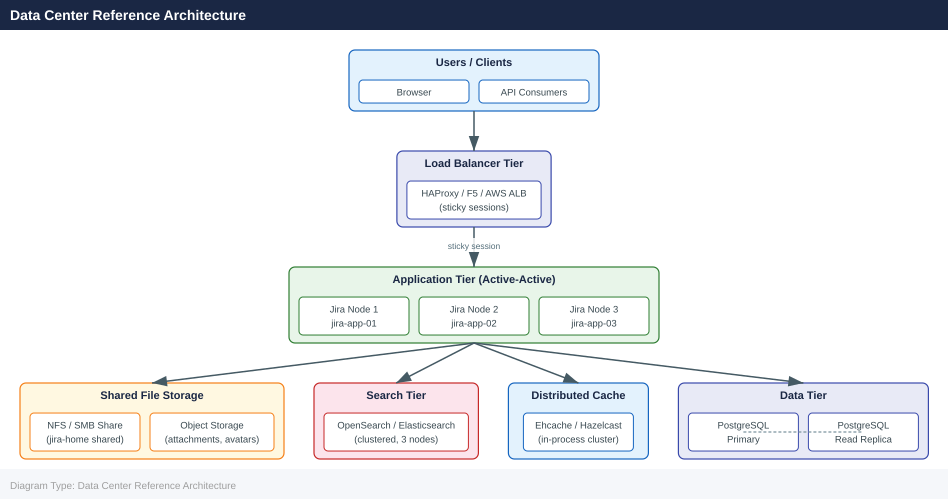
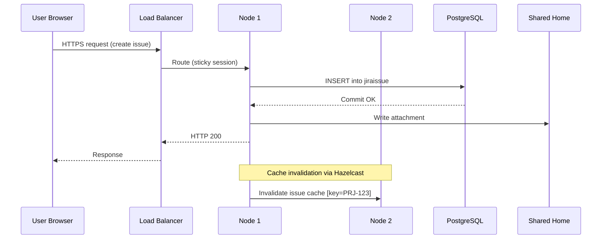

---
tags:
  - architecture
  - jira
description: "How It Works reference covering Deployment Models, Data Center Reference Architecture, Clustering, Port Reference, Cloud Architecture (Reference)."
---
# Jira — How It Works

<div class="kb-summary">
How It Works reference covering Deployment Models, Data Center Reference Architecture, Clustering, Port Reference, Cloud Architecture (Reference).

*Applies to: Jira Cloud / Data Center*
</div>

## Deployment Models

Jira is available in three deployment models, each with distinct architectural characteristics:

| Model | Hosting | Clustering | DB Control | Customisation |
|---|---|---|---|---|
| **Server** | Self-hosted | Single node | Full | Full |
| **Data Center** | Self-hosted | Active-active | Full | Full |
| **Cloud** | Atlassian-managed | Managed | None | Limited |

!!! warning "Server End-of-Life"
    Jira Server reached end of support on **15 February 2024**. All on-premises deployments should be on Data Center.

---

## Data Center Reference Architecture



NFS mount options:

```text
nfs-server:/jira-shared /var/atlassian/application-data/jira/shared \
  nfs4 rw,sync,hard,intr,noatime,rsize=131072,wsize=131072 0 0
```

### Distributed Cache (Hazelcast)

Jira Data Center uses Hazelcast for in-cluster cache invalidation and distributed locking.

| Port | Protocol | Purpose |
|---|---|---|
| 5701 | TCP | Hazelcast cluster communication |
| 40001 | TCP | Ehcache replication (legacy) |

```properties
# /var/atlassian/application-data/jira/cluster.properties
jira.node.id=jira-app-01
jira.shared.home=/var/atlassian/application-data/jira/shared
```

---

## Clustering

### Node Registration

```sql
-- Check active cluster nodes
SELECT node_id, node_name, status, last_heartbeat
FROM clusternodeinfo
ORDER BY last_heartbeat DESC;
```

### Cluster Traffic Flow



---

## Port Reference

| Port | Protocol | Component | Direction |
|---|---|---|---|
| 443 | TCP | Load Balancer (HTTPS) | Inbound from clients |
| 8080 | TCP | Jira Tomcat | LB → App nodes |
| 5432 | TCP | PostgreSQL | App nodes → DB |
| 9200 | TCP | OpenSearch HTTP | App nodes → Search |
| 5701 | TCP | Hazelcast | App nodes (internal) |
| 389 / 636 | TCP | LDAP / LDAPS | App nodes → Directory |

---

## Cloud Architecture (Reference)

For Jira Cloud, Atlassian manages all infrastructure on AWS:

- No direct DB or file system access — all operations via REST API or UI
- Data residency configurable for Enterprise plans (EU, US, AUS)
- Atlassian Access required for SAML SSO and enforced MFA
- Connect / Forge app framework replaces Server plugins

---

## See also

- [Jira — Design Standards](../design-standards/)
- [Jira — Integrations](../integrations/)
- [Jira — Deploy](../../deploy/)
