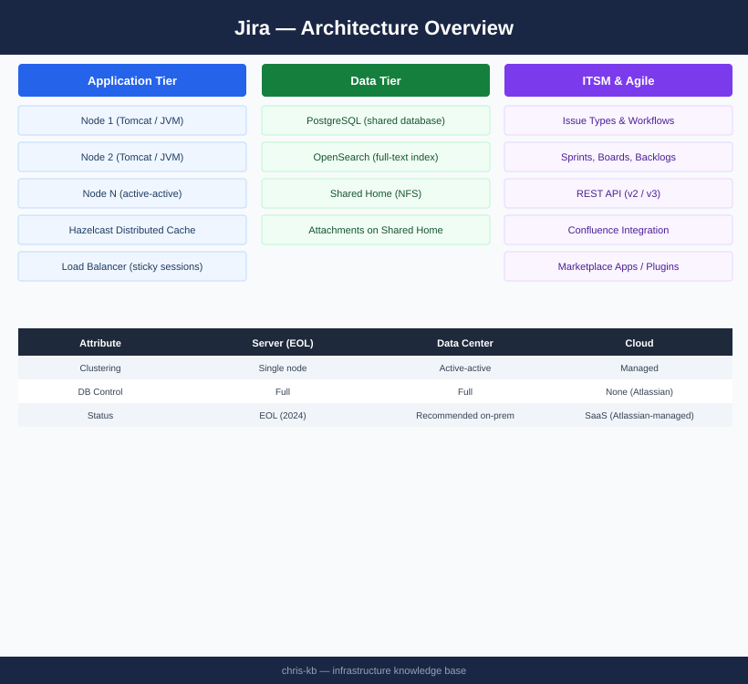

---
tags:
  - architecture
  - jira
---
# Jira — Architecture

Jira Data Center runs as an active-active Java cluster backed by a shared PostgreSQL database, shared NFS home, and distributed Hazelcast cache. Load balancer sticky sessions are mandatory.

*Applies to: Jira Cloud / Data Center*

<a class="kb-card" href="how-it-works/"><strong>How It Works</strong>Deployment models, cluster topology, component roles, and port reference.</a>
<a class="kb-card" href="integrations/"><strong>Integrations</strong>Integration with other platforms and external systems.</a>
<a class="kb-card" href="design-standards/"><strong>Design Standards</strong>Sizing guidelines, design standards, and best practices.</a>

---

## Deployment Models

| Model | Hosting | Clustering | DB Control | Customisation |
|---|---|---|---|---|
| Server (EOL) | Self-hosted | Single node | Full | Full |
| **Data Center** | Self-hosted | Active-active | Full | Full |
| Cloud | Atlassian-managed | Managed | None | Limited |

---

## Data Center Topology

