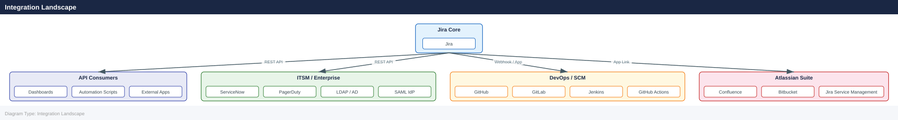

---
tags:
  - architecture
  - jira
description: "Integrations reference covering Integration Landscape, GitHub Integration, Bitbucket Integration, CI/CD Pipeline Integration, REST API Overview and 4 more..."
---
# Jira — Integrations

<div class="kb-summary">
Integrations reference covering Integration Landscape, GitHub Integration, Bitbucket Integration, CI/CD Pipeline Integration, REST API Overview and 4 more sections.

*Applies to: Jira Cloud / Data Center*
</div>

## Integration Landscape



### Commit Message Convention

```bash
<issue-key>: <imperative summary>

# Examples
PROJ-123: Add OAuth2 login flow
PROJ-456: Fix null pointer in search controller

# Transition on commit (if workflow enabled)
PROJ-123 #done: Implement user authentication
```


```text title="Expected output"
(no output — command completes silently)
```

!!! warning "Common errors"
    **`fatal: not a git repository (or any of the parent directories): .git`** — Initialize a git repository with `git init` or clone an existing repository before committing.
    **`error: pathspec '<issue-key>' did not match any files`** — Replace `<issue-key>` with an actual Jira issue key (e.g., `PROJ-123`) in your commit message.
Supported smart commit commands (requires **Smart Commits** enabled in DVCS):

| Command | Effect |
|---|---|
| `#comment <text>` | Adds comment to issue |
| `#done` | Transitions to "Done" (or configured transition) |
| `#time 2h 30m` | Logs 2h 30m work |

---

## Bitbucket Integration

### DVCS Connector

For Bitbucket Server/Data Center, connect via **Admin → System → DVCS accounts**:

1. Add account → select Bitbucket Server
2. Provide base URL, OAuth consumer key/secret
3. Select repositories to sync
4. Set sync interval (minimum 60 minutes for large repos)

### Bitbucket Pipelines Build Status

Bitbucket Pipelines posts build status to Jira automatically when the Jira integration is configured in the Bitbucket workspace. Build results appear in the **Releases** panel of the Jira issue.

---

## CI/CD Pipeline Integration

### Jenkins

Use the **Jira plugin for Jenkins** (available on Jenkins Plugin Index).

Pipeline snippet to update Jira issue on build result:

```groovy
pipeline {
    agent any
    stages {
        stage('Build') {
            steps {
                sh 'mvn clean package'
            }
        }
    }
    post {
        success {
            jiraSendBuildInfo site: 'https://jira.example.com',
                              branch: env.GIT_BRANCH
        }
        failure {
            jiraComment body: "Build ${env.BUILD_NUMBER} failed. See: ${env.BUILD_URL}",
                        issueKey: getIssueKey(env.GIT_BRANCH)
        }
    }
}
```

### GitHub Actions

```yaml
# .github/workflows/ci.yml
name: CI

on: [push, pull_request]

jobs:
  build:
    runs-on: ubuntu-latest
    steps:
      - uses: actions/checkout@v4

      - name: Build
        run: mvn clean package

      - name: Update Jira
        if: always()
        uses: atlassian/gajira-transition@v3
        with:
          issue: ${{ env.JIRA_ISSUE_KEY }}
          transition: "In Progress"
        env:
          JIRA_BASE_URL: ${{ secrets.JIRA_BASE_URL }}
          JIRA_USER_EMAIL: ${{ secrets.JIRA_USER_EMAIL }}
          JIRA_API_TOKEN: ${{ secrets.JIRA_API_TOKEN }}
```

---

## REST API Overview

Jira exposes a versioned REST API at `/rest/api/3/` (Cloud) and `/rest/api/2/` (Server/DC).

### Authentication

| Method | Use Case | Header |
|---|---|---|
| Basic Auth | Scripts, testing | `Authorization: Basic base64(user:token)` |
| API Token | Cloud (replaces password) | `Authorization: Basic base64(email:token)` |
| OAuth 2.0 | App integrations | `Authorization: Bearer <token>` |
| Personal Access Token | DC/Server | `Authorization: Bearer <PAT>` |

### Key Endpoints

| Method | Endpoint | Description |
|---|---|---|
| `GET` | `/rest/api/2/issue/{issueKey}` | Get issue |
| `POST` | `/rest/api/2/issue` | Create issue |
| `PUT` | `/rest/api/2/issue/{issueKey}` | Update issue |
| `DELETE` | `/rest/api/2/issue/{issueKey}` | Delete issue |
| `POST` | `/rest/api/2/issue/{issueKey}/transitions` | Transition issue |
| `POST` | `/rest/api/2/issue/{issueKey}/comment` | Add comment |
| `GET` | `/rest/api/2/search` | JQL search |
| `GET` | `/rest/api/2/project` | List projects |
| `GET` | `/rest/api/2/user` | Get user |

---

## Webhook Configuration

Webhooks allow Jira to push events to external systems in real time.

### Configuration

Navigate to: `Admin → System → WebHooks → Create a WebHook`

| Field | Description |
|---|---|
| Name | Descriptive label |
| URL | Target endpoint (must return 2xx) |
| Events | Issue created/updated/deleted, Comment, Sprint events, etc. |
| JQL Filter | Scope events to matching issues (e.g., `project = PROJ`) |
| Exclude body | Send event metadata only (no payload), for lightweight receivers |

### Payload Structure

```json
{
  "timestamp": 1700000000000,
  "webhookEvent": "jira:issue_updated",
  "issue_event_type_name": "issue_generic",
  "user": {
    "name": "jdoe",
    "emailAddress": "jdoe@example.com"
  },
  "issue": {
    "id": "10042",
    "key": "PROJ-123",
    "fields": {
      "summary": "Fix login bug",
      "status": { "name": "In Progress" },
      "assignee": { "name": "jdoe" }
    }
  },
  "changelog": {
    "items": [
      {
        "field": "status",
        "fromString": "To Do",
        "toString": "In Progress"
      }
    ]
  }
}
```

### Webhook Reliability

Jira retries failed webhooks up to 10 times with exponential backoff. Failed deliveries are visible in `Admin → System → WebHooks → [webhook name] → Recent Deliveries`.

---

## LDAP / Active Directory Integration

### Connector Types

| Connector | Use Case |
|---|---|
| Internal Directory | Standalone, no sync |
| LDAP (read-only) | Authenticate against AD, no write-back |
| LDAP (read/write) | Sync users/groups bidirectionally |
| Atlassian Crowd | Centralised SSO for multiple Atlassian apps |

### LDAP Configuration (Active Directory)

`Admin → User Management → User Directories → Add Directory → Microsoft Active Directory`

Key settings:

```yaml
Hostname:               ad.example.com
Port:                   636 (LDAPS) or 389 (LDAP)
Use SSL:                true (required for prod)
Base DN:                DC=example,DC=com
Username DN:            CN=svc-jira,OU=ServiceAccounts,DC=example,DC=com
Password:               <service account password>

User Object Class:      user
User Object Filter:     (&(objectCategory=Person)(sAMAccountName=*))
User Name Attribute:    sAMAccountName
User Email Attribute:   mail
User Full Name Attr:    displayName

Group Object Class:     group
Group Object Filter:    (objectCategory=Group)
Group Name Attribute:   cn
Group Members Attr:     member
```

### LDAP Sync Schedule

```text
Synchronise Every:   60 minutes
```

Trigger immediate sync:
`Admin → User Management → [Directory] → Synchronise`

Or via REST:
```bash
curl -u admin:token -X POST \
  "https://jira.example.com/rest/api/2/user/bulk/migration/start"
```


```text title="Expected output"
{
  "taskId": "a1b2c3d4-e5f6-47g8-h9i0-j1k2l3m4n5o6",
  "status": "STARTED",
  "startTime": "2024-01-15T09:42:33.521Z",
  "progress": 0,
  "description": "User bulk migration initiated"
}
```

!!! warning "Common errors"
    **`curl: (60) SSL certificate problem: self signed certificate`** — Add `-k` flag to skip certificate verification, or configure your CA bundle with `--cacert /path/to/ca-bundle.crt`.
    **`{"errorMessages":["User admin does not have permission to perform this operation"],"errors":{}}`** — Ensure the admin user has the global "Administer Jira" permission or use a service account with migration privileges.
    **`curl: (7) Failed to connect to jira.example.com port 443: Connection refused`** — Verify the Jira instance is running and accessible at the specified hostname and port.
---

## SAML / SSO Integration

Jira Data Center supports SAML 2.0 SP-initiated SSO.

`Admin → System → SAML 2.0 Single Sign-On`

| Field | Value |
|---|---|
| Single Sign-On URL | IdP SSO endpoint URL |
| Identity Provider Entity ID | IdP entity ID from metadata |
| X.509 Certificate | IdP signing certificate (PEM) |
| Username Mapping | `Email` or `Username` attribute |
| Redirect URL | `https://jira.example.com/plugins/servlet/saml/auth` |

**SP Metadata URL** (provide to IdP):
```text
https://jira.example.com/plugins/servlet/saml/metadata
```

Common IdP configurations:

| IdP | Notes |
|---|---|
| Okta | Use Atlassian SAML app template |
| Azure AD / Entra ID | Add Jira as Enterprise Application, configure attribute mapping |
| ADFS | Configure relying party trust with Jira SP metadata |
| Google Workspace | Custom SAML app, map `email` to NameID |

---

## ServiceNow Integration

### Patterns

| Pattern | Description | Direction |
|---|---|---|
| Incident → Jira Bug | ITSM incidents that need development work create Jira bugs | ServiceNow → Jira |
| Jira Done → SNOW Resolve | Completed Jira issues trigger incident/change resolution | Jira → ServiceNow |
| Bidirectional sync | Status and comments mirrored between platforms | Both |

### Implementation Options

1. **Jira Automation + ServiceNow REST API**: Use Jira Automation rules to call the ServiceNow Table API on status transitions.
2. **ServiceNow IntegrationHub**: Out-of-the-box Jira spoke available in ServiceNow Store.
3. **Middleware (e.g., MuleSoft, Zapier, custom)**: Webhook receiver transforms and forwards events.

### Example: Jira Automation Rule — Transition Jira Issue on SNOW Resolve

```yaml
Trigger:  Incoming webhook (from ServiceNow)
Condition: {{webhookData.state}} equals "resolved"
Action:   Transition issue → Done
Action:   Add comment → "Resolved via ServiceNow incident {{webhookData.number}}"
```

### Example: ServiceNow → Jira Issue Creation (REST)

```bash
# Create a Jira issue from a ServiceNow script
curl -u svc-jira:token -X POST \
  -H "Content-Type: application/json" \
  "https://jira.example.com/rest/api/2/issue" \
  -d '{
    "fields": {
      "project":     { "key": "OPS" },
      "issuetype":   { "name": "Bug" },
      "summary":     "INC0012345 - Prod login failure",
      "description": "Created from ServiceNow incident INC0012345",
      "priority":    { "name": "High" },
      "labels":      ["servicenow", "incident"]
    }
  }'
```


```text title="Expected output"
{
  "id": "10847",
  "key": "OPS-4521",
  "self": "https://jira.example.com/rest/api/2/issue/10847"
}
```

!!! warning "Common errors"
    **`401 Unauthorized`** — Verify the svc-jira credentials are correct and the API token hasn't expired; regenerate the token in Jira if needed.
    **`400 Bad Request: 'project' is required`** — Ensure the project key "OPS" exists in your Jira instance and the service account has permission to create issues in it.
    **`403 Forbidden: User does not have permission to create issues`** — Grant the svc-jira service account the "Create Issues" permission in the OPS project's permission scheme.
---

## See also

- [Jira — Design Standards](../design-standards/)
