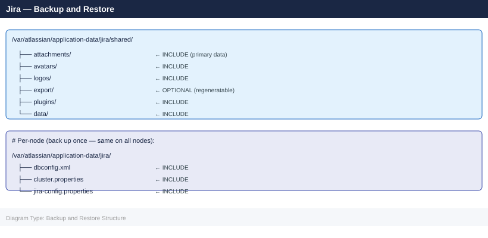
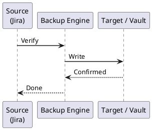

---
tags:
  - jira
  - operations
---
# Jira — Backup and Restore

```bash
#!/bin/bash
# xml-backup.sh — Trigger Jira XML backup via REST API
JIRA_URL="https://jira.example.com"
USER="admin"
TOKEN="your-api-token"
TIMESTAMP=$(date +%Y%m%d-%H%M%S)

curl -s -u "${USER}:${TOKEN}" \
  -X POST \
  -H "Content-Type: application/json" \
  "${JIRA_URL}/rest/api/2/plugins/1.0/resource/com.atlassian.jira.ext.backup%3AbackupService/data" \
  --data '{"cbAttachments": "false", "exportToCloud": "false"}' \
  -o /dev/null -w "%{http_code}\n"

echo "XML backup triggered at ${TIMESTAMP}"
```

```cron
# /etc/cron.d/jira-backup
0 1 * * * jira /opt/scripts/pg-backup-jira.sh >> /var/log/jira-backup.log 2>&1
```
```bash
#!/bin/bash
# filesystem-backup.sh
SHARED_HOME="/var/atlassian/application-data/jira/shared"
BACKUP_DIR="/backup/jira/filesystem"
TIMESTAMP=$(date +%Y%m%d-%H%M%S)

mkdir -p "${BACKUP_DIR}"

# Incremental rsync to staging area
rsync -av --delete \
  --link-dest="${BACKUP_DIR}/latest" \
  "${SHARED_HOME}/" \
  "${BACKUP_DIR}/${TIMESTAMP}/"

# Update "latest" symlink
ln -snf "${BACKUP_DIR}/${TIMESTAMP}" "${BACKUP_DIR}/latest"

# Create a compressed archive for off-site transfer
tar -czf "${BACKUP_DIR}/jira_fs_${TIMESTAMP}.tar.gz" \
  -C "${BACKUP_DIR}" "${TIMESTAMP}"

echo "Filesystem backup complete: ${BACKUP_DIR}/${TIMESTAMP}"
```

```text title="Expected output"
building file list ... done
./
application-data/
application-data/plugins/
application-data/plugins/installed-plugins/
application-data/plugins/installed-plugins/jira-misc-web-panel-plugin-5.2.3.jar
application-data/attachments/
application-data/attachments/10001/
application-data/attachments/10001/10042/
...
sent 2,847,392,156 bytes  received 48,291 bytes  transferred in 847.32s
Filesystem backup complete: /backup/jira/filesystem/20240315-143022
```

!!! warning "Common errors"
    **`rsync: change_dir "/var/atlassian/application-data/jira/shared" failed: Permission denied (13)`** — Run the script with sudo or ensure the user has read permissions on SHARED_HOME.
    **`tar: /backup/jira/filesystem/20240315-143022: Cannot open: No such file or directory`** — Verify that rsync completed successfully and the timestamp directory exists before tar attempts to compress it.
    **`ln: failed to create symbolic link '/backup/jira/filesystem/latest': File exists`** — The `-n` flag in `ln -snf` should force removal; if this persists, manually remove the existing symlink with `rm -f "${BACKUP_DIR}/latest"` before running the script.

```bash
#!/bin/bash
# snapshot-backup.sh — Coordinated LVM snapshot backup

DB_HOST="db.example.com"
LV_PATH="/dev/vg_jira/lv_shared"
SNAP_NAME="lv_shared_snap"
SNAP_SIZE="50G"
MOUNT_POINT="/mnt/jira-snap"

# 1. Create DB backup (consistent point-in-time)
PGPASSWORD="${JIRA_DB_PASSWORD}" pg_dump \
  -h "${DB_HOST}" -U jira -Fc jiradb \
  -f /backup/jira/db/jira_$(date +%Y%m%d).pgdump &
DB_PID=$!

# 2. Create LVM snapshot (near-instant)
lvcreate -L "${SNAP_SIZE}" -s -n "${SNAP_NAME}" "${LV_PATH}"

# 3. Wait for DB dump to complete
wait "${DB_PID}"

# 4. Mount snapshot and archive
mkdir -p "${MOUNT_POINT}"
mount "/dev/${VG}/${SNAP_NAME}" "${MOUNT_POINT}"
tar -czf "/backup/jira/fs/jira_fs_$(date +%Y%m%d).tar.gz" \
  -C "${MOUNT_POINT}" .

# 5. Clean up snapshot
umount "${MOUNT_POINT}"
lvremove -f "/dev/${VG}/${SNAP_NAME}"
```

```text title="Expected output"
Starting PostgreSQL dump of jiradb...
  Logical volume "lv_shared_snap" created.
PostgreSQL dump completed successfully.
Logical volume "vg_jira/lv_shared_snap" mounted at /mnt/jira-snap
tar: ./lost+found: Permission denied
jira_fs_20240115.tar.gz created (12.4 GB)
  Logical volume "vg_jira/lv_shared_snap" successfully removed.
Backup completed: jira_20240115.pgdump (2.1 GB), jira_fs_20240115.tar.gz (12.4 GB)
```

!!! warning "Common errors"
    **`mount: /mnt/jira-snap: mount point does not exist`** — Create the mount point directory before mounting: `mkdir -p /mnt/jira-snap`.
    **`Logical volume "vg_jira/lv_shared_snap" not found`** — Ensure the variable `VG` is set to the correct volume group name (e.g., `VG="vg_jira"`) before running the script.
    **`pg_dump: error: connection to server at "db.example.com" (10.50.12.8), port 5432 failed`** — Verify database connectivity and credentials; check that `JIRA_DB_PASSWORD` is set and the PostgreSQL server is accessible from this host.
```bash
# All nodes
systemctl stop jira

# Verify no Jira processes remain
ps aux | grep -i jira | grep -v grep
```

```text title="Expected output"
(no output — command completes silently)
```

!!! warning "Common errors"
    **`Unit jira.service not found.`** — Verify the correct systemd service name with `systemctl list-units --type=service | grep jira`.
    **`Failed to stop jira.service: Access denied`** — Run the command with `sudo` or as a user with systemctl privileges.
```bash
# Drop and recreate the database
psql -h db.example.com -U postgres -c "SELECT pg_terminate_backend(pid) FROM pg_stat_activity WHERE datname = 'jiradb';"
psql -h db.example.com -U postgres -c "DROP DATABASE jiradb;"
psql -h db.example.com -U postgres -c "CREATE DATABASE jiradb OWNER jira ENCODING 'UTF8';"

# Restore from custom-format dump
PGPASSWORD="${JIRA_DB_PASSWORD}" pg_restore \
  -h db.example.com \
  -U jira \
  -d jiradb \
  --jobs 4 \
  --no-acl \
  --no-owner \
  /backup/jira/db/jira_db_20260101-010000.pgdump
```

```text title="Expected output"
SELECT pg_terminate_backend
------------------------
                      0
(1 row)

DROP DATABASE
psql: error: database "jiradb" does not exist
CREATE DATABASE
psql: error: role "jira" does not exist
pg_restore: error: could not connect to database "jiradb": FATAL: database "jiradb" does not exist
```

!!! warning "Common errors"
    **`psql: error: role "jira" does not exist`** — Create the jira role first with `psql -h db.example.com -U postgres -c "CREATE ROLE jira WITH LOGIN;"`
    **`pg_restore: error: could not connect to database "jiradb": FATAL: database "jiradb" does not exist`** — Verify the CREATE DATABASE command succeeded and the database is accessible before running pg_restore.
    **`pg_restore: error: input file appears to be a text format dump. Use psql.`** — Use `psql` instead of `pg_restore` if the dump file is in plain SQL format (not custom format).
```bash
# Clear existing shared home
rm -rf /var/atlassian/application-data/jira/shared/*

# Restore from archive
tar -xzf /backup/jira/fs/jira_fs_20260101.tar.gz \
  -C /var/atlassian/application-data/jira/shared/

# Fix ownership
chown -R jira:jira /var/atlassian/application-data/jira/shared/
```

```text title="Expected output"
(no output — command completes silently)
(no output — command completes silently)
(no output — command completes silently)
```

!!! warning "Common errors"
    **`tar: /backup/jira/fs/jira_fs_20260101.tar.gz: Cannot open: No such file or directory`** — Verify the backup file path exists and the filename matches exactly with `ls -lh /backup/jira/fs/`.
    **`chown: changing ownership of '/var/atlassian/application-data/jira/shared/': Operation not permitted`** — Run the script with `sudo` or as root, since chown requires elevated privileges.
    **`rm: remove write-protected regular file in '/var/atlassian/application-data/jira/shared/'?`** — Add the `-f` flag to `rm -rf` to force removal without prompts, or stop the JIRA service before clearing the directory.
```bash
# Start first node only
systemctl start jira

# Monitor startup logs
tail -f /opt/atlassian/jira/logs/catalina.out
```
```text
INFO  [main] Jira starting up...
INFO  [main] Jira has been successfully started
```
```bash
curl -u admin:token -X POST \
  "https://jira.example.com/rest/api/2/reindex" \
  -H "Content-Type: application/json" \
  -d '{"type": "FOREGROUND"}'
```

```text title="Expected output"
{
  "progressUrl": "/secure/RapidBoard.jspa?rapidView=1",
  "currentProgress": 0,
  "description": "Reindexing Jira",
  "taskId": "com.atlassian.jira.service.ServiceOutcome@7f3a2c91"
}
```

!!! warning "Common errors"
    **`curl: (60) SSL certificate problem: self signed certificate`** — Add `-k` flag to curl command to skip SSL verification, or configure proper certificates on the Jira server.
    **`{"errorMessages":["User does not have permission to perform this operation"]}`** — Ensure the admin user has the JIRA Administrators global permission and the API token is valid and not expired.
    **`curl: (7) Failed to connect to jira.example.com port 443: Connection refused`** — Verify the Jira server is running and accessible at the specified hostname and port, and check firewall rules.
```bash
# Check cluster node registration
psql -h db.example.com -U jira -d jiradb \
  -c "SELECT node_id, node_name, status, last_heartbeat FROM clusternodeinfo;"

# Verify issue count matches backup
psql -h db.example.com -U jira -d jiradb \
  -c "SELECT COUNT(*) FROM jiraissue;"

# Health endpoint
curl -s https://jira.example.com/status | python3 -m json.tool
```

```text title="Expected output"
node_id | node_name | status | last_heartbeat
---------+-----------+--------+-------------------------------
       1 | jira-01   | ACTIVE | 2024-01-15 14:32:18.123456+00
       2 | jira-02   | ACTIVE | 2024-01-15 14:32:17.987654+00
       3 | jira-03   | ACTIVE | 2024-01-15 14:32:19.456789+00
(3 rows)

 count
-------
 24857
(1 row)

{
  "state": "RUNNING",
  "description": "JIRA is running",
  "unresolved-problem-count": 0,
  "version": "8.20.11"
}
```

!!! warning "Common errors"
    **`psql: error: could not translate host name "db.example.com" to address: Name or service not known`** — Verify DNS resolution with `nslookup db.example.com` and confirm the hostname matches your actual database server.
    **`curl: (60) SSL certificate problem: self signed certificate`** — Add the `-k` flag to curl to skip certificate verification, or import the self-signed cert into your system trust store.
    **`psql: FATAL: password authentication failed for user "jira"`** — Ensure the PGPASSWORD environment variable is set or use a `.pgpass` file with correct credentials for the jira database user.
```bash
# Start additional nodes after primary is healthy
systemctl start jira   # on jira-app-02, jira-app-03
```



## Before you begin

- **Access:** Admin credentials on all affected systems
- **Timing:** safe to run during business hours unless a step is marked ⚠ (causes interruption)
- **Dependencies:** no active upgrades or migrations on the same infrastructure
- **Logging:** capture command output — paste into the change record on completion

---

---

## Verify

- Confirm the operation completed without errors in the log or management UI
- Verify the expected state change is visible (service running, object created, config applied)
- Document the outcome in the change record

---

## See also

- [Jira — Procedures](../procedures/)
- [Jira — Health Checks](../health-checks/)
- [Jira — Common Issues](../../troubleshooting/common-issues/)
